# Changelog

<details>

<summary>Scale Log. Release 3.8.0</summary>

<figure>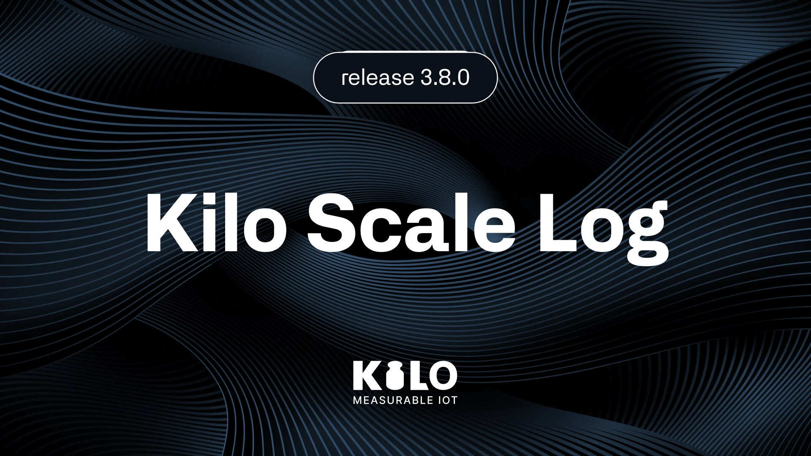<figcaption></figcaption></figure>

3.8.0 removes the two things that used to stand between an idea and a working deployment: hardware, and hands. The **Emulator** lets you build an entire site — dashboards, rules, escalating alarms — with no devices at all, and then hand those same devices over to real sensors when they arrive. And the **AI assistant can now operate your equipment**: it lists the commands configured on a device, runs one after asking you to confirm, and checks that it was delivered. Connect your own AI client over MCP and it can do the same. Alongside that, the platform now tells you what changed in a **What's New** panel, and MIOTY reaches a wider set of base stations with **BSSCI 1.1** support. [kiloiot.io](https://kiloiot.io)

***

#### What's in This Release

* **Emulator connector** — Build and test a deployment before any hardware exists: devices that generate their own telemetry from real device presets, with manual values and send-once, then swap to a real connector on go-live day.
* **AI runs device commands** — The assistant lists a device's commands, executes one behind a confirmation, and reports whether it was delivered. Your own AI client can do it too, over MCP.
* **AI drives the emulator** — Provision an emulated device, change its configuration, send a reading, and swap it to real hardware, all in conversation.
* **What's New in the product** — A panel that tells you what shipped, generated from this changelog so it can never drift from the documentation.
* **MIOTY BSSCI 1.1** — Protocol version negotiation brings newer base stations onto the same service center, and station identifiers are accepted across the full unsigned 64-bit EUI range.
* **Audit Trail repaired** — The broken components on the Audit Trail page are fixed.
* **Fixes and polish** — Subscription plan period, a CORS fix, MIOTY reliability, dashboard widget placement, and interface fixes across devices and thresholds.

***

**The Emulator — a deployment you can build before the sensors land**

Sensor lead times are measured in weeks. Until now the configuration work waited for them: you could not see a dashboard update, watch a rule fire, or test whether an escalation chain actually reaches somebody, because there was nothing sending data. The Emulator removes that dependency entirely. Add the connector — it has no settings, nothing to configure — create a device on it, and that device starts producing telemetry on the interval you choose.

The metrics come from **real device presets**. Pick a Milesight AM319 and you get `temperature`, `humidity`, `co2`, `tvoc`, `pm2_5` and `pm10` with the correct data types, which means the metric names you build dashboards and rules against are the ones the physical sensor will send. Or define the keys by hand. On the device's Emulator tab you can pin a value so the device holds it — a freezer parked at −18 °C while you watch an alarm escalate — or **send once** to trip a threshold on demand. Turn on **Support commands** and the device behaves like controllable hardware, so you can rehearse a closed loop before the equipment exists.

Then the part that makes it more than a demo. When the hardware arrives, change the device's connector from Emulator to the real one. **Everything you built stays** — the dashboards, the rules, the thresholds, the escalation chains. You are replacing the source of the data, not rebuilding the deployment. The swap works in both directions, so you can also move a real device onto the emulator to reproduce a problem and then move it back.

<figure>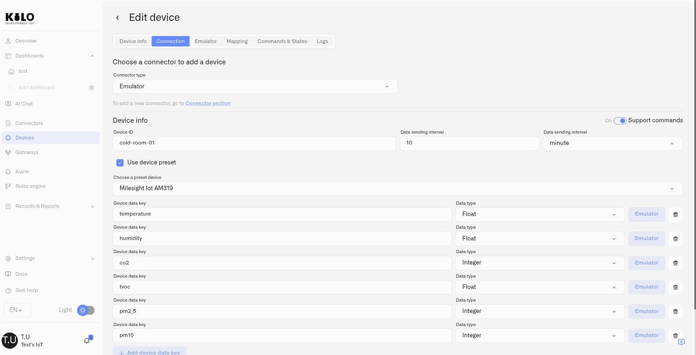<figcaption></figcaption></figure>

[→ Emulator Connector](../kilo-iot-server/connectors/emulator-connector.md)

***

**AI that operates the equipment, not just the software**

Everyone has seen the demo where a lamp is wired to a language model and switched on. It is a good trick, and it is not a system: there is no device model behind it, no permissions, no typed parameters, no delivery status, no record of what happened. Ask a model to do that across a building, a plant or a fleet and it has to improvise radio protocols, payloads and access policy on every single call.

3.8.0 puts the IoT server behind the model. The assistant can now **list the commands configured on a device, execute one, and check the execution status** — and so can any AI client you connect over MCP, through `device_command_list`, `device_command_execute` and `device_command_status`. Change a reporting interval, switch a relay, adjust a device configuration, in the client you already have open.

What makes that safe is what it refuses to do. It executes **commands that already exist** on the device — named actions with typed parameters that someone who knows the equipment defined deliberately — rather than composing a raw downlink. Every execution goes behind an explicit confirmation, because the effect is physical. Delivery is asynchronous, so it reports the status afterwards instead of assuming success. And every dispatch lands in command execution history like any other.

The assistant also learned the Emulator: it can list presets, provision an emulated device, read and update its configuration, send a one-off reading, and perform the swap to a real connector. Setting up a test deployment is now a conversation.

<figure><figcaption></figcaption></figure>

[→ Physical AI Platform](../kilo-iot-server/physical-ai.md) · [→ MCP Server](../kilo-iot-server/api/mcp-server.md) · [→ Building with AI](../kilo-iot-server/ai-assistant/building-with-ai.md)

***

**What's New, inside the product**

Releases are no use if nobody notices them. The platform now shows a **What's New** panel that walks through what shipped, so a change reaches the people using the product rather than sitting in a changelog they never open.

It is generated from this page. The changelog is the source, a pipeline turns it into the release feed the product reads, and the panel shows the same words you are reading now — so the product and the documentation cannot drift apart.

<figure>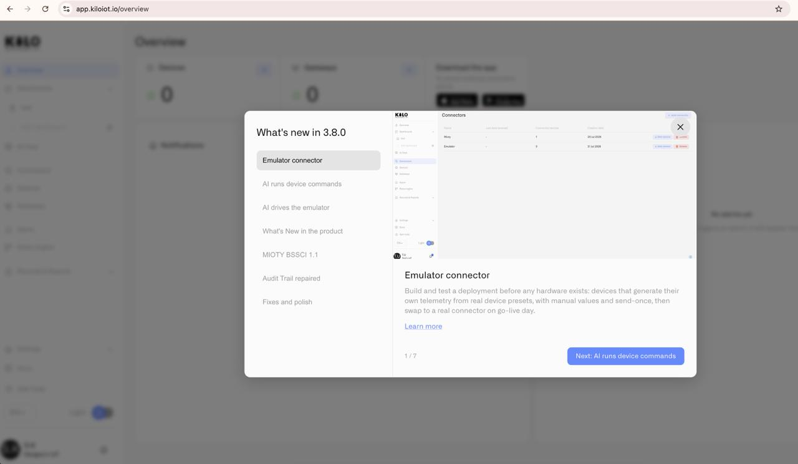<figcaption></figcaption></figure>

***

**MIOTY reaches more base stations**

MIOTY arrived in 3.7.0. This release is the first hardening pass on real deployments. The service center now negotiates the **BSSCI protocol version** as each station connects and supports **BSSCI 1.1** alongside earlier revisions, so a newer station and an older one can serve the same site and a firmware upgrade does not cost you the connection. Station identifiers are accepted across the **full unsigned 64-bit EUI range**, including high values that some platforms reject outright.

Underneath, session resume, certificate issuance and downlink dispatch were tightened, and duplicate-station and page errors were fixed along with the ability to unbind a physical MIOTY endpoint from its digital device.

<figure>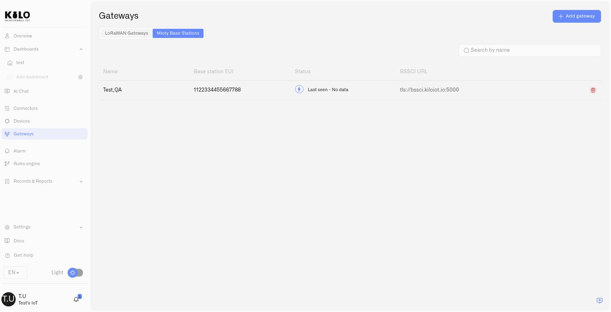<figcaption></figcaption></figure>

[→ MIOTY Base Stations](../kilo-iot-server/gateways/mioty-base-stations/README.md)

***

**Audit Trail repaired**

The Audit Trail page had broken components. It is fixed: the actor filter, the event-type filter and the date range all work again, so you can narrow an organization's access history to the person, the kind of change, and the window you care about.

<figure>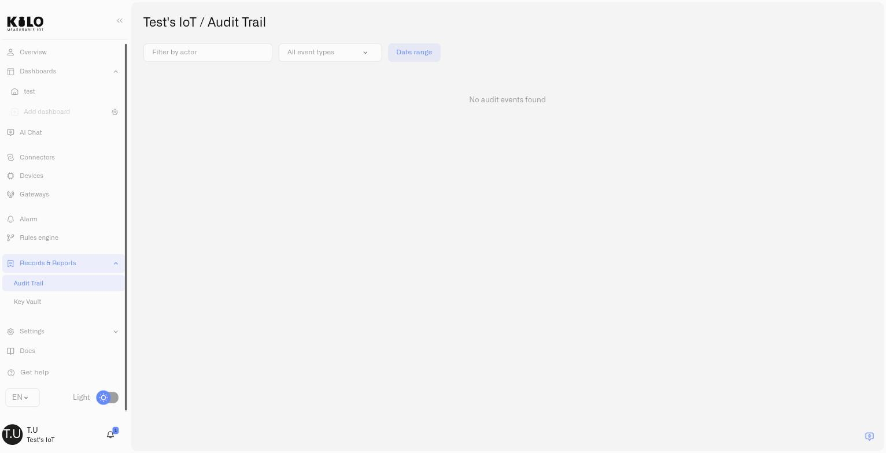<figcaption></figcaption></figure>

***

**Fixes and polish**

The Audit Trail page had broken components; they are repaired. Subscription now reports the current plan period correctly, and a CORS error affecting the interface is resolved. Adding a widget no longer disturbs the placement of the widgets already on a dashboard. Long MQTT topics no longer overflow their container on mobile, the threshold **Label** field is wide enough to read what you typed, the device mapping tooltip says what it means, and the allowed range for a MIOTY **Short Address** is described consistently. Type validation and a set of access-control hardening fixes round out the release.

<figure><figcaption></figcaption></figure>

</details>

<details>

<summary>Scale Log. Release 3.7.0</summary>

<figure>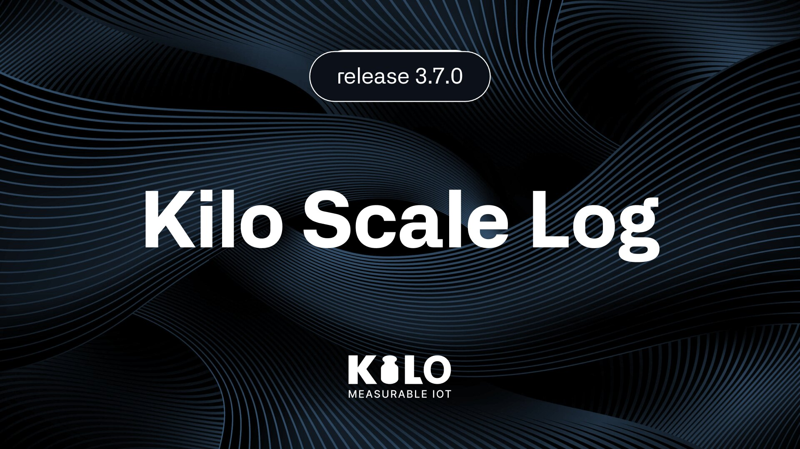<figcaption></figcaption></figure>

3.7.0 widens what the Kilo IoT Platform reaches and tightens what it tells you. **MIOTY** arrives as a first-class protocol — base stations, endpoints, and payload blueprints — so the massive-scale, interference-hard deployments that LoRaWAN was never shaped for now run on the same platform, the same dashboards, the same rules. Dashboards learn to leave the building: a **share link** turns any dashboard into a password-protected address you can hand to a customer or pin to a wall tablet, with **View** or **Control** access and a one-click revoke. **Device diagnostics** replaces the worst moment in any deployment — *it's installed, and nothing is happening* — with a plain answer and the next step. **Key Vault** gets device credentials out of spreadsheets. And an **MCP server** lets your own AI client sign in and work your deployment directly. [kiloiot.io](https://kiloiot.io)

***

#### What's in This Release

* **MIOTY support** — A new connector, a Mioty Base Stations category under Gateways, MIOTY endpoint fields, and a full blueprint system for decoding payloads — with per-device snapshots so a catalog edit never disturbs a device already in production.
* **Share dashboard** — Publish a dashboard as a password-protected link with **View** or **Control** access. Regenerate or revoke it at any time; open it full screen on a tablet or a wall display.
* **Device diagnostics** — A device's Connection tab now reports its reception status, the pipeline each message travels, and an event feed with a status legend — and tells you what to check when something is wrong.
* **Key Vault** — An encrypted, access-controlled store for device EUI and key pairs, under the new **Records & Reports** group, with **Add to Vault** right on the device form.
* **MCP server** — Connect the AI client you already use — Claude Code, Claude Desktop, ChatGPT, Codex, Cursor — to your organization with your own account sign-in, and put it to work on your real deployment.
* **Scan a QR code** — Read a DevEUI or AppKey with a laptop or phone camera instead of typing 16 or 32 hex characters.
* **Duplicate and move widgets** — Repeat a configured widget across identical sensors, or move one to another dashboard.
* **Fixes and polish** — Layout, mobile, and navigation fixes across dashboards, gateways, devices, and the audit trail.

***

**MIOTY — a second protocol for the deployments LoRaWAN can't carry**

MIOTY ([ETSI TS 103 357](https://mioty-alliance.com)) is the newer of the two LPWAN technologies, developed at the Fraunhofer Institute and built for the environments that break the first generation: factory floors thick with interference, tens of thousands of endpoints under one receiver, sensors on machinery that never stops moving. It encodes each message, splits it into two dozen bursts of about 15 milliseconds, and scatters them across frequency and time — so the base station rebuilds the whole telegram **even when half of its bursts are destroyed**. An interferer has to take out more than 50% of a single transmission, across both time and frequency, to cost you one reading. That is why one base station carries up to 110,000 endpoints and 3.5 million messages a day. In 3.7.0 it becomes a native part of the platform rather than a parallel system.

Create a **Mioty connector** and a **Mioty Base Stations** tab appears alongside your LoRaWAN gateways. Register a base station with its BS EUI, download its certificate bundle, copy the BSSCI address, and it connects over a certificate-secured link — no packet forwarder in between. Endpoints get their own form: End Point EUI, short address, network session key, and the MIOTY radio options that matter.

**There is no MIOTY infrastructure to run.** The Enterprise edition of our service center is built into Kilo Cloud, so the connector is the whole setup. That distinction is the point of the release: a MIOTY network server moves messages and manages base stations — useful, and not the same as being able to *do* anything with a reading. Here the endpoints arrive on a full platform, so the rules engine, alarms with escalation, dashboards, the Digital Building Twin, and the audit trail all apply to MIOTY data exactly as they do to everything else, and one rule can reason across a MIOTY endpoint and a LoRaWAN sensor together. If you would rather operate the network yourself, the Community edition — Kilo Center — remains open source and self-hosted.

Payload decoding is where the design earns its keep. A **blueprint** is a decoder spec bound to a device type, organized as manufacturer → model → version and split into a **System** catalog everyone can use and a **Custom** catalog that is yours. Choose one for a device and the platform takes a *snapshot* of it onto that device. Edit or delete the catalog template afterwards and nothing already in the field changes — those devices keep running on their own copy until you deliberately move them to a new version. Two devices of the same model can run different blueprints. Author a new one from pasted JSON and test the decoder against a sample payload before you save it.

[→ What is MIOTY?](../mioty/README.md) · [→ Mioty Connector](../kilo-iot-server/connectors/mioty-connector.md) · [→ Mioty Base Stations](../kilo-iot-server/gateways/mioty-base-stations/README.md) · [→ Mioty Blueprints](../kilo-iot-server/devices/mioty-blueprints.md)

***

**Share dashboard — a link, a password, and an off switch**

A dashboard used to stop at the edge of your organization. Now it doesn't. Open a dashboard's actions menu, choose **Share dashboard**, set a password, and generate a link that opens the dashboard full screen for anyone you send it to — no account needed. Choose **View** for a customer, an auditor, or a client who should see and nothing more; choose **Control** for the tablet mounted by the line where an operator needs to actually work the devices. Change the password when the audience changes, regenerate the link to invalidate the old one, or revoke it outright the moment a contract ends — the link stops working immediately.

[→ Sharing Dashboards](../kilo-iot-server/dashboards/sharing-dashboards.md)

***

**Device diagnostics — an answer instead of a silence**

Commissioning fails quietly. The device is mounted, the connector is configured, and nothing arrives — with nothing to inspect but a blank chart. The Connection tab now opens with a **reception status** that says which of the real situations you're in: *Receiving & storing*, *Sending data — set up mapping to keep it*, *Data arrives but nothing is stored*, *Reached network — waiting for data*, or *Hasn't reported — device looks offline*. Underneath, a **pipeline** view shows how far each message gets, and an **event feed** lists them stage by stage with a legend that says plainly what Routed, Mapped, Stored, OK, Skipped, and Error each mean — including that Skipped is often not an error at all. Every unhealthy state comes with a **what to check** list and, where the fix is in the platform, a button that takes you to it. Connectors get their own diagnostics with source health, incoming messages, and activity.

Those states are a lifecycle, and the docs now say so — including the step that catches everyone out. An LPWAN device belongs to one network at a time, so a unit returned from another site, bought used, or run on a different platform is still joined *there*. Registering it here changes nothing: it sits on *Waiting for first data* forever while every setting you can check is correct. It has to be reset before it will send a fresh join request. That answer was previously nowhere in the documentation, and it is the difference between a five-minute fix and a site visit.

[→ Device Diagnostics](../kilo-iot-server/devices/device-diagnostics.md)

***

**Key Vault — device keys where they belong**

A DevEUI and an AppKey are printed on a sticker, entered once at commissioning, and then live in a spreadsheet, a chat thread, or an installer's notebook. Four years later a device needs replacing and nobody can find them. Whether you can read the key back out of the hardware at that point is a lottery — some manufacturers will give it up over a wired connection, plenty won't, and none of it is a job you want on a unit that is already six meters up an aisle.

**Key Vault** is the encrypted notebook that makes the question moot: a store for those pairs, scoped to your organization, governed by its own page permission, sitting in the new **Records & Reports** group beside the Audit Trail. Save a pair as you configure a device with **Add to Vault**, or enter it directly; search by any fragment of an EUI or a key. LoRaWAN DevEUI and AppKey, MIOTY EP EUI and Network Key, in one place, encrypted, with access you control.

[→ Key Vault](../kilo-iot-server/reports/key-vault.md)

***

**MCP server — bring your own AI client**

3.6.0 put an AI integrator inside the platform. 3.7.0 opens the same deployment to the AI client you already use. Point Claude Code, Claude Desktop, ChatGPT, Codex, Cursor — anything that speaks MCP — at your organization's endpoint, sign in through the browser with your usual Kilo account, and your client can list devices, provision hardware, query telemetry, inspect rules and alarms, pull logs, and manage your team, all with exactly the permissions your account already carries. No key to copy, no token to paste. The default endpoint follows whichever organization you have selected; a path with an explicit organization ID pins it to one, and refuses anything you're not a member of. Because this is the open standard rather than a one-off integration, clients that adopt MCP later work without us shipping anything.

[→ MCP Server](../kilo-iot-server/api/mcp-server.md) · [→ IoT AI Assistant](../kilo-iot-server/ai-assistant/README.md)

***

**Smaller things that save real minutes**

Registering a device no longer means transcribing a 32-character AppKey off a label: **Scan QR code** reads it with your laptop or phone camera. Configured widgets can be **duplicated** — one setup, repeated across a row of identical sensors — or **moved to another dashboard** when they outgrow where they started. And a device's location can now be edited or removed, not just set once.

[→ Registering Devices](../kilo-iot-server/devices/registering-devices.md) · [→ Adding Widgets](../kilo-iot-server/dashboards/adding-widgets.md)

***

**Fixes and polish**

This release also clears a set of layout and navigation issues: dashboards now adjust correctly to large monitors instead of breaking their layout, the gateway photo form matches the rest of the platform, the Audit Trail date-range control sits where it belongs, the add-device flow works properly on a phone, and the Terms of Use and Privacy Policy links resolve again.

</details>

<details>

<summary>Scale Log. Release 3.6.0</summary>

<figure><figcaption></figcaption></figure>

3.6.0 is the release where the Kilo IoT Server becomes **AI-first**. The built-in assistant — **AIoT**, Artificial Intelligence of Things wired into the core of the platform — stops being a question box and starts working like an experienced IoT integrator by your side: ask in plain language and it provisions devices, writes the CEL, builds and deploys rules, and stands up alarms, all under your confirmation. And the Rules Engine grows hands of its own — a new **Execute Command** node lets a rule act on a device the instant a condition is met, so a leak no longer just raises an alarm, it can shut the water off. New public command APIs round out a release that makes the platform both smarter and more capable. [kiloiot.io](https://kiloiot.io)

***

#### What's in This Release

* **AIoT — an AI integrator built into the platform** — Grounded in your live deployment, the assistant answers from your real data and does the work with you: provisioning devices, writing and deploying rules, and building alarms with escalation — confirming before any consequential change and verifying its own results.
* **Commands in the Rules Engine** — A new **Execute Command** node turns automation two-way: a rule can send a command straight to a device when conditions are met. Sense, decide, act — end to end, with no one in the loop.
* **Public command APIs** — The device-command endpoints are now part of the public REST API, with new `Commands` read and write scopes for API keys.
* **iFrame dashboard widget** — Embed an external web page — a BI report, a weather map, live traffic — directly onto a dashboard, beside your device data.
* **Clearer device logs** — Logs are now grouped by the minute, and a status indicator in the device header shows live connection and logging activity at a glance.
* **Portuguese interface** — The platform interface is now available in Portuguese.
* **Fixes and polish** — A round of stability and sign-in fixes across organizations, alarms, and API keys.

***

**AIoT — your platform, run like an integrator**

<figure><figcaption></figcaption></figure>

This is the headline of 3.6.0, and it changes what the platform *is*. We were among the first to put an AI chat on top of device data — then we paused, and instead of rushing, we built the infrastructure underneath it properly: an enterprise-grade agent runtime that knows your deployment end to end and does real work inside it. Open it from **AI Chat** in the sidebar and brief it like a colleague.

It answers from your live data, scoped to your permissions — *"which devices haven't reported in 24 hours?"* — and it acts: describe an automation and it designs the rule, writes the [CEL](https://cel.dev), tests it, and deploys it; ask it to onboard a device or stand up an alarm and it runs the flow, pausing for your **Confirm Action** before anything consequential and reading the result back to check its own work.

This is the beginning, not the finish line: the architecture is in place, and the assistant's accuracy and reach grow as its agents are trained on more real-world IoT work. We were confident enough in the runtime to open-source it as [Synthetic Brew](https://github.com/syntheticinc/syntheticbrew) — so teams can see how seriously we approach the backend, or bring AI into their own products faster.

[→ IoT AI Assistant](../kilo-iot-server/ai-assistant/README.md)

***

**Commands in the Rules Engine — automation that acts**

Until now the Rules Engine could watch and warn; now it can act. The new **Execute Command** node sends a command straight to a device the moment a rule's conditions are met — closing the loop the platform used to leave to a human. A leak detected in a plant room used to mean an alarm and a scramble to the shutoff valve; now the same rule closes the valve itself and raises the alarm in the same evaluation. Cold storage drifting warm pushes its own setpoint correction. A tank at a high-level mark closes its inlet. Pick the target device and one of its existing commands, set each parameter as a fixed value or a CEL expression driven by the live reading, and the rule does the rest — recorded in the device's execution history like any other command.

[→ Running Device Commands](../kilo-iot-server/rules-engine/running-device-commands.md) · [→ Device Commands](../kilo-iot-server/devices/commands/README.md)

***

**Public command APIs**

The device-command endpoints are now exposed on the public REST API, so external systems can define and dispatch commands programmatically. Two new scopes — **Commands: Read** and **Commands: Write** — let you grant a key exactly the command access it needs and no more.

[→ Public REST API](../kilo-iot-server/api/public-rest-api.md) · [→ API Keys](../kilo-iot-server/settings/api-keys.md)

***

**iFrame widget — external context on the dashboard**

<figure><figcaption></figcaption></figure>

Not everything an operations team watches comes from a sensor. The new **iFrame** widget embeds a live external web page straight into a dashboard tile, so a corporate BI report, a regional weather map, a live traffic view, or a dependency's status page sits beside your device data instead of in another browser tab. Pick **iFrame** in the widget picker, paste the embed URL the source hands you under *Share → Embed* — just the `https://` link, not the whole `<iframe>` snippet — name the widget, and it renders live, refreshing on the source's own schedule. Embeds are limited to a reviewed list of supported services grouped by category in the picker, so a shared dashboard only ever shows pages the platform has vetted; if a source you need isn't listed, request it from the same panel.

[→ iFrame Widget](../kilo-iot-server/dashboards/adding-widgets/iframe-widget.md)

***

**Clearer device logs**

The device Logs tab now groups entries by the minute, so a busy minute with several batches reads as one tidy group instead of a cluttered stream. A status indicator in the device header reflects live connection and logging activity, so you can see at a glance whether new data is flowing in.

[→ Device Management](../kilo-iot-server/devices/device-management.md)

***

**Fixes and polish**

This release also clears a batch of stability and sign-in issues: more reliable organization selection after login, the alarm inbox refreshing correctly when you switch organizations, plan-limit handling that no longer blocks managing your devices and rules, consistent API-key scope labels, and assorted device-registration and command-creation fixes.

</details>

<details>

<summary>Scale Log. Release 3.5.0</summary>

<figure><figcaption></figcaption></figure>

Every release until now made the Kilo IoT Server a sharper pair of eyes. **3.5.0 gives it hands.** For the first time the platform goes genuinely **two-way**: a full family of six **Control widgets** — backed by the new **Device Commands** engine — lets you send actions straight back to your hardware. Switch a relay, dim and color-tune a luminaire, push a setpoint, reboot a controller — over MQTT or LoRaWAN, from a dashboard tile or the device page. Add a Text widget, a new Radial Gauge, and step-through rule debugging, and this is the most capable Kilo IoT Server yet. [kiloiot.io](https://kiloiot.io)

***

#### What's in This Release

* **Control widgets — a family of six** — Six dashboard control types — **Switch, Button, Simple Slider, Circular Slider, Vertical Slider, and Input** — each bound to a device command and reflecting the device's live state, so you operate a device right beside the readings that say whether you need to.
* **Device Commands** — The engine behind the controls. Define named, typed commands and dispatch them as downlinks over **MQTT or LoRaWAN**, with parameter validation, optional closed-loop verification, and a complete execution history.
* **Text widget** — Headings and notes to structure a busy operations dashboard into labeled sections.
* **Radial Gauge** — A sixth Last Data display type: a circular instrument dial with a configurable sweep angle and your conditions drawn as colored arcs.
* **Rule debugging** — Step through a rule node by node against a test payload, set breakpoints, inspect variables and CEL expressions, and control how side effects run — before you deploy to production.
* **Simplified upgrades** — Choosing a plan now goes straight to checkout with a single **Upgrade Plan** action, and plan limits apply by default.

***

**Device Commands — the platform goes two-way**

<figure>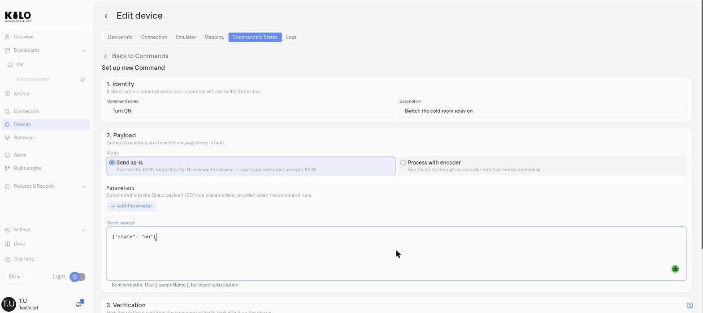<figcaption></figcaption></figure>

This is the headline of 3.5.0, and it changes what the platform *does*. Until now the Kilo IoT Server was a one-way data pipe: telemetry flowed in, and acting on it meant leaving the platform for a vendor app, a hand-built MQTT publisher, or a technician with a laptop. Device Commands closes that loop. A device's new **Commands & States** tab turns "control this device" into a modeled, reusable, auditable surface.

**Define once, run anywhere.** A command is a named action with typed parameters — a brightness level, a setpoint, an open/close. Operators run it without ever seeing the raw payload, byte layout, or topic. The same command concept delivers an **MQTT** downlink to a smart plug and a **LoRaWAN** downlink to a Class C controller; the platform handles the encoding for each.

**Closed-loop, with a full record.** Typed parameters keep inputs inside safe ranges. Optional verification confirms the device *actually acted* — not just that the message left the building. And every dispatch is recorded with its outcome — Pending, Confirmed, Soft warning, or Failed — giving operations and compliance a complete who-changed-what-and-when. Available for MQTT devices and **Class C** LoRaWAN devices (which listen continuously, so they're always ready to receive). A device becomes controllable the moment it has one command defined — which is also what makes it selectable for a Control widget.

[→ Device Commands](../kilo-iot-server/devices/commands/README.md)

***

**Control widgets — operate devices from the dashboard**

<figure>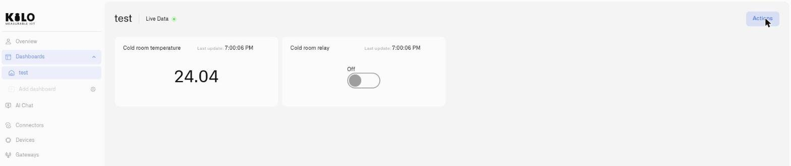<figcaption></figcaption></figure>

If Device Commands is the engine, the Control widget is the control surface — and it isn't one widget, it's a **family of six**. Each binds to a device command and reflects the device's live state, so an operator can change a device right beside the readings that say whether they need to. When a device is offline or a binding is incomplete, the control greys out instead of sending into the void.

| Control type | Best for | Sends |
| --- | --- | --- |
| [Switch](../kilo-iot-server/dashboards/adding-widgets/control-widget/switch.md) | A persistent two-state condition (on/off, open/closed) | An on or off command as you toggle |
| [Button](../kilo-iot-server/dashboards/adding-widgets/control-widget/button.md) | A one-shot action (reset, open, start) | A single command per press |
| [Simple Slider](../kilo-iot-server/dashboards/adding-widgets/control-widget/slider-simple.md) | A numeric value on a horizontal track | A command parameter as you slide |
| [Circular Slider](../kilo-iot-server/dashboards/adding-widgets/control-widget/slider-circular.md) | A numeric value on a radial dial | A command parameter as you turn the dial |
| [Vertical Slider](../kilo-iot-server/dashboards/adding-widgets/control-widget/slider-vertical.md) | A numeric value on an upright track | A command parameter as you slide |
| [Input](../kilo-iot-server/dashboards/adding-widgets/control-widget/input.md) | An exact typed value | A command parameter when you press **Apply** |

[→ Control widget overview](../kilo-iot-server/dashboards/adding-widgets/control-widget.md)

***

**Text and Radial Gauge widgets**

<figure>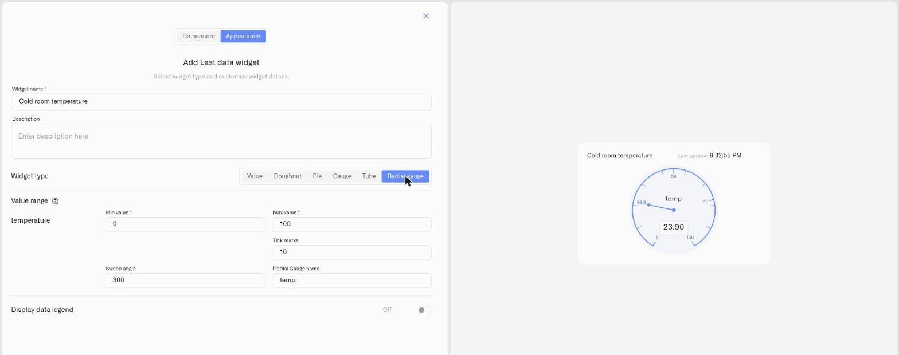<figcaption></figcaption></figure>

Two more dashboard building blocks land alongside the controls. The **Text widget** drops headings and notes onto a board, so a dense NOC-style screen reads as organized sections instead of an undifferentiated grid of tiles. And the **Radial Gauge** joins the Last Data widget as its sixth display type — a circular instrument dial with a configurable sweep angle and your conditions drawn as colored arcs, ideal for a headline reading like a tank level or load percentage.

[→ Text widget](../kilo-iot-server/dashboards/adding-widgets/text-widget.md) · [→ Radial Gauge display](../kilo-iot-server/dashboards/adding-widgets/last-data-widget/radial-gauge.md)

***

**Step-through rule debugging**

Automation you can trust means seeing exactly what a rule does before it runs for real. The visual rule editor now includes an interactive debugger: feed a rule a test payload and walk its execution one node at a time, pausing on breakpoints, watching variables change, and evaluating each CEL expression as it fires. A debug toolbar drives the session — step into, step over, run, run past breakpoints, and stop — so you can prove a rule behaves before deploying it.

[→ Debugging Rules](../kilo-iot-server/rules-engine/debugging-rules.md)

***

**Simplified plan upgrades**

Moving to a paid plan is now a single step: choose a tier and **Upgrade Plan** takes you straight to secure checkout, with no extra confirmation screens in between. Plan limits apply by default.

[→ Subscription](../kilo-iot-server/settings/subscription.md)

</details>

<details>

<summary>Scale Log. Releases 3.2.0, 3.3.0, 3.4.0</summary>

<figure>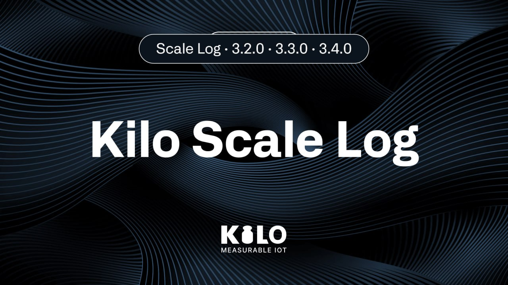<figcaption></figcaption></figure>

Kilo IoT Server 3.4.0 is the release the major-version jump from 3.1 to 3.4 exists for, and it lands with the feature the whole platform has been building toward: the **Digital Building Twin** — a live IoT digital twin of your real-world property. Bind any sensor in your deployment to any object on a 3D scale model — a parking bay in the lot, a boom barrier at the entrance, an entrance gate, a dumpster on the loading dock, a smoke detector in the server room, an AC unit on the roof, a water tank in the basement — and the scene recolors live as readings flow. Smart-parking lots, perimeter security, waste management, multi-floor building interiors: one model, one set of sensor bindings, one spatial surface to operate from. Draw the property in 2D and 3D, or trace its outline onto an aerial map and anchor everything to its real GPS coordinates. Alongside the Digital Building Twin, dashboard authors gain two new single-value visualisations for the Last Data widget — Tube and Gauge. 3.2.0 and 3.3.0 shipped along the way as small maintenance releases; their notes are folded into this entry. [kiloiot.io](https://kiloiot.io)

***

#### What's in This Release

* **Digital Building Twin** — Bind any sensor in your deployment to any object on a live 3D model of your real-world property, and watch the scene recolor as readings flow. Smart-parking bays, boom barriers, entrance gates, dumpsters, AC units, smoke detectors, water tanks, desks — anything in the 60+ object catalog. Multi-floor buildings and outdoor lots in one scene; draw in 2D and 3D, or trace from an aerial map; the whole property anchored to real GPS coordinates.
* **Tube Widget** — New display type for the Last Data widget — a vertical filled tube with configurable tick marks and conditional coloring
* **Gauge Widget** — New display type for the Last Data widget — a horizontal track gauge with condition bands, a position marker, and metric icons
* **Connectors sidebar access fix** — The Connectors entry no longer appears in the sidebar for users without permission on the resource
* **Overview surfaces alarm activity** — The Overview page now lists active alarms and links directly to the Alarm application
* **Transport layer reliability** — Fail-fast schema readiness and rolling-restart-safe session handling on the data-ingestion transport

***

**Digital Building Twin**

<figure>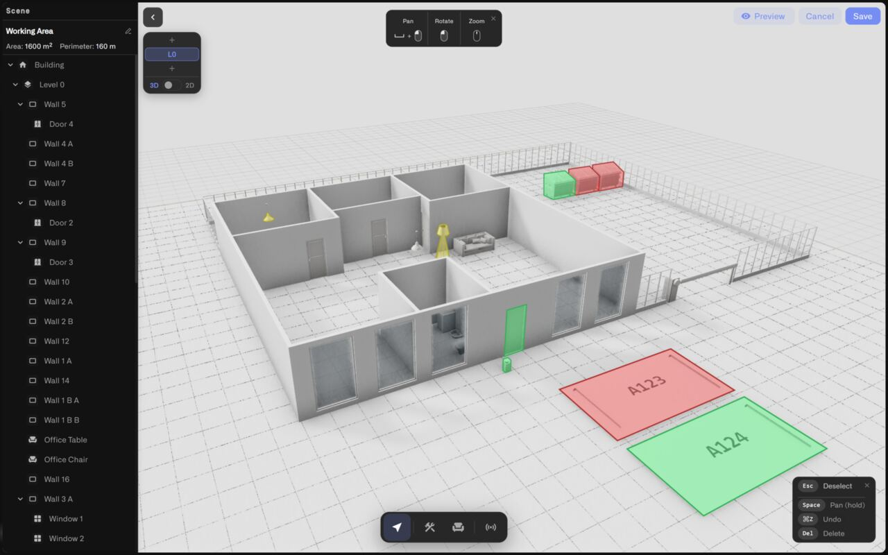<figcaption></figcaption></figure>

The Digital Building Twin is Kilo's live IoT digital twin of a real-world property. Sensors from your deployment bind directly to the objects on a 3D scale model — a warehouse, an office floor, a parking lot, a retail site, a server room, a residential block, an industrial yard — and the scene recolors as readings flow in. Open a dashboard, add the Digital Building Twin widget, switch to edit mode, and start drawing — there's no separate CAD program, no external 3D engine, no plugin install.

**Bind any sensor to any real-world object**

This is the centerpiece. Every scene element — a parking bay marked off in the lot, a boom barrier at the entrance, an entrance gate, a public dumpster on the loading dock, a smoke detector mounted to a ceiling, an AC unit on the roof, a water tank in a basement, a desk on a floor, a wall of a room, an entire floor — can be bound to an IoT sensor from your deployment. Open the Sensors panel, pick a data source, select the sensor metric, then point-and-click the scene element(s) that sensor governs.

Bindings are many-to-many in spirit. One sensor can color a parking spot AND its label. One desk can carry an occupancy binding AND a temperature binding. One dumpster can show its fill level on the body and its lid-open state on the label. There is no artificial restriction on which node types accept a binding — bind a sensor to a room by binding it to that room's walls or floor zone, bind a sensor to a vehicle by binding it to the parked car model, bind a sensor to a piece of equipment by binding it to the catalog item that represents it.

**Conditional coloring driven by live values**

Every binding carries a set of **condition rules** — the same condition model used by the Last Data, Chart, and Image widgets:

* **Number ranges** — color when the value falls in a range (e.g. 0–25 = green, 25–28 = amber, 28+ = red on a room temperature sensor; or 0–60% = green, 60–85% = amber, 85+% = red on a dumpster fill sensor)
* **String match** — color when the value equals an exact string (e.g. `occupied` = red, `vacant` = green on a parking sensor; `raised` = green, `lowered` = red on a boom barrier)
* **Boolean** — color when the value is true or false (e.g. gate open = red, gate closed = green)

Conditions are priority-ordered: the first matching rule wins. A default color applies when no condition matches. As live values flow in, the model recolors in real time — operators see facility state at a glance: every red parking spot is occupied, every amber dumpster is filling up, every red boom barrier is down, every green desk is free, every amber AC unit is running outside its setpoint.

**Live values overlaid in the scene**

Sensors can also be **pinned** to a specific point in the scene — a drop-pin marker that renders the binding's current value as a label, anchored to whichever floor the pin was placed on. Markers can be toggled globally for clean screenshots and toggled back for operations.

**Build the model two ways**

There are two entry paths into a property model, and they compose freely:

* **Draw from scratch in 2D or 3D** — Start with an empty site and place walls, doors, windows, fences, and structural elements. The editor exposes both a 2D floor-plan view and a 3D walk-through view of the same scene, so you can sketch the geometry top-down and then verify it in three dimensions. Undo, redo, and a scene tree give you full editorial control.
* **Trace from the real-world map** — Open the GPS map-trace dialog and sketch a building outline directly onto an aerial map. The editor converts the traced outline into walls and anchors the building to the GPS coordinates of the trace, so the model sits on the planet exactly where the physical property does.

A scene can carry **multiple floors**, switched via the Level selector — a multi-storey warehouse, an office tower, an underground car park stacked beneath a building, or a layered facility is one model with one set of bindings spread across floors.

**A library of 60+ objects, indoor and outdoor**

The editor ships with a built-in catalog of more than 60 ready-to-place 3D objects. The outdoor and infrastructure items are central to the IoT use cases — parking spots, traffic barriers, boom barriers, gates, public trash bins and dumpsters, AC condensers (residential and rooftop), water-softener tanks, vehicles — and the interior items make per-room and per-zone bindings expressive: smoke detectors, AC units, water boilers, water heaters, water pumps and pump stations, ceiling and floor lamps, desks, chairs, sofas, beds, kitchen and bathroom fixtures, plants and decor.

Full catalog at a glance:

* **Furniture** — sofas, armchairs, dining and office chairs, coffee and dining tables, office tables, beds (single, double, bunk), bookshelves, dressers, closets, wall shelves, columns, carpets, plants, trash bins
* **Kitchen** — stove, fridge, counter, microwave
* **Bathroom** — toilet, bathtub, sinks (vessel and wall-mount), faucets
* **Appliance** — ceiling lamps, floor and table lamps, TVs, computers, washing machines, AC units, smoke detectors, water boilers, gas water heaters, water pumps and pump stations, water-softener tanks
* **Outdoor** — fir trees and bushes, patio umbrellas, **parking spots**, vehicles, AC condensers (residential and rooftop), traffic barriers, gates, public trash bins and dumpsters

Each object is a measured, properly-scaled 3D model. Many attach to walls or ceilings automatically. Drag from the catalog strip, drop onto the scene, position with the placement tool.

**GPS anchoring — the spatial base**

Buildings can be anchored to GPS coordinates by tracing them on the real-world map at build time, and individual scene points can be anchored to a lat/lng manually from the bindings panel. Together, these anchors create the spatial base for location-aware IoT workflows.

**What this unlocks**

A short tour through the kinds of deployments the Digital Building Twin is built for:

* **Smart-parking visibility** — Bind occupancy sensors to individual parking bays in the lot; a glance at the model tells you which bays are taken (red) and which are free (green). Bind the entrance boom barrier's state sensor to the barrier model so its current position colors the same scene.
* **Perimeter and access monitoring** — Bind open/closed sensors to entrance gates, boom barriers, and doors to see the perimeter state across an entire facility from one surface.
* **Waste-container fill tracking** — Bind fill-level sensors to dumpsters and public bins placed on the site map; conditional coloring takes each container from green (empty) through amber (filling) to red (ready for pickup).
* **Building-interior conditions** — Bind temperature, humidity, CO₂, and air-quality sensors to rooms, floors, and AC units to see which zones are inside spec and which need attention. Smoke detectors and water-leak sensors light up the moment they trip.
* **Critical-asset state** — Bind level sensors to the water tanks, boilers, and softener tanks already in the catalog so the tank model itself reads as a level indicator at facility scale.

The Digital Building Twin shows you what's happening across the property. The rules engine reacts to the same sensor stream when an action is needed — both work against the same bindings.

**Where to find it**

Add a Digital Building Twin to any dashboard via the standard Add Widget flow, then open the widget's editor to draw, populate, and bind. Like every other widget, it lives in the dashboard's folder hierarchy, follows organization-level sharing and ABAC permissions, and resizes on the dashboard grid.

[→ Digital Building Twin](../kilo-iot-server/dashboards/adding-widgets/digital-building-twin/README.md)

***

**Tube Widget**

The Last Data widget gains a **Tube** display type — a vertical filled-tube visualisation that maps the current metric value against a configured range. It suits any reading an operator can picture as a level, whether the value filling up or draining down is what matters — storage-tank levels, fuel reserves, water cisterns, pressure indicators, and beyond.

Tube widgets carry the same configuration surface as the rest of the Last Data widget family: multiple data sources per tile, per-metric conditional coloring, custom units, configurable tick-mark density, and an optional legend. Color conditions are priority-ordered — the first matching rule determines the fill color.

[→ Last Data Widget](../kilo-iot-server/dashboards/adding-widgets/last-data-widget.md)

***

**Gauge Widget**

A second new Last Data display type — **Gauge** — renders the current value on a horizontal track, with each condition shown as a color-coded band and a marker that slides to the live reading. Each metric carries an icon that appears alongside the gauge for at-a-glance identification.

Gauges fit single-value dashboards where the threshold matters as much as the reading — temperature ranges in cold storage, RPM bands on industrial equipment, battery levels on field assets, capacity utilisation on connected machinery, and signal-strength indicators for remote installations.

Tube and Gauge are added to the same widget-type selector that previously offered Number, Doughnut, and Pie — choose them from the standard Last Data widget configuration flow.

[→ Last Data Widget](../kilo-iot-server/dashboards/adding-widgets/last-data-widget.md)

***

**Connectors Sidebar Access Fix**

A correctness fix in the access-control rules governing the management console: users without permission on the Connectors resource no longer see the Connectors entry in the sidebar. Visibility of the entry now matches the underlying authorization decision — consistent with every other ABAC-gated page in the platform.

[→ Users and Permissions](../kilo-iot-server/account/users-and-permissions.md)

***

**Overview Surfaces Alarm Activity**

The Overview page receives a dedicated alarm panel that lists active alarms in the current organization and links directly into the Alarm application. Operators no longer need to leave the landing surface to triage incoming alerts — the most-active items are surfaced on entry to the platform.

[→ Inbox and Resolution](../kilo-iot-server/alarm/inbox-and-resolution.md)

***

**Transport Layer Reliability**

Two targeted hardening changes to the data-ingestion transport:

* **Fail-fast schema readiness** — The transport no longer starts in a degraded state when its persistence schema is unavailable at boot. Schema-readiness errors are now surfaced as fast-fail startup errors with the original cause logged, preventing silent failures that previously produced opaque downstream errors at runtime.
* **Rolling-restart safety** — Each transport instance now claims a unique session identity on the messaging broker and explicitly clears its prior session on connect. Rolling restarts of the broker — and rolling redeploys of the transport itself — proceed without stuck subscriptions or duplicate-client rejections.

Together these changes remove a class of incidents where downstream services were unable to look up device connectivity state because the transport had started in a degraded mode without surfacing the cause.

</details>

<details>

<summary>Scale Log. Release 3.1.0</summary>

<figure><figcaption></figcaption></figure>

Kilo IoT Server 3.1.0 extends the platform's connectivity model with External MQTT support, completing the connector framework's first expansion since 3.0.0. Programmatic access is now available through an API key system with granular scope control, rotation, and revocation. The subscription tier structure has been restructured and repriced across the full range — from the free evaluation tier to the Max plan. Alarm management receives targeted precision improvements: one-time notification semantics, mandatory escalation recipient validation, and last-trigger visibility for operational triage. [kiloiot.io](https://kiloiot.io)

***

#### What's in This Release

* **MQTT Connector** — External MQTT broker support added to the connectivity framework; connect any MQTT-publishing device or system without a LoRaWAN gateway
* **Map Widget** — New dashboard widget that plots a tracker's current position on an interactive map and displays the current value of any selected metric the device transmits; includes live view and historical route playback
* **API Keys** — Scoped programmatic access with key lifecycle management: create, rotate, and revoke credentials for backend integrations
* **Subscription Plan Restructure** — Revised tier names, pricing, and limits across all plans with a new Individual tier for custom deployments
* **Alarm System Precision** — One-time notification mode, mandatory recipient validation in escalation chains, and last-trigger timestamps in the alarm definitions table

***

**MQTT Connector**

<figure>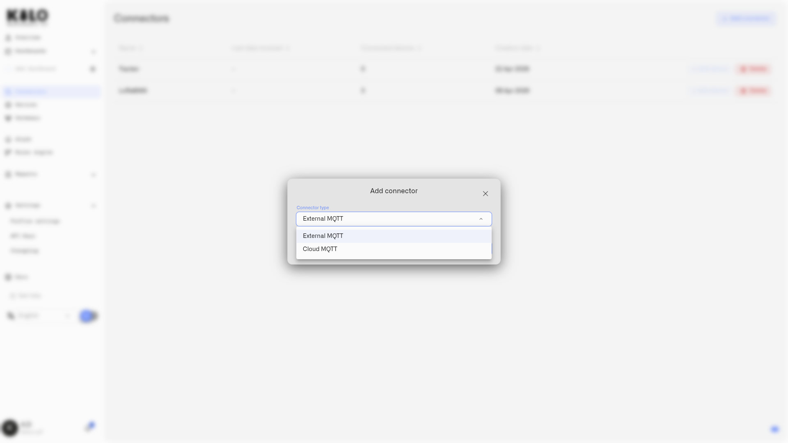<figcaption></figcaption></figure>

Kilo IoT 3.1.0 adds External MQTT as the third connector type in the platform's modular connectivity framework, alongside LoRaWAN and Vehicle Tracker.

**Architecture**

The MQTT connector follows the same three-level model established in 3.0.0: **Connector** (protocol type) → **Connection** (organization-scoped instance with broker credentials) → **Device** (registered through the connection with per-device topic routing). Connection-level configuration holds broker credentials and authentication. Topic routing, payload mapping, and metric binding are configured per device — the same normalized measurement pipeline applies regardless of connector type.

**External MQTT Support**

Operators connect the server to any MQTT broker they operate or control. Supported broker URL schemes: `mqtt://`, `mqtts://`, `tcp://`, `ssl://`. Authentication options:

* **Anonymous** — No credentials required
* **Username / Password** — Standard MQTT credential pair
* **TLS / Certificate** — Mutual TLS with CA certificate, client certificate, and client key (PEM-encoded)
* **Token** — JWT-style token authentication

Sensitive fields — passwords, tokens, certificates — are encrypted at rest. GET and LIST responses mask these fields. Authentication credentials are never re-exposed after initial creation.

**Per-Device Topic Routing**

Topic routing is configured per device rather than per connection. The routing model supports two device identification strategies:

* **Topic-based identification** — The device identifier is extracted from a positional segment in the MQTT topic using a `{{deviceId}}` placeholder. Example: `factory/sensors/{{deviceId}}/data`
* **Payload-based identification** — The device identifier is extracted from a JSON field in the message body, specified by path

Telemetry topics support an additional `{{value}}` placeholder for single-value extraction from topic segments. When no telemetry topics are configured, the server parses the full JSON payload using flattened key paths — compatible with standard automation bridge formats that publish flat JSON device payloads.

**Operational Impact**

The MQTT connector eliminates the requirement for LoRaWAN infrastructure when connecting IP-native devices. Building management systems, industrial PLCs, energy meters, and any device already publishing to an MQTT broker can be onboarded without protocol conversion or gateway deployment. The same Digital Twin model, payload normalization pipeline, and sensor template library that governs LoRaWAN devices applies to MQTT devices without modification.

***

**API Keys**

Kilo IoT 3.1.0 introduces a production-grade API key system enabling controlled programmatic access to the server's data and management APIs.

**Scope-Based Access Control**

Each API key carries an explicit permission set selected at creation. Scopes follow a resource-action model and cover the full operational surface of the platform: connections, dashboards, devices, events, logs, organizations, rules, sensors, and users — each with independent read and write grants. Integration systems receive precisely the access they require with no implicit elevation.

**Key Lifecycle**

API keys follow a three-state lifecycle:

* **Active** — Key is valid and authenticates requests
* **Rotated** — A replacement key has been issued; this key no longer authenticates
* **Revoked** — Key is permanently disabled; remains visible in the table for audit continuity

**Rotation** generates a new key and immediately invalidates the predecessor. The new key is displayed once at rotation and never again — consistent with the creation UX. Rotated keys appear in the table with their historical metadata intact.

**Revocation** permanently disables a key. Revoked keys remain in the table — deletion is not supported, preserving the audit record of every key ever issued for the organization.

**Key Display Policy**

The full key value is displayed exactly once: immediately after creation and immediately after rotation. After the dialog is closed, only the key prefix is retained in the interface. This is enforced at the API level — the server does not store or return the full key value after initial issuance.

**Operational Table**

The API keys table surfaces the operational state of every key: name, prefix, active scopes, lifecycle status, creation date, configured expiry, and last-authenticated timestamp. Default sort order is newest first.

***

**Subscription Plan Restructure**

Kilo IoT 3.1.0 introduces a revised subscription tier structure with updated names, pricing, and a new Individual tier for deployments that exceed the fixed plan parameters.

**Kilo IoT Server Plans**

| Tier | Monthly Price |
|---|---|
| Free | — |
| Starter | €25 |
| Pro | €145 |
| Business | €379 |
| Max | €659 |
| Individual | Custom — contact sales |

The Individual tier replaces the prior Enterprise designation. Organizations with requirements that exceed the Max plan parameters — device count, rule limits, retention period, or support terms — engage directly with the sales team for a scoped agreement.

Plan changes take effect through Stripe-integrated billing. Upgrades are processed immediately. Subscribers on annual terms retain their billing cycle on plan change.

***

**Map Widget**

<figure>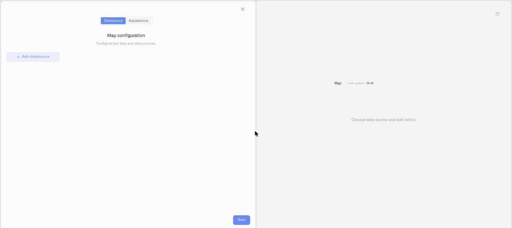<figcaption></figcaption></figure>

<figure><figcaption></figcaption></figure>

Kilo IoT 3.1.0 introduces the Map widget as a native dashboard widget type, extending the platform's visualization layer beyond static charts and numeric displays to location-aware, geospatial monitoring.

**Tracker Data on the Dashboard**

The Map widget connects to any tracker-type device registered on the platform and renders its position as a live marker on an interactive map. Unlike the device detail map view, which is scoped to a single device page, the Map widget is a configurable dashboard tile — it participates in the same folder hierarchy, sharing model, and layout system as every other dashboard widget. A single dashboard can carry multiple Map widgets, each tracking a different asset.

**Selected Metric Display**

Location alone is insufficient for operational monitoring. The Map widget resolves this by surfacing selected device metrics alongside the position marker. When configuring the widget, operators select which fields transmitted by the tracker to display — speed, battery level, temperature, signal quality, fuel level, or any mapped metric the device sends. The selected metric's current value appears on the marker, with color derived from the metric's configured conditions. A green marker at 42 km/h and a red marker at 0 km/h with engine running signal operationally different states at a glance.

**Configuration**

The widget is configured through the standard two-tab panel:

* **Datasource tab** — Select the tracker device. The widget identifies the device's latitude and longitude metrics. Select additional fields transmitted by the tracker to display alongside location.
* **Appearance tab** — Assign a name, description, map theme (Light or Dark), and toggle the data legend.

**Historical Route Mode**

The Map widget supports a date-range history mode accessible from the widget's menu. Selecting a date range queries the device's recorded position history for that period and renders the route as a line connecting sequential GPS points. The map auto-fits to the route extent. Operators can inspect a delivery route, verify a field technician's site coverage, or reconstruct the movement history of any tracked asset without leaving the dashboard. Clearing the date range returns the widget to live tracking mode.

***

**Alarm System Precision**

Kilo IoT 3.1.0 delivers targeted improvements to alarm definition authoring, escalation chain validation, and operational triage visibility.

**One-Time Notification Mode**

Alarm definitions support a one-time delivery option: a single notification is dispatched when the alarm condition becomes active, with no repeat until the alarm resolves and re-triggers. The form surface makes the behavior explicit — when one-time mode is enabled, the form displays the active repeat policy for the selected severity level alongside the override control. Operators see the platform default and the override in the same view, eliminating ambiguity about which cadence governs the alarm.

**Mandatory Escalation Recipients**

The Notify field in each escalation step is now enforced as a required field. Alarm definitions cannot be saved with an escalation step that has no recipients configured. This prevents misconfigured alarms from entering the active rule set with silent escalation chains.

**Last Trigger Visibility**

The alarm definitions table now exposes a Last Trigger timestamp column — the most recent timestamp at which that alarm definition fired. Operations teams can assess alarm activity across the full definition inventory without navigating into individual alarm event history. High-frequency or unexpectedly silent alarms are immediately identifiable from the definitions list.

</details>

<details>

<summary>Scale Log. Release 3.0.0</summary>

<figure><figcaption></figcaption></figure>

Kilo IoT Server 3.0.0 delivers a ground-up rearchitecture of the platform's core infrastructure. The connectivity layer has been replaced with a modular framework that abstracts protocol handling into pluggable connector types. Device management now operates on a Digital Twin model with inline payload normalization — eliminating the need for manual onboarding of new device types. A BPMN-based automation engine provides enterprise-grade rule authoring with full version control, validated builds, and zero-downtime deployment. Operational alerting supports five severity tiers with multi-step escalation policies delivered across email, SMS, and native mobile push notifications. Dashboard widgets are now fully operator-configurable with per-metric conditional formatting. Multi-tenant access control is enforced through ABAC with complete audit logging. [kiloiot.io](https://kiloiot.io)

***

#### What's in This Release

* **Modular Connectivity Framework** — Pluggable protocol adapters with LoRaWAN and OBD2/CAN vehicle tracker support at launch
* **Device Lifecycle and Data Normalization** — Digital Twin device model with inline payload mapping and sensor template libraries
* **Visualization and Monitoring** — Operator-configurable widgets with threshold-driven formatting and a new facility Image Widget
* **Production Automation Engine** — BPMN workflow designer with CEL expressions, artifact versioning, and managed deployment
* **Operational Alerting and Escalation** — Severity-based alarm routing with escalation chains and mobile push delivery
* **Multi-Tenant Governance and Compliance** — Organization isolation with Attribute-Based Access Control and immutable audit logs

***

**Modular Connectivity Framework**

Kilo IoT 3.0.0 replaces protocol-specific device onboarding with a unified connectivity model. Every protocol integration is now encapsulated as a Connector — a modular adapter that defines how a particular class of devices communicates with the server.

**Architecture**

The framework operates at three levels: **Connector** (protocol definition) → **Connection** (organization-scoped instance with credentials and configuration) → **Device** (registered through the connection and bound to the server's data pipeline). Adding support for a new protocol no longer requires platform-level engineering — it requires a new connector type.

**Available Connectors**

* **LoRaWAN (Integrated LNS)** — Kilo IoT includes an integrated LoRaWAN Network Server that handles device activation, uplink and downlink routing, deduplication, and key management. No external LNS infrastructure is required.
* **Vehicle Tracker (OBD2/CAN)** — Purpose-built for fleet and asset monitoring hardware. Over 2,000 vehicle tracker models are preconfigured. Registration generates a dedicated ingestion endpoint per device.

Connections are organization-scoped with protocol-specific configuration. LoRaWAN connections require device EUI, application key, frequency band, and device class. Tracker connections require device identifier, phone number, and hardware model.

**Scalability Impact**

Under the previous architecture, each new protocol demanded cross-cutting changes to the server's ingestion pipeline. The connector model decouples protocol handling from the core data path. New device protocols are introduced as connector definitions — a configuration record and an optional management interface — without modifying the platform's transport or normalization layers.

***

**Device Lifecycle and Data Normalization**

Every device registered on Kilo IoT Server is represented as a Digital Twin — a persistent, composite model that captures the device's identity, physical binding, sensor configuration, measurement history, and operational metadata. The deliberate separation of the logical device model from physical hardware binding lays the groundwork for device emulation — enabling teams to architect and validate a complete deployment using emulated devices before commissioning physical hardware incrementally.

**Structured Device Management**

Device configuration follows a four-stage workflow:

1. **Identity** — Assign a name and attach reference photography for field identification during maintenance or commissioning.
2. **Connection Binding** — Associate the device with a connector. Specify protocol credentials: EUI and application key for LoRaWAN devices, or device identifier and model for vehicle trackers.
3. **Metric Configuration** — Select sensor templates and map raw payload fields to normalized measurement parameters. The platform surfaces the live device payload — every field name, current value, and last transmission timestamp — directly in the configuration interface.
4. **Event History** — Access the complete raw telemetry stream with date range filtering for diagnostics and commissioning verification.

**Inline Payload Normalization**

This capability eliminates a critical operational bottleneck. In previous releases, integrating a device from an unsupported manufacturer required a support request to create database-level field mappings. Prototype hardware and devices in active development could not be onboarded at all.

Kilo IoT 3.0.0 exposes the raw ingestion payload in the metric configuration interface. Operators see every field the device transmits and map each one to a sensor template through a structured selection workflow:

1. Select a sensor template from the organization's library (e.g. "Ambient Temperature", unit: °C, value type: FLOAT)
2. Bind the template to the raw payload field (e.g. map field `"t"` to Ambient Temperature)
3. The mapping takes effect immediately — normalized data propagates to dashboards, automation rules, alarm evaluations, and historical queries

The capability extends to any hardware the server can receive data from — including devices in pre-production validation where payload schemas are still evolving, industrial sensors from niche manufacturers with undocumented telemetry formats, and legacy field equipment that transmits encoded identifiers rather than descriptive field names.

**Normalization Architecture**

The normalization pipeline is structured as a four-level hierarchy. At the top, **Normalized Keys** represent the measurement domain — what is being measured (e.g. "Ambient Temperature", "Supply Voltage"). **Sensor Templates** bind each key to engineering units, value constraints, and data classification. **Sensors** instantiate templates on specific devices, enabling per-device configuration. **Sensor Mappings** resolve the final link between a sensor instance and the raw field name in the device payload. This taxonomy is defined at the organization level and enforced consistently across every device in the deployment — independent of hardware vendor or firmware revision.

**Additional Capabilities**

* Sensor template libraries with standardized keys and units — define once, apply across every deployment
* Inline payload mapping — no support tickets, no deployment-blocking dependencies
* Hardware binding and rebinding — replace physical devices without losing configuration or telemetry history
* Device photography — attach reference images for field teams and asset management
* Operator metadata — add deployment-specific attributes for filtering, grouping, and reporting
* Bookmarked devices — pin frequently accessed devices for rapid navigation

***

**Visualization and Monitoring**

Kilo IoT 3.0.0 delivers a fully operator-configurable dashboard system. Organize monitoring views into folder hierarchies — by site, building, department, or any operational taxonomy. Every widget supports multiple data sources, custom metric selection, and conditional visual formatting driven by operator-defined rules.

**Threshold-Driven Conditional Formatting**

Widgets no longer present data with static styling. Operators define per-metric display conditions that adapt to operational context. The same temperature sensor can drive different visual indicators depending on where it is deployed:

* In a warehouse receiving area: 20°C renders with a standard indicator (within specification)
* In a cold storage unit: 20°C renders with a critical indicator (compliance violation)

Conditions support numeric ranges, string matching, and boolean evaluation. Multiple conditions per metric are evaluated in priority order — the first match determines the visual state. Operators configure custom units, iconography, and color assignments per metric.

**Facility Image Widget (New)**

Deploy a site floor plan or facility layout as an interactive monitoring surface. Position sensor indicators at precise coordinates on the image. Each indicator displays live telemetry and applies conditional formatting in real time — providing immediate spatial awareness of operational conditions across an entire facility.

The Image Widget supports multiple layers for multi-floor buildings or segmented facilities. Switch between floors to maintain full situational awareness from a single dashboard widget.

**Real-Time Value Display**

Monitor current device readings using configurable numeric, doughnut, or pie visualizations. Aggregate multiple devices and metrics in a single widget. Conditional formatting highlights deviations from expected operating parameters.

**Historical Analysis**

Examine telemetry trends with configurable line and bar charts. Define threshold bands that color-code data regions — making it immediately visible when measurements enter warning or critical ranges. Multiple data sources with adjustable time windows support both real-time monitoring and retrospective analysis.

***

**Production Automation Engine**

Kilo IoT 3.0.0 introduces an enterprise-grade automation engine built on BPMN (Business Process Model and Notation). The engine is designed for production reliability — every rule is version-controlled, validated before deployment, and reversible without data loss.

**Visual Workflow Design**

Automation rules are composed on a BPMN-standard visual canvas. Operators construct processing flows by arranging and connecting typed nodes: start events receive sensor data, exclusive gateways evaluate branching conditions, script tasks execute transformation logic, enrichment nodes correlate data across multiple devices, alarm nodes trigger the notification pipeline, and boundary error events provide fault-tolerant exception routing.

**CEL Expression Language**

Rule conditions and transformations are authored in CEL (Common Expression Language) — a compiled, sandboxed expression language developed by Google. CEL enables operators to express complex multi-variable conditions that exceed the capabilities of simple threshold comparisons:

```
sensor.co2_ppm > 1000 && sensor.ventilation_status == "off"
sensor.cold_storage_temp > -15 || sensor.door_open_duration > 300
sensor.vibration_rms > 4.5 && time.now.hour >= 6 && time.now.hour <= 22
```

CEL evaluates deterministically with no filesystem access, no unbounded iteration, and no side effects. Technical reference: [cel.dev](https://cel.dev).

**Concurrent Editing Protection**

The platform enforces exclusive edit locks on active rules. Team members see the current lock holder and lock duration. Session timeout triggers an automatic save before lock release. Organization administrators can force-release locks when operational urgency demands it — forced releases preserve all pending changes.

**Continuous Auto-Save**

Rule state is persisted automatically at configurable intervals, on editor close, and before session expiration. Manual save is available at any time. A persistent status indicator displays the current save state — in progress, confirmed, or error — ensuring operators always know whether their work is persisted.

**Version Control and Rollback**

Every save operation produces a discrete version entry. Operators can label versions, compare any two revisions, and restore a previous version with a single action. Version restoration is non-destructive — the superseded version is preserved in the history timeline.

**Validated Build and Deployment Pipeline**

Rules are compiled into versioned deployment artifacts through a build step that performs structural validation — verifying flow completeness, expression correctness, and connection integrity. Failed validation prevents artifact creation. Validated artifacts deploy to the runtime with a single action. Running rules can be stopped immediately. Previous builds remain available for instant rollback.

**Soft-Delete Recovery**

Deleted rules are retained in a recovery queue with configurable retention. Any rule can be restored to active status before the retention window expires.

***

**Operational Alerting and Escalation**

Kilo IoT 3.0.0 delivers a structured alert management system that routes notifications through configurable escalation chains with multi-channel delivery.

**Mobile Notification Delivery**

Native mobile applications for Android and iOS enable field personnel and on-call engineers to receive push notifications directly on their devices. Critical operational alerts reach the responsible team without requiring access to a workstation.

**Centralized Alert Console**

All active and historical alerts are consolidated in a unified inbox, sorted by severity. Each alert links directly to the originating automation rule. Operators acknowledge and resolve alerts from the console to maintain operational accountability.

**Severity-Based Classification**

Alert definitions support five severity tiers — Critical, High, Medium, Low, and Info — each governing escalation behavior and delivery urgency. Escalation policies define multi-step notification chains: specify the recipient, the delivery channel, and the delay interval before escalating to the next tier.

**Delivery Channels**

* **Email** — Detailed alert payloads delivered to operator inboxes
* **SMS** — Time-critical text notifications for on-call personnel
* **Push** — Native mobile delivery to Android and iOS devices

Channel activation requires verification — email confirmation link or SMS validation code. Notification repeat intervals are configurable per alert to prevent operator fatigue during sustained alarm conditions.

**Operational Schedules**

Weekly delivery windows with timezone awareness control when notifications are dispatched. Non-critical alerts are suppressed during designated quiet periods. Accumulated alerts are delivered when the schedule resumes, ensuring no events are silently dropped.

***

**Multi-Tenant Governance and Compliance**

Kilo IoT 3.0.0 implements a comprehensive organizational isolation model with Attribute-Based Access Control and immutable activity logging.

**Organizational Isolation**

Each user account is provisioned with a personal organization at registration. Additional organizations can be created for client deployments, project teams, or operational divisions. Every organization maintains fully isolated resources — devices, connectors, dashboards, automation rules, alarm configurations, and subscription billing exist within strict tenant boundaries.

**Attribute-Based Access Control (ABAC)**

Kilo IoT replaces traditional Role-Based Access Control with ABAC — a dynamic permission model that evaluates access decisions based on multiple contextual attributes: organizational membership, page-level authorization, resource ownership, and operator context. A system integrator can be granted edit permissions on a single client dashboard without exposing any other organizational resources. ABAC eliminates the role proliferation and permission workarounds that characterize traditional RBAC deployments.

Operators are invited to organizations with precisely scoped permissions assigned at the page and resource level.

Organization administrators configure tenant settings including display name, corporate email identity, and branding. Users with membership in multiple organizations switch between them without re-authentication.

**Immutable Audit Trail**

Every organizational membership event is recorded: invitation dispatch, user acceptance, permission modification, and user removal. The audit log supports search and filtering by actor and event category. Access to audit records is governed by a dedicated permission — only authorized operators can review organizational activity. This provides the traceability required for regulatory compliance and internal security reviews.

**Subscription Management**

* Evaluation tier — provision up to 2 devices without payment enrollment
* Plan-enforced resource limits displayed in the management interface
* Version history retention governed by subscription tier
* Stripe-integrated billing and payment processing

</details>

<details>

<summary>Scale Log. Release 2.2.1</summary>

<figure><figcaption></figcaption></figure>

### Major Changes

#### Stripe Bank Card Integration

**Features**

* Card Linking: Users can now connect their bank card through Stripe to activate free trial subscriptions
* Card Management: Users can view and manage linked cards in their Stripe account
* Card Removal: Users have the option to unlink/remove their bank card at any time

**Security**

* All payment data is processed securely through Stripe's PCI-compliant infrastructure

### &#x20;Minor Changes

#### Stripe Subscription Management Fix

**Fixed**

* Users now have only one active order after upgrading subscription plan
* Corrected order replacement logic to ensure previous subscription order is properly canceled when upgrading

**Improved**

* Enhanced subscription upgrade flow to properly transition between tariff plans
* Improved Stripe order management to ensure clean subscription changes
* Updated order lifecycle handling during tariff plan upgrades

**Technical Changes**

* Implemented proper order cancellation/replacement logic during subscription upgrades
* Added validation to prevent duplicate active orders for same user

#### Frontend Technical Debt Cleanup

**Refactored**

* Core UI components: Button, Tab, Text Field, Select, Typography
* Improved consistency and maintainability across component library

**Removed**

* Deprecated legacy components
* Unused translation keys

**Improved**

* Enhanced component reusability and type safety
* Reduced bundle size
* Cleaner component APIs

</details>

<details>

<summary>Scale Log. Release 2.2.0</summary>

<figure><figcaption></figcaption></figure>

#### **Scale Log 2.2.0 is one of the biggest releases of the year — and this Weightlog is a great way to close it out strong.**

This update introduces several major platform capabilities that move Kilo into a new phase of scalability — giving teams more reliable alerting, better dashboard organization, and stronger tools for managing multi-user deployments.

Most importantly, **KILO 2.2.0 improves the day-to-day operations of real deployments**: users can now receive critical alerts via **SMS**, organize dashboards into a **folder hierarchy**, and manage organizations with more control through ownership transfers and editable settings. These changes make Kilo more reliable in the field, easier to operate across teams, and easier to scale as deployments grow.\
\
Major Changes

***

#### Add SMS as a Notification Channel

**New Feature: SMS Notification Support**

The Notification Center now supports **SMS alerts**, enabling users to receive important notifications directly on their phone. This improves reliability for time-sensitive events and gives teams another channel when email is delayed or missed.

**SMS Notification Capabilities**

* SMS notification channel with phone verification flow
* Phone number input and verification code interface
* Toggle control for enabling/disabling SMS notifications
* Error messages for invalid or expired verification codes
* Duplicate phone number detection

**How to Use**

1. Navigate to **Notifications → Settings**
2. In the **SMS Notifications** section, click **“+ Add phone number”**
3. Enter your phone number and click **Save**
4. Enter the verification code sent to your phone
5. Toggle SMS notifications **on/off** as needed

This update enables users to receive critical alerts directly via SMS, increasing reliability and flexibility across deployments.

***

#### SMS Add-On

**New Feature: SMS Credit Purchase (Stripe)**

<figure><figcaption></figcaption></figure>

Kilo now supports purchasing SMS credits directly inside the platform. This allows teams to scale SMS alerting without additional operational overhead and makes usage predictable through a simple balance system.

<figure><figcaption></figcaption></figure>

**SMS Purchase Feature Highlights**

* **Flexible quantity selection** — choose the exact number of SMS messages to purchase
* **Transparent costing** — per-SMS price and total cost displayed before purchase
* **Secure transactions** — payments are processed via Stripe
* **Immediate confirmation** — confirmation modal appears after successful payment
* **Live balance updates** — SMS balance updates in real time

**How to Use**

1. Navigate to **Notifications → SMS Settings**
2. Select the number of SMS credits you want to purchase
3. Review the unit price and total cost
4. Complete payment via Stripe
5. View the confirmation and updated SMS balance

***

#### Subscription & Billing Updates

<figure><figcaption></figcaption></figure>

**Free Subscription Default Plan**

KILO 2.2.0 improves subscription handling so onboarding and plan upgrades are clearer and more predictable.

**Subscription Improvements**

* New users are automatically assigned the **default Free Plan** upon registration
* Free plan details are now visible in the **Billing / Subscription** area
* Users can upgrade from the free plan to a paid subscription at any time
* Upon expiration of a paid subscription, users are automatically downgraded to the free plan
* Feature limitations are applied based on the free plan after downgrade

***

#### Change Organization Settings

**Organization Management Enhancements**

<figure><figcaption></figcaption></figure>

Organization owners now have improved control over organization settings and ownership, making it easier to manage long-running deployments and team transitions.

**New Capabilities**

* **Organization name editing** directly in Organization Settings
* **Ownership transfer** to another user via the organization member list
* **Email invitation workflow** for ownership transfer acceptance
* Ownership transfer invitation expires after **1 week**
* **Re-authentication required** for the new owner during acceptance
* Upon acceptance, the new owner is granted the **Editor role** with full administrative rights
* Organization name and ownership changes must be explicitly **saved** to take effect

***

#### Dashboard Hierarchy

**Enhanced Dashboard Management and Display**

<figure><figcaption></figcaption></figure>

Change Log 2.2.0 introduces a new dashboard structure designed for users managing multiple deployments or operational views.

**Dashboard Improvements**

* Dashboards can now be organized into a **two-level hierarchy** (folder → dashboards)
* Folders are created via the **Settings** icon next to the “Add dashboard” button in the left menu
* Dashboards can be added, deleted, and modified inside the folder structure
* Reordering and restructuring dashboards is possible using the **Edit** button
* Widgets can be placed on any dashboard regardless of its folder location

This update makes it significantly easier to scale dashboard usage and keep operational views organized as deployments grow.

***

#### Minor Changes

**Admin Contacts Information**

* Permissions tooltips now display **admin contact details**, helping users quickly request access or assistance when permissions are required.

</details>

<details>

<summary>Scale Log. Release 2.0.0</summary>

<figure><figcaption></figcaption></figure>

#### Major Changes

**Custom Dashboards**

* Added the ability for users to create custom dashboards for personalized data monitoring, overview of multiple devices and parameters on one dashboard.

**Users can now:**

* Add a new dashboard.
* Delete dashboard when no longer needed.
* Add widgets to dashboards.
* Added widgets can be from different devices.
* Widgets are now draggable and customizeable.

<figure><figcaption></figcaption></figure>

**Collapsible Menu**

* Added a collapsible menu that can be reduced to a narrow strip with icons.
* Users can expand or collapse the menu using the hover arrow, freeing up more screen space for main content or custom dashboards.

<figure><figcaption></figcaption></figure>

**Device and Gateway Photo Placeholder & Direct Upload**

* Added a placeholder image for devices with no photos to indicate that a photo can be uploaded.
* Users can now upload photos directly from the device or gateway page without navigating to settings.
* Upload options available via avatar, dropdown menu, or settings.

<figure><figcaption></figcaption></figure>

#### Minor Changes

**Rule Inactive Status Email Fix**

* Fixed an issue where notifications continued to be sent after a rule was set to inactive.
* Inactive rules now correctly stop email notifications and mark notifications as resolved.

**Rule Deletion Email Fix**

* Fixed an issue where notifications continued to be sent after a rule was deleted.

**GPS Tracker URL Fix**

* The device URL now correctly links to the production environment.

**Widget Pinning Fix**

* Fixed an issue where widgets could not be pinned on device pages

**Page Access Restriction for Empty Subscriptions**

* Frontend now disables access to pages if the user has no active subscription or the subscription/data API returns empty.
* Prevents users from interacting with features that require a valid subscription.

**Non-LoRa Device Creation Fix**

* Fixed an issue where users could not add non-LoRa devices if isEnabledDevicePhoto was disabled.
* Users can now add non-LoRa devices regardless of the device photo setting.

</details>

<details>

<summary>Scale Log. Release 1.0.0</summary>

<figure>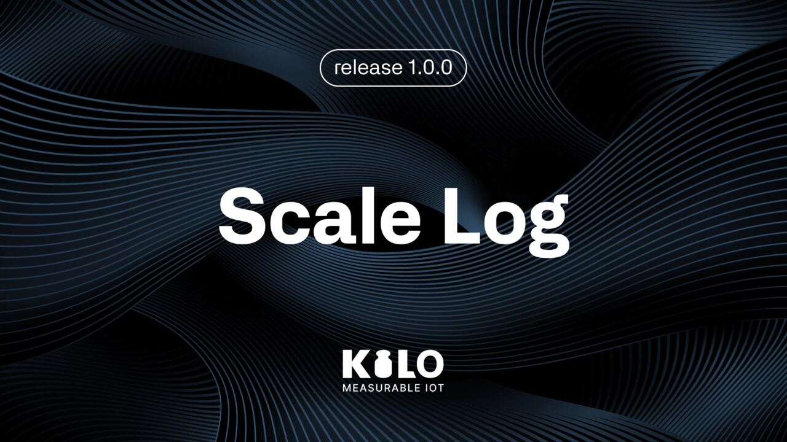<figcaption></figcaption></figure>

### Released features

**Device & Gateway Photo Uploads**

<figure><figcaption></figcaption></figure>

* Users can now upload up to 3 photos for devices and gateways (during creation or from the device/gateway page).
* Uploaded photos are visible on the device page and when creating rules.
* Added upload button with “+” icon and ability to view all photos in expanded info.
* Photos can be deleted in settings (delete icon on hover, always visible on mobile).
* Improved UX: entire device/gateway card can now be expanded or collapsed with a click.

### Minor Changes

**Notification Icon Display Fix**

* Fixed an issue where the Notification icon was not fully displayed when a user had more than 10 notifications.
* The icon now displays correctly regardless of the number of notifications.

**Gateway Submission Fix**

<figure><figcaption></figcaption></figure>

* Gateway submission now works correctly without server-side access errors.

**Error Message Fix**

* Fixed an incorrect error message when adding gateways.

</details>
