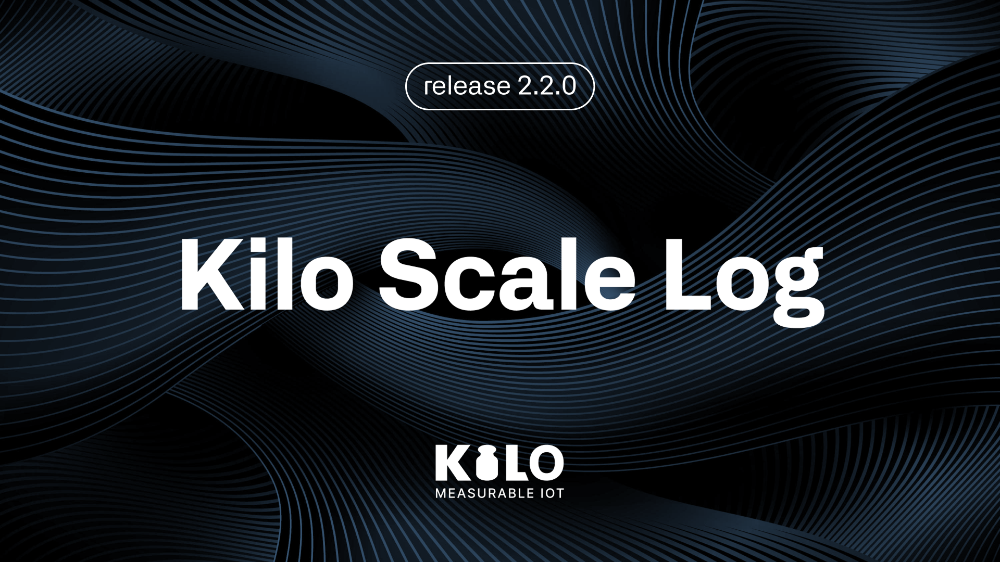
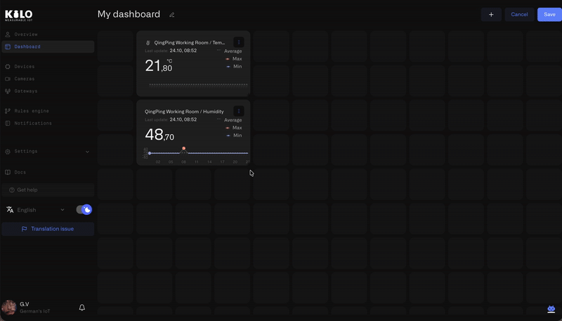
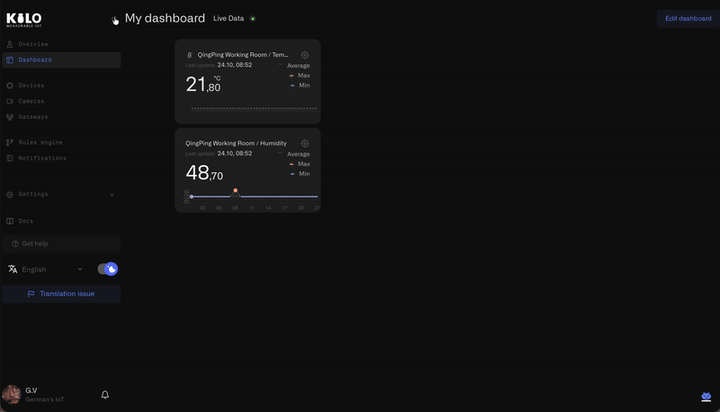
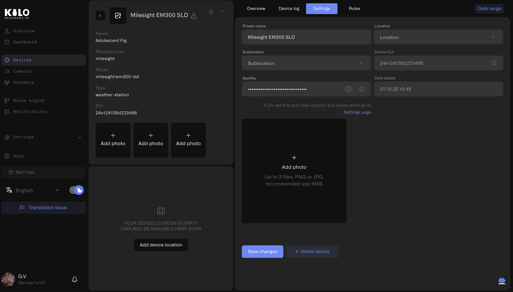
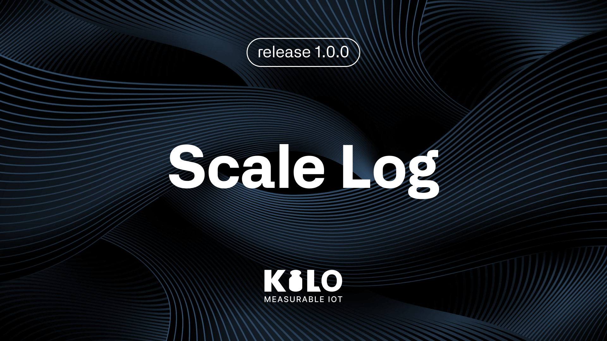
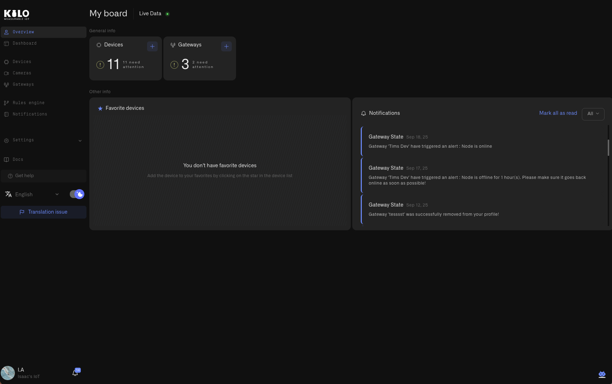

# Changelog

<details>

<summary>Scale Log. Release 3.0.0</summary>

<figure><figcaption></figcaption></figure>

Kilo IoT Server 3.0.0 delivers a ground-up rearchitecture of the platform's core infrastructure. The connectivity layer has been replaced with a modular framework that abstracts protocol handling into pluggable connector types. Device management now operates on a Digital Twin model with inline payload normalization — eliminating the need for manual onboarding of new device types. A BPMN-based automation engine provides enterprise-grade rule authoring with full version control, validated builds, and zero-downtime deployment. Operational alerting supports five severity tiers with multi-step escalation policies delivered across email, SMS, and native mobile push notifications. Dashboard widgets are now fully operator-configurable with per-metric conditional formatting. Multi-tenant access control is enforced through ABAC with complete audit logging.

***

### What's in This Release

* **Modular Connectivity Framework** — Pluggable protocol adapters with LoRaWAN and OBD2/CAN vehicle tracker support at launch
* **Device Lifecycle and Data Normalization** — Digital Twin device model with inline payload mapping and sensor template libraries
* **Visualization and Monitoring** — Operator-configurable widgets with threshold-driven formatting and a new facility Image Map
* **Production Automation Engine** — BPMN workflow designer with CEL expressions, artifact versioning, and managed deployment
* **Operational Alerting and Escalation** — Severity-based alarm routing with escalation chains and mobile push delivery
* **Multi-Tenant Governance and Compliance** — Organization isolation with Attribute-Based Access Control and immutable audit logs

***

#### Modular Connectivity Framework

Kilo IoT 3.0.0 replaces protocol-specific device onboarding with a unified connectivity model. Every protocol integration is now encapsulated as a Connector — a modular adapter that defines how a particular class of devices communicates with the server.

**Architecture**

The framework operates at three levels: **Connector** (protocol definition) → **Connection** (organization-scoped instance with credentials and configuration) → **Device** (registered through the connection and bound to the server's data pipeline). Adding support for a new protocol no longer requires platform-level engineering — it requires a new connector type.

**Available Connectors**

* **LoRaWAN (Integrated LNS)** — Kilo IoT includes an integrated LoRaWAN Network Server that handles device activation, uplink and downlink routing, deduplication, and key management. No external LNS infrastructure is required.
* **Vehicle Tracker (OBD2/CAN)** — Purpose-built for fleet and asset monitoring hardware. Over 2,000 vehicle tracker models are preconfigured. Registration generates a dedicated ingestion endpoint per device.

Connections are organization-scoped with protocol-specific configuration. LoRaWAN connections require device EUI, application key, frequency band, and device class. Tracker connections require device identifier, phone number, and hardware model.

**Scalability Impact**

Under the previous architecture, each new protocol demanded cross-cutting changes to the server's ingestion pipeline. The connector model decouples protocol handling from the core data path. New device protocols are introduced as connector definitions — a configuration record and an optional management interface — without modifying the platform's transport or normalization layers.

***

#### Device Lifecycle and Data Normalization

Every device registered on Kilo IoT Server is represented as a Digital Twin — a persistent, composite model that captures the device's identity, physical binding, sensor configuration, measurement history, and operational metadata. The deliberate separation of the logical device model from physical hardware binding lays the groundwork for device emulation — enabling teams to architect and validate a complete deployment using emulated devices before commissioning physical hardware incrementally.

**Structured Device Management**

Device configuration follows a four-stage workflow:

1. **Identity** — Assign a name and attach reference photography for field identification during maintenance or commissioning.
2. **Connection Binding** — Associate the device with a connector. Specify protocol credentials: EUI and application key for LoRaWAN devices, or device identifier and model for vehicle trackers.
3. **Metric Configuration** — Select sensor templates and map raw payload fields to normalized measurement parameters. The platform surfaces the live device payload — every field name, current value, and last transmission timestamp — directly in the configuration interface.
4. **Event History** — Access the complete raw telemetry stream with date range filtering for diagnostics and commissioning verification.

**Inline Payload Normalization**

This capability eliminates a critical operational bottleneck. In previous releases, integrating a device from an unsupported manufacturer required a support request to create database-level field mappings. Prototype hardware and devices in active development could not be onboarded at all.

Kilo IoT 3.0.0 exposes the raw ingestion payload in the metric configuration interface. Operators see every field the device transmits and map each one to a sensor template through a structured selection workflow:

1. Select a sensor template from the organization's library (e.g. "Ambient Temperature", unit: °C, value type: FLOAT)
2. Bind the template to the raw payload field (e.g. map field `"t"` to Ambient Temperature)
3. The mapping takes effect immediately — normalized data propagates to dashboards, automation rules, alarm evaluations, and historical queries

The capability extends to any hardware the server can receive data from — including devices in pre-production validation where payload schemas are still evolving, industrial sensors from niche manufacturers with undocumented telemetry formats, and legacy field equipment that transmits encoded identifiers rather than descriptive field names.

**Normalization Architecture**

The normalization pipeline is structured as a four-level hierarchy. At the top, **Normalized Keys** represent the measurement domain — what is being measured (e.g. "Ambient Temperature", "Supply Voltage"). **Sensor Templates** bind each key to engineering units, value constraints, and data classification. **Sensors** instantiate templates on specific devices, enabling per-device configuration. **Sensor Mappings** resolve the final link between a sensor instance and the raw field name in the device payload. This taxonomy is defined at the organization level and enforced consistently across every device in the deployment — independent of hardware vendor or firmware revision.

**Additional Capabilities**

* Sensor template libraries with standardized keys and units — define once, apply across every deployment
* Inline payload mapping — no support tickets, no deployment-blocking dependencies
* Hardware binding and rebinding — replace physical devices without losing configuration or telemetry history
* Device photography — attach reference images for field teams and asset management
* Operator metadata — add deployment-specific attributes for filtering, grouping, and reporting
* Bookmarked devices — pin frequently accessed devices for rapid navigation

***

#### Visualization and Monitoring

Kilo IoT 3.0.0 delivers a fully operator-configurable dashboard system. Organize monitoring views into folder hierarchies — by site, building, department, or any operational taxonomy. Every widget supports multiple data sources, custom metric selection, and conditional visual formatting driven by operator-defined rules.

**Threshold-Driven Conditional Formatting**

Widgets no longer present data with static styling. Operators define per-metric display conditions that adapt to operational context. The same temperature sensor can drive different visual indicators depending on where it is deployed:

* In a warehouse receiving area: 20°C renders with a standard indicator (within specification)
* In a cold storage unit: 20°C renders with a critical indicator (compliance violation)

Conditions support numeric ranges, string matching, and boolean evaluation. Multiple conditions per metric are evaluated in priority order — the first match determines the visual state. Operators configure custom units, iconography, and color assignments per metric.

**Facility Image Map (New)**

Deploy a site floor plan or facility layout as an interactive monitoring surface. Position sensor indicators at precise coordinates on the image. Each indicator displays live telemetry and applies conditional formatting in real time — providing immediate spatial awareness of operational conditions across an entire facility.

The Image Map supports multiple layers for multi-floor buildings or segmented facilities. Switch between floors to maintain full situational awareness from a single dashboard widget.

**Real-Time Value Display**

Monitor current device readings using configurable numeric, doughnut, or pie visualizations. Aggregate multiple devices and metrics in a single widget. Conditional formatting highlights deviations from expected operating parameters.

**Historical Analysis**

Examine telemetry trends with configurable line and bar charts. Define threshold bands that color-code data regions — making it immediately visible when measurements enter warning or critical ranges. Multiple data sources with adjustable time windows support both real-time monitoring and retrospective analysis.

***

#### Production Automation Engine

Kilo IoT 3.0.0 introduces an enterprise-grade automation engine built on BPMN (Business Process Model and Notation). The engine is designed for production reliability — every rule is version-controlled, validated before deployment, and reversible without data loss.

**Visual Workflow Design**

Automation rules are composed on a BPMN-standard visual canvas. Operators construct processing flows by arranging and connecting typed nodes: start events receive sensor data, exclusive gateways evaluate branching conditions, script tasks execute transformation logic, enrichment nodes correlate data across multiple devices, alarm nodes trigger the notification pipeline, and boundary error events provide fault-tolerant exception routing.

**CEL Expression Language**

Rule conditions and transformations are authored in CEL (Common Expression Language) — a compiled, sandboxed expression language developed by Google. CEL enables operators to express complex multi-variable conditions that exceed the capabilities of simple threshold comparisons:

```
sensor.co2_ppm > 1000 && sensor.ventilation_status == "off"
sensor.cold_storage_temp > -15 || sensor.door_open_duration > 300
sensor.vibration_rms > 4.5 && time.now.hour >= 6 && time.now.hour <= 22
```

CEL evaluates deterministically with no filesystem access, no unbounded iteration, and no side effects. Technical reference: [cel.dev](https://cel.dev).

**Concurrent Editing Protection**

The platform enforces exclusive edit locks on active rules. Team members see the current lock holder and lock duration. Session timeout triggers an automatic save before lock release. Organization administrators can force-release locks when operational urgency demands it — forced releases preserve all pending changes.

**Continuous Auto-Save**

Rule state is persisted automatically at configurable intervals, on editor close, and before session expiration. Manual save is available at any time. A persistent status indicator displays the current save state — in progress, confirmed, or error — ensuring operators always know whether their work is persisted.

**Version Control and Rollback**

Every save operation produces a discrete version entry. Operators can label versions, compare any two revisions, and restore a previous version with a single action. Version restoration is non-destructive — the superseded version is preserved in the history timeline.

**Validated Build and Deployment Pipeline**

Rules are compiled into versioned deployment artifacts through a build step that performs structural validation — verifying flow completeness, expression correctness, and connection integrity. Failed validation prevents artifact creation. Validated artifacts deploy to the runtime with a single action. Running rules can be stopped immediately. Previous builds remain available for instant rollback.

**Soft-Delete Recovery**

Deleted rules are retained in a recovery queue with configurable retention. Any rule can be restored to active status before the retention window expires.

***

#### Operational Alerting and Escalation

Kilo IoT 3.0.0 delivers a structured alert management system that routes notifications through configurable escalation chains with multi-channel delivery.

**Mobile Notification Delivery**

Native mobile applications for Android and iOS enable field personnel and on-call engineers to receive push notifications directly on their devices. Critical operational alerts reach the responsible team without requiring access to a workstation.

**Centralized Alert Console**

All active and historical alerts are consolidated in a unified inbox, sorted by severity. Each alert links directly to the originating automation rule. Operators acknowledge and resolve alerts from the console to maintain operational accountability.

**Severity-Based Classification**

Alert definitions support five severity tiers — Critical, High, Medium, Low, and Info — each governing escalation behavior and delivery urgency. Escalation policies define multi-step notification chains: specify the recipient, the delivery channel, and the delay interval before escalating to the next tier.

**Delivery Channels**

* **Email** — Detailed alert payloads delivered to operator inboxes
* **SMS** — Time-critical text notifications for on-call personnel
* **Push** — Native mobile delivery to Android and iOS devices

Channel activation requires verification — email confirmation link or SMS validation code. Notification repeat intervals are configurable per alert to prevent operator fatigue during sustained alarm conditions.

**Operational Schedules**

Weekly delivery windows with timezone awareness control when notifications are dispatched. Non-critical alerts are suppressed during designated quiet periods. Accumulated alerts are delivered when the schedule resumes, ensuring no events are silently dropped.

***

#### Multi-Tenant Governance and Compliance

Kilo IoT 3.0.0 implements a comprehensive organizational isolation model with Attribute-Based Access Control and immutable activity logging.

**Organizational Isolation**

Each user account is provisioned with a personal organization at registration. Additional organizations can be created for client deployments, project teams, or operational divisions. Every organization maintains fully isolated resources — devices, connectors, dashboards, automation rules, alarm configurations, and subscription billing exist within strict tenant boundaries.

**Attribute-Based Access Control (ABAC)**

Kilo IoT replaces traditional Role-Based Access Control with ABAC — a dynamic permission model that evaluates access decisions based on multiple contextual attributes: organizational membership, page-level authorization, resource ownership, and operator context. A system integrator can be granted edit permissions on a single client dashboard without exposing any other organizational resources. ABAC eliminates the role proliferation and permission workarounds that characterize traditional RBAC deployments.

Operators are invited to organizations with precisely scoped permissions assigned at the page and resource level.

Organization administrators configure tenant settings including display name, corporate email identity, and branding. Users with membership in multiple organizations switch between them without re-authentication.

**Immutable Audit Trail**

Every organizational membership event is recorded: invitation dispatch, user acceptance, permission modification, and user removal. The audit log supports search and filtering by actor and event category. Access to audit records is governed by a dedicated permission — only authorized operators can review organizational activity. This provides the traceability required for regulatory compliance and internal security reviews.

**Subscription Management**

* Evaluation tier — provision up to 2 devices without payment enrollment
* Plan-enforced resource limits displayed in the management interface
* Version history retention governed by subscription tier
* Stripe-integrated billing and payment processing

</details>

<details>

<summary>Scale Log. Release 2.2.1</summary>

<figure><figcaption></figcaption></figure>

## Major Changes

### Stripe Bank Card Integration

#### Features

* Card Linking: Users can now connect their bank card through Stripe to activate free trial subscriptions
* Card Management: Users can view and manage linked cards in their Stripe account
* Card Removal: Users have the option to unlink/remove their bank card at any time

#### Security

* All payment data is processed securely through Stripe's PCI-compliant infrastructure

\
Minor Changes
-------------

### Stripe Subscription Management Fix

#### Fixed

* Users now have only one active order after upgrading subscription plan
* Corrected order replacement logic to ensure previous subscription order is properly canceled when upgrading

#### Improved

* Enhanced subscription upgrade flow to properly transition between tariff plans
* Improved Stripe order management to ensure clean subscription changes
* Updated order lifecycle handling during tariff plan upgrades

#### Technical Changes

* Implemented proper order cancellation/replacement logic during subscription upgrades
* Added validation to prevent duplicate active orders for same user

### Frontend Technical Debt Cleanup

#### Refactored

* Core UI components: Button, Tab, Text Field, Select, Typography
* Improved consistency and maintainability across component library

#### Removed

* Deprecated legacy components
* Unused translation keys

#### Improved

* Enhanced component reusability and type safety
* Reduced bundle size
* Cleaner component APIs


</details>

<details>

<summary>Scale Log. Release 2.2.0</summary>

<figure><figcaption></figcaption></figure>

### **Scale Log 2.2.0 is one of the biggest releases of the year — and this Weightlog is a great way to close it out strong.**


This update introduces several major platform capabilities that move Kilo into a new phase of scalability — giving teams more reliable alerting, better dashboard organization, and stronger tools for managing multi-user deployments.

Most importantly, **KILO 2.2.0 improves the day-to-day operations of real deployments**: users can now receive critical alerts via **SMS**, organize dashboards into a **folder hierarchy**, and manage organizations with more control through ownership transfers and editable settings. These changes make Kilo more reliable in the field, easier to operate across teams, and easier to scale as deployments grow.\
\
Major Changes

***

### Add SMS as a Notification Channel

#### New Feature: SMS Notification Support

The Notification Center now supports **SMS alerts**, enabling users to receive important notifications directly on their phone. This improves reliability for time-sensitive events and gives teams another channel when email is delayed or missed.

#### SMS Notification Capabilities

* SMS notification channel with phone verification flow
* Phone number input and verification code interface
* Toggle control for enabling/disabling SMS notifications
* Error messages for invalid or expired verification codes
* Duplicate phone number detection

#### How to Use

1. Navigate to **Notifications → Settings**
2. In the **SMS Notifications** section, click **“+ Add phone number”**
3. Enter your phone number and click **Save**
4. Enter the verification code sent to your phone
5. Toggle SMS notifications **on/off** as needed

This update enables users to receive critical alerts directly via SMS, increasing reliability and flexibility across deployments.

***

### SMS Add-On

#### New Feature: SMS Credit Purchase (Stripe)

<figure><figcaption></figcaption></figure>

Kilo now supports purchasing SMS credits directly inside the platform. This allows teams to scale SMS alerting without additional operational overhead and makes usage predictable through a simple balance system.

<figure><figcaption></figcaption></figure>

#### SMS Purchase Feature Highlights

* **Flexible quantity selection** — choose the exact number of SMS messages to purchase
* **Transparent costing** — per-SMS price and total cost displayed before purchase
* **Secure transactions** — payments are processed via Stripe
* **Immediate confirmation** — confirmation modal appears after successful payment
* **Live balance updates** — SMS balance updates in real time

#### How to Use

1. Navigate to **Notifications → SMS Settings**
2. Select the number of SMS credits you want to purchase
3. Review the unit price and total cost
4. Complete payment via Stripe
5. View the confirmation and updated SMS balance

***

### Subscription & Billing Updates

<figure><figcaption></figcaption></figure>

#### Free Subscription Default Plan

KILO 2.2.0 improves subscription handling so onboarding and plan upgrades are clearer and more predictable.

#### Subscription Improvements

* New users are automatically assigned the **default Free Plan** upon registration
* Free plan details are now visible in the **Billing / Subscription** area
* Users can upgrade from the free plan to a paid subscription at any time
* Upon expiration of a paid subscription, users are automatically downgraded to the free plan
* Feature limitations are applied based on the free plan after downgrade

***

### Change Organization Settings

#### Organization Management Enhancements

<figure><figcaption></figcaption></figure>

Organization owners now have improved control over organization settings and ownership, making it easier to manage long-running deployments and team transitions.

#### New Capabilities

* **Organization name editing** directly in Organization Settings
* **Ownership transfer** to another user via the organization member list
* **Email invitation workflow** for ownership transfer acceptance
* Ownership transfer invitation expires after **1 week**
* **Re-authentication required** for the new owner during acceptance
* Upon acceptance, the new owner is granted the **Editor role** with full administrative rights
* Organization name and ownership changes must be explicitly **saved** to take effect

***

### Dashboard Hierarchy

#### Enhanced Dashboard Management and Display

<figure><figcaption></figcaption></figure>

Change Log 2.2.0 introduces a new dashboard structure designed for users managing multiple deployments or operational views.

#### Dashboard Improvements

* Dashboards can now be organized into a **two-level hierarchy** (folder → dashboards)
* Folders are created via the **Settings** icon next to the “Add dashboard” button in the left menu
* Dashboards can be added, deleted, and modified inside the folder structure
* Reordering and restructuring dashboards is possible using the **Edit** button
* Widgets can be placed on any dashboard regardless of its folder location

This update makes it significantly easier to scale dashboard usage and keep operational views organized as deployments grow.

***

### Minor Changes

#### Admin Contacts Information

* Permissions tooltips now display **admin contact details**, helping users quickly request access or assistance when permissions are required.


</details>

<details>

<summary>Scale Log. Release 2.0.0</summary>

<figure><figcaption></figcaption></figure>

### Major Changes

#### Custom Dashboards

* Added the ability for users to create custom dashboards for personalized data monitoring, overview of multiple devices and parameters on one dashboard.

**Users can now:**

* Add a new dashboard.
* Delete dashboard when no longer needed.
* Add widgets to dashboards.
* Added widgets can be from different devices.
* Widgets are now draggable and customizeable.

<figure><figcaption></figcaption></figure>

#### Collapsible Menu

* Added a collapsible menu that can be reduced to a narrow strip with icons.
* Users can expand or collapse the menu using the hover arrow, freeing up more screen space for main content or custom dashboards.

<figure><figcaption></figcaption></figure>

#### Device and Gateway Photo Placeholder & Direct Upload

* Added a placeholder image for devices with no photos to indicate that a photo can be uploaded.
* Users can now upload photos directly from the device or gateway page without navigating to settings.
* Upload options available via avatar, dropdown menu, or settings.

<figure><figcaption></figcaption></figure>

### Minor Changes

#### Rule Inactive Status Email Fix

* Fixed an issue where notifications continued to be sent after a rule was set to inactive.
* Inactive rules now correctly stop email notifications and mark notifications as resolved.

#### Rule Deletion Email Fix

* Fixed an issue where notifications continued to be sent after a rule was deleted.

#### GPS Tracker URL Fix

* The device URL now correctly links to the production environment.

#### Widget Pinning Fix

* Fixed an issue where widgets could not be pinned on device pages

#### Page Access Restriction for Empty Subscriptions

* Frontend now disables access to pages if the user has no active subscription or the subscription/data API returns empty.
* Prevents users from interacting with features that require a valid subscription.

#### Non-LoRa Device Creation Fix

* Fixed an issue where users could not add non-LoRa devices if isEnabledDevicePhoto was disabled.
* Users can now add non-LoRa devices regardless of the device photo setting.


</details>

<details>

<summary>Scale Log. Release 1.0.0</summary>

<figure><figcaption></figcaption></figure>

## Released features

#### Device & Gateway Photo Uploads

<figure><figcaption></figcaption></figure>

* Users can now upload up to 3 photos for devices and gateways (during creation or from the device/gateway page).
* Uploaded photos are visible on the device page and when creating rules.
* Added upload button with “+” icon and ability to view all photos in expanded info.
* Photos can be deleted in settings (delete icon on hover, always visible on mobile).
* Improved UX: entire device/gateway card can now be expanded or collapsed with a click.


## Minor Changes

#### Notification Icon Display Fix

* Fixed an issue where the Notification icon was not fully displayed when a user had more than 10 notifications.
* The icon now displays correctly regardless of the number of notifications.

#### Gateway Submission Fix

<figure><figcaption></figcaption></figure>

* Gateway submission now works correctly without server-side access errors.

#### Error Message Fix

* Fixed an incorrect error message when adding gateways.

</details>
