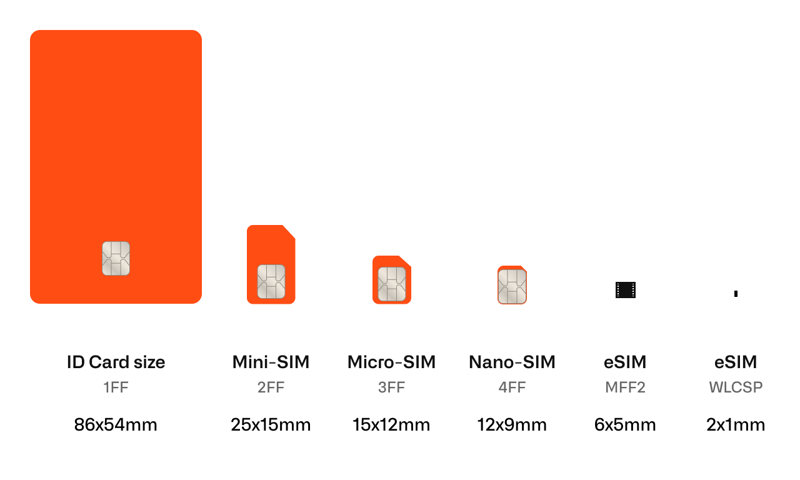

# SIM Cards Types

### Standard vs. Industrial SIM Cards

**Standard SIM cards** are suitable for fixed-location devices operating in typical environments with stable temperatures and humidity levels. These are commonly used in indoor or climate-controlled settings.

**Industrial SIM cards**, on the other hand, are built for harsher conditions and mobile use cases—such as smart metering, transportation, or outdoor installations. They’re designed to withstand temperature extremes, vibrations, and long operational lifespans.

| Type           | Typical Lifespan | Recommended Use Cases                     |
| -------------- | ---------------- | ----------------------------------------- |
| Standard SIM   | 2–5 years        | Indoor sensors, stable environments       |
| Industrial SIM | 5–10 years       | Mobile devices, smart meters, outdoor IoT |

> Note: While SIM longevity can exceed 10 years, lifespan expectations assume consistent activity. In LPWAN deployments, where communication is infrequent, wear on the SIM may be lower.

***

### eSIM (Embedded SIM / eUICC)

**eSIM**, or **embedded SIM**, follows GSMA remote provisioning standards and allows SIM profiles to be activated, updated, or switched remotely—without needing to physically access the device.

There are two primary eSIM provisioning models:

#### 1. Consumer eSIM

Used in smartphones, tablets, and wearables (e.g., smartwatches), where space is limited and user-driven activation is expected. These rely on **over-the-air (OTA)** provisioning but are typically not suited for M2M or headless IoT devices.

#### 2. M2M eSIM (eUICC for IoT)

Ideal for IoT devices that lack user interfaces and require automated or remote connectivity management. The **M2M eSIM architecture** supports secure, scalable deployments with centralized control over SIM provisioning and switching.

**Core Components of Remote Provisioning:**

* **eUICC**: The embedded secure element that stores one or more operator profiles.
* **SM-DP** (Subscription Manager – Data Preparation): Prepares and protects SIM profiles.
* **SM-SR** (Subscription Manager – Secure Routing): Manages the secure delivery and switching of profiles.

This architecture enables streamlined global logistics, easier manufacturing, and centralized SIM lifecycle management—reducing cost and operational complexity.

***

### nuSIM

**nuSIM** takes integration one step further by embedding SIM functionality directly into the modem chipset—removing the need for a physical SIM card entirely.

This reduces hardware complexity, eliminates SIM slot logistics, and lowers total cost of ownership. nuSIM is ideal for high-volume, cost-sensitive IoT deployments that need secure, efficient, and space-saving connectivity.

***

### SIM Card Formats

Kilo supports all common SIM formats:

* **2FF (Mini SIM)**
* **3FF (Micro SIM)**
* **4FF (Nano SIM)**
* **MFF2 (Embedded SIM / eSIM)**
* **nuSIM (Integrated into chipset)**

Each format has trade-offs in durability, size, and integration complexity. MFF2 and nuSIM are preferred for rugged or space-constrained deployments, while 2FF–4FF remain widely used in general-purpose IoT hardware.

