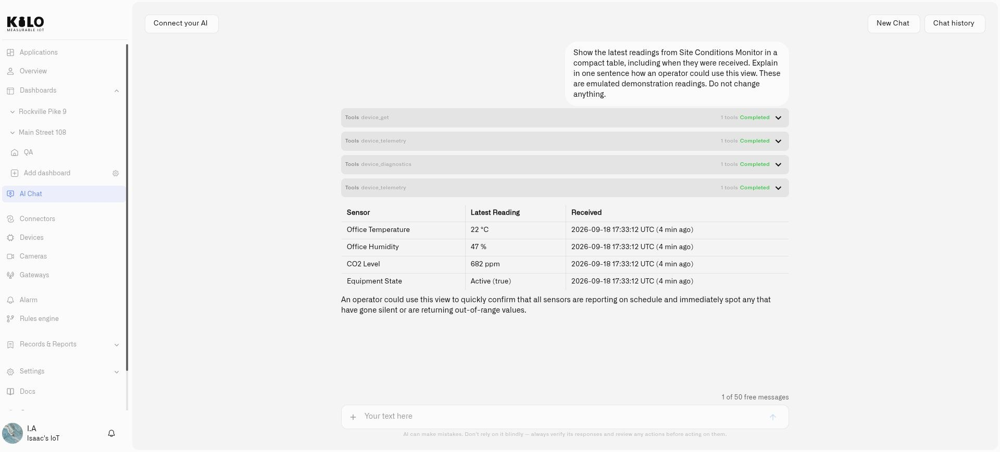

# Kilo IoT Platform

**Kilo IoT Server** brings connected equipment, video cameras, and automation into one operational platform. Use it to understand conditions across a deployment, investigate what changed, and configure a response—from an equipment command to an alarm for the team who can act.

A project can begin with one sensor or an existing IP camera. The same platform supports broader use cases across facilities, property portfolios, transport infrastructure, and distributed operations. You can combine equipment from different manufacturers through supported connections, rather than building an isolated monitoring system for each device type.

**Kilo Cloud** is the hosted offering. Start with the outcome you need: maintain cold-storage conditions, monitor a station entrance, check equipment at several offices, or understand a building's occupancy and environment. Then bring together the devices, views, and responses that make that outcome practical.

## Who Kilo IoT is for

Kilo serves operational teams, system integrators, equipment suppliers, and organizations building solutions around connected assets. A facilities team might use it to monitor conditions and respond to faults. A transport operator might combine camera visibility with environmental and equipment readings. An integrator can organize a customer's solution while keeping access within the appropriate organization.

You do not need every capability to start. Choose a working connection, build a useful view, and configure one response. [Emulated devices](devices/emulated-devices.md) let you try that workflow before hardware is installed.

## What the platform does

### Connect equipment and give its readings meaning

A temperature probe, meter, tracker, and controller may communicate differently. Kilo's [connectors](connectors/README.md) provide the supported connection paths, while each device's digital model gives its readings names, types, and units that dashboards and rules can use.

This lets the useful information move beyond a manufacturer's own interface. A warehouse temperature reading can appear on an operations dashboard, take part in a rule, and provide context during an investigation. Device details and diagnostics help you distinguish the sensor's reported value from a connection or configuration problem.

Kilo includes a [LoRaWAN network server](connectors/lns-connector/built-in-lns.md) and [MIOTY integration](connectors/mioty-connector/README.md), alongside MQTT and supported tracker connections. The right starting point depends on the equipment: a LoRaWAN journey uses a compatible Basics Station gateway, while another integration may connect directly or through its own bridge.

[Register a device](devices/registering-devices.md) or explore [device diagnostics](devices/device-diagnostics.md).

### Bring cameras into the IoT platform with Lens

[Lens](lens/README.md) adds live video and camera motion to the platform. It is useful for security cameras and property management, but its scope also includes smart-city observation, traffic monitoring, stations, depots, and distributed enterprise sites.

Consider offices in New York, Washington, and London with different camera brands. Compatible RTSP cameras can connect to Lens without replacing every installation. Teams can view the feeds through the same platform used for other IoT information and manage access through the organization.

Lens runs in the cloud. At each site, **Twin** runs as a Docker container and acts as the digital twin of one camera. Twenty cameras use twenty Twin containers, each with its own configuration. This model supports expansion across cameras and locations while keeping the camera connection at the premises.

An existing camera can also gain selected-area motion detection. If its picture includes a busy street and an office door, draw a zone around the door in Twin. Movement in that area can supply a motion reading to a Kilo rule, which can raise an operational alarm. The camera does not need built-in AI for this detection.

[Connect your first camera](lens/installing-twin.md), then [configure motion and a response](lens/camera-rules-and-alerts.md).

<figure><figcaption>
Keep compatible cameras from different manufacturers together in one operational workspace.
</figcaption></figure>

### Make operations visible

A useful [dashboard](dashboards/README.md) answers the questions an operator actually has. Combine current values, trends, device states, and supported controls in a layout suited to the job. A cold-storage view might emphasize temperatures and their recent history; a facilities view might bring together environmental conditions and equipment status.

Maps add location to the readings. A [Digital Building Twin](dashboards/adding-widgets/digital-building-twin/README.md) adds spatial context in 3D: rooms, equipment, parking places, and other objects can show values or change color according to linked sensor conditions. Instead of reading an unfamiliar device identifier, an operator can see which part of a site needs attention.

Choose the view that helps the decision. A chart makes a changing trend clear; a color-coded room makes a location clear. The platform's [Applications](applications/README.md) can organize related devices, dashboards, rules, and alarm definitions around the solution, so operators can find its parts together.

[Create an operational dashboard](dashboards/creating-dashboards.md) or [connect sensor values to a 3D view](dashboards/adding-widgets/digital-building-twin/binding-sensors-and-colors.md).

### Turn conditions into controlled responses

The [Rules Engine](rules-engine/README.md) gives automation a visual workflow. Start from a reading or trigger, evaluate conditions, branch to the relevant actions, and inspect the result. Use [CEL expressions](rules-engine/cel-reference.md) for conditions and calculations, with schedules and trigger timing when a response should depend on time as well as a value.

For example, a temperature excursion may need to persist before the team is alerted. A camera's motion reading may need a different response during a configured operating period. Rules connect those conditions to the actions you choose.

Version history, debugging, build, deploy, and stop controls help you manage changes deliberately. Inspect a proposed rule, test its paths, and deploy the version intended to run. Restoring an earlier version is part of that managed lifecycle; review and deploy the restored rule when it is ready.

[Alarm definitions](alarm/notification-rules.md) specify how an incident is communicated: its message, recipients, channels, schedules, suppression, and escalation. The inbox gives the team a place to inspect and respond to incidents. Together, rules and alarms connect a measurement to a practical response rather than merely adding another number to a screen.

[Build your first rule](rules-engine/README.md) or [configure an operational alert](alarm/first-operational-alert.md).

### Work with an AI assistant that knows the platform

The [AI Assistant](ai-assistant/README.md) helps with both setup and investigation. Describe the outcome you want, ask about suitable connections, or request help preparing supported device, dashboard, alarm, and rule configuration. Review the result in the platform's normal editors and confirm consequential actions when prompted.

Once equipment is reporting, ask focused questions about its available readings and history. For example: “Which devices have stopped reporting?” or “Compare these warehouse temperatures over the last week.” The answer can guide the next inspection or configuration change.

For teams integrating external AI agents, Kilo's [Physical AI](physical-ai.md) and [MCP interface](api/mcp-server.md) provide supported paths to platform operations. Available actions remain subject to permissions and the connected equipment's capabilities.

<figure><figcaption>
Ask about your devices in ordinary language. This example uses emulated site readings.
</figcaption></figure>

## Operate with the right access and integrations

Organizations keep resources and access within the relevant working context. Fine-grained permissions determine what team members can view or change; the [audit trail](reports/audit-trail.md) supports inspection of recorded activity. Plan access alongside the operational workflow, especially when several teams or customers use the platform.

The [public API](api/README.md) supports software integrations using scoped API keys. Start with the documented REST workflow for standard HTTP integrations and use the protocol-specific reference for other requirements.

For deployment choices, subscriptions, and interface preferences, use the relevant [settings guides](settings/README.md). Lens's edge Twin setup is explained separately in its installation guide.

## Access the Platform

Open [Kilo Cloud](https://app.kiloiot.io/).

## Where to start

- **Connect equipment:** follow [First Steps](getting-started/README.md).
- **Reuse an IP camera:** [install Twin and connect Lens](lens/installing-twin.md).
- **Try before installation:** use an [emulated device](devices/emulated-devices.md).
- **Build around an outcome:** [create an application](applications/creating-an-application.md) and assemble its devices, views, and responses.
