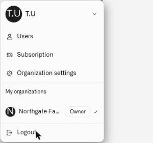

# Account

A Kilo **organization** gives a team a shared workspace for devices, dashboards, rules, and access. An integrator can work with several client workspaces from one personal login, while each workspace keeps its own members and permissions.

Your account is your login; the organization is the deployment you are working in. Use the **user menu** in the bottom-left corner to switch workspaces or manage membership and organization settings. Personal preferences live separately in [Settings](../settings/README.md).

Click your name or avatar in the bottom-left to open the user menu. From there you can:

- **Users** — manage team membership and per-surface permissions
- **Organization settings** — rename your organization or transfer ownership (owner only)
- **My organizations** — switch between organizations if you belong to more than one

<figure><figcaption></figcaption></figure>

## In this section

- [How Organizations Start](how-organizations-start.md) — Default organization creation and invitation entry paths
- [Organization Settings](organization-settings.md) — Rename and ownership transfer
- [Switching Organizations](switching-organizations.md) — Multi-org membership and context switching
- [Users and Permissions](users-and-permissions.md) — Per-surface permission model and access controls
- [Inviting Users](inviting-users.md) — Send invitations and assign permissions
- [Accepting Invitations](accepting-invitations.md) — Accept membership and ownership transfer invites
- [Roles and Page Access](roles-and-page-access.md) — Full permission reference
- [Managing Access](managing-access.md) — Update permissions, revoke invites, remove users
