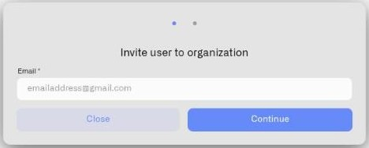

# Inviting Users

You can invite someone to join your organization — as long as they already have a Kilo IoT platform account. The invitation system does not create new accounts. If the person you want to invite has not signed up yet, they need to create an account first, and then you can send the invitation.

Sending invitations requires **Manage users** permission with Edit access.

## Where to Find It

Open the user menu and click **Users**. The organization page opens at `/superIot/organizations/users`, showing the members and pending invitations for your current organization. Click the **Add user** button at the top of the page.

## Sending an Invitation

1. Click **Add user**. The **"Invite user to organization"** dialog opens.

2. **Step 1 — Enter the email address.** Type the email address of the person you want to invite. This must be the email associated with their existing Kilo IoT account. Click **Continue**.

   <figure><figcaption></figcaption></figure>

3. **Step 2 — Assign permissions.** The **Page access** section appears, listing each configurable product surface. For every surface, choose one of three access levels:

   - **Edit** — the user can view and make changes
   - **View** — the user can see the surface but not make changes
   - **No access** — the surface is hidden from the user

   The dialog pre-fills defaults for new invitations: Edit on most features, with **Manage users** and **Audit Trail** set to No access. You can adjust any feature before sending.

   Two surfaces have restricted options:
   - **Audit Trail** — only View or No access (no Edit option, because the audit trail is read-only for everyone)
   - **API Keys** — only Edit or No access (no View option, because API key management is self-service)

   <figure><figcaption></figcaption></figure>

4. Click **Send invite**. The system sends an email to the invited user with a link to accept. The invitation is valid for **7 days**.

5. The pending invitation appears in the users table. The row shows the invited email with an **"Awaiting invitation confirmation"** tooltip, and a **Remove** button to revoke the invitation if needed.

## What the Dialog Shows

The invitation dialog shows a subset of the platform's access features. The underlying permission model includes additional features not shown in the current dialog. For the full permission reference, see [Roles and Page Access](roles-and-page-access.md).

## Constraints

- **Existing accounts only.** If the email does not match an existing platform user, the invitation is rejected.
- **No self-invitations.** You cannot invite yourself.
- **No duplicate invitations.** If an active invitation already exists for the same email in this organization, a new one cannot be sent.
- **No duplicate members.** If the user is already a member of this organization, the invitation is rejected.
- **No Owner invitations.** You cannot invite someone as Owner. Ownership transfer is a separate process handled in [Organization Settings](organization-settings.md).

## What Happens Next

Once the invite is sent, the recipient receives an email with a one-click acceptance link. For what happens on their end, see [Accepting Invitations](accepting-invitations.md). To revoke a pending invitation or manage members after they join, see [Managing Access](managing-access.md).
