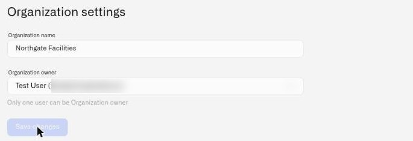

# Organization Settings

The Organization settings dialog is where you rename your organization and transfer ownership to another member. It contains two fields — the organization name and the organization owner — and nothing else. Only the organization owner can access this dialog.

## Where to Find It

Open the user menu by clicking your avatar in the sidebar. If you are the organization owner, you will see **Organization settings** in the menu. Click it to open the settings dialog.

If you do not see **Organization settings** in the menu, you are not the owner of the current organization.

<figure><figcaption></figcaption></figure>

## Changing the Organization Name

1. Open the settings dialog.
2. Edit the **Organizations name** field. The name cannot be blank.
3. Click **Save changes**.

The new name takes effect immediately and is reflected everywhere the organization name appears — in the user menu, in page headers, and in the audit trail.

## Transferring Ownership

Ownership transfer is a two-step process: the current owner initiates the transfer, and the new owner must accept it. The transfer does not happen immediately.

### Initiating the Transfer

1. Open the settings dialog.
2. In the **Organizations owner** dropdown, select the member you want to transfer ownership to. The dropdown lists all current members of the organization. The helper text reads: *"Only one user can be Organization owner."*
3. Click **Save changes**.
4. The system sends an ownership transfer invitation to the selected member. The invitation is valid for **24 hours**.
5. A success message confirms: *"We sent an invitation letter to the specified email."*

Until the new owner accepts the invitation, you remain the owner with full control.

### What Happens After Acceptance

Once the new owner accepts the transfer (see [Accepting Invitations](accepting-invitations.md)):

- **The new owner** gets automatic access across the organization. The audit trail is read-only.
- **The previous owner** remains a member of the organization. They retain write access on all product surfaces except the audit trail, which becomes read-only.
- The **Organization settings** menu item moves to the new owner's user menu. The previous owner no longer sees it.

### Constraints

- **Only the current owner can initiate a transfer.** No other user can open the settings dialog or change the owner field.
- **The target must already be an organization member.** You cannot transfer ownership to someone who has not yet joined the organization.
- **Only one active transfer invitation at a time.** If a transfer invitation is already pending, you cannot create another until it expires or is accepted.
- **No co-ownership.** There is always exactly one owner.
- **24-hour expiration.** If the new owner does not accept within 24 hours, the invitation expires and you remain the owner.

