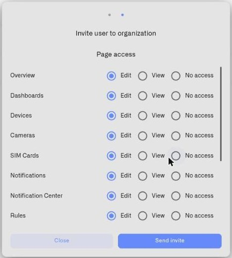

# Roles and Page Access

Kilo IoT Server uses attribute-based access control (ABAC). Access is evaluated based on three attributes: which organization you belong to, whether you are the owner, and what per-feature permissions you have. Each feature can be set to Edit, View, or No access independently. There is no role selector — you work directly with per-feature permissions.

## The Per-Feature Model

When you invite a user or edit their permissions, the dialog shows a **Page access** list. Each feature has three radio options:

- **Edit** — the user can view and make changes
- **View** — the user can see the feature but not make changes
- **No access** — the feature is hidden from the user

<figure><figcaption></figcaption></figure>

## Configurable Surfaces

The following features appear in the invitation and permission dialog. You can set each one independently.

| Feature | Allowed levels | Default for new invites | Special rules |
|---|---|---|---|
| Overview | Edit / View / No access | Edit | |
| Dashboards | Edit / View / No access | Edit | |
| Devices | Edit / View / No access | Edit | |
| Cameras | Edit / View / No access | Edit | |
| SIM Cards | Edit / View / No access | Edit | |
| Notifications | Edit / View / No access | Edit | |
| Rules | Edit / View / No access | Edit | |
| Subscription | Edit / View / No access | Edit | |
| Manage Users | Edit / View / No access | No access | Read access lets the user view the members list and pending invitations. Edit access is required to invite users, change permissions, revoke invitations, and remove members. |
| Connectors | Edit / View / No access | Edit | |
| Audit Trail | View / No access | No access | No Edit option exists. The audit trail is read-only for everyone, including the owner. Even if write access is requested through other means, it is automatically downgraded to read at both invitation creation and acceptance. |
| API Keys | Edit / No access | Edit | No View option exists. API key management is self-service — if a user has access, they can create and manage their own keys. |

## Server-Side Surfaces

The underlying permission model includes four additional features that are enforced server-side but do not appear in the dialog: Gateways, Logs, Notification Center, and Geofencing. These cannot be configured through the Users interface and are not relevant to day-to-day access management.

## Defaults for New Invitations

When you open the invite dialog, permissions are pre-filled with hardcoded defaults — not from a template. The starting point for every new invitation is:

- **Edit** on all surfaces except Manage Users and Audit Trail
- **No access** on Manage Users
- **No access** on Audit Trail

You can adjust every surface individually before sending the invite. These defaults are designed to give a new team member broad access to operational features while keeping administrative and audit capabilities restricted until explicitly granted.

## Display Labels and Matching

The users table shows **Edit access** and **View access** columns. These display computed labels — not stored roles. The platform defines three named permission patterns and matches each user's actual permissions against them:

| Pattern | What it includes | What it excludes |
|---|---|---|
| **Admin** | Edit on all configurable surfaces. Audit Trail = View. API Keys = Edit. Includes Subscription and Manage Users. | Nothing excluded |
| **Editor** | Edit on most surfaces. Audit Trail = View. API Keys = Edit. | No access to Subscription and Manage Users |
| **Viewer** | View on most surfaces. Audit Trail = View. API Keys = Edit (self-service exception). | No access to Subscription and Manage Users |

After permissions are saved, the platform compares the user's actual permission set against these patterns:

- If the set matches the Admin pattern → the column displays **Admin**
- If it matches the Editor pattern → **Editor**
- If it matches the Viewer pattern → **Viewer**
- If the set does not match any pattern → the column displays the individual feature names instead
- The owner always displays **Owner**

These labels help you see at a glance what kind of access each member has, but the underlying model is always per-feature. The patterns are not assigned as roles and do not pre-fill the dialog — they exist only to compute the display labels in the users table.

## Owner Access

Owner is not a permission pattern. It is a property of the organization itself — exactly one member is the owner, and that status is stored as part of the organization record.

The owner gets automatic access to all features, with one exception: the audit trail is always read-only, even for the owner. This is enforced at two levels — owner permissions are generated with audit trail set to read, and a separate enforcement layer hard-denies audit trail write for every user.

Owner access cannot be edited or removed. It changes only through ownership transfer in [Organization Settings](organization-settings.md).

## When You Lack Access

When you do not have Edit access to a feature, the platform disables the relevant controls — buttons and inputs appear greyed out. Hovering over a disabled control shows a tooltip explaining why and who to contact:

- If no other administrators exist in the organization: *"You don't have the required permissions. Please contact your organization owner."*
- If administrators exist: *"Contact your administrators: Maria Schmidt, ..."*

The administrators listed in the tooltip are automatically derived from the organization owner and all members who have **Manage Users** set to Edit. These contacts are computed automatically — not configured manually.

## Access Evaluation

Access is checked per-feature: does this user have read or write permission for this feature in this organization? If no matching permission exists, access is denied. The owner is the only exception — the owner has automatic access to every feature, with audit trail limited to read.
