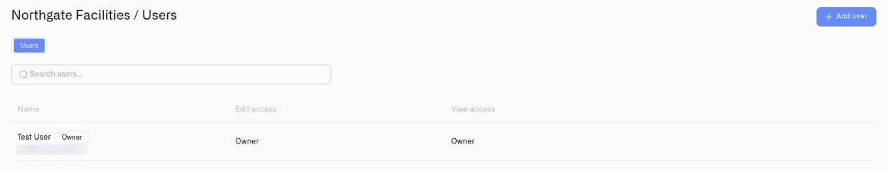

# Users and Permissions

Permissions define which operations a person may perform in a Kilo organization, the shared workspace for a deployment. Set each product area, such as devices, dashboards, or rules, to **Edit**, **View**, or **No access** when inviting a user or changing their access.

For example, a contractor can view device readings without being able to change the rules that operate equipment. Check the organization and the areas that person needs before assigning access; the same account can have different permissions in another organization.

Kilo uses **attribute-based access control (ABAC)**: access decisions take account of membership, ownership, and assigned permissions. The interface exposes these choices per feature, rather than relying on a single role selector.

## How Permission Labels Work

The platform uses per-surface permissions as the primary access model. There is no "select a role" step — when you invite a user, you set each surface individually to Edit, View, or No access. The dialog starts with hardcoded defaults (Edit on most surfaces, with Manage Users and Audit Trail set to No access), and you can adjust every surface before sending.

After permissions are saved, the platform computes a display label by matching the user's actual permission set against three named patterns — **Admin**, **Editor**, and **Viewer**. If the set matches the Admin pattern, the users table shows "Admin." If it matches Editor, it shows "Editor." Custom combinations that do not match any pattern display the individual surface names instead.

**Owner** is not a predefined role in the same sense. It is a property of the organization itself — exactly one member is the owner, and that status grants automatic access across the org (with audit trail limited to read). Owner access cannot be customized or removed; it changes only through ownership transfer.

| Display label | What it means | Customizable? |
|---|---|---|
| **Owner** | Org ownership status. Automatic access across the org. Audit trail is read-only. | No — implicit in ownership |
| **Admin** | Edit on all surfaces, including Subscription and Manage Users. Audit Trail is always View. API Keys is always Edit. | Yes — per surface |
| **Editor** | Edit on most surfaces. Audit Trail = View. API Keys = Edit. No access to Subscription or Manage Users. | Yes — per surface |
| **Viewer** | View on most surfaces. Audit Trail = View. API Keys = Edit (self-service exception). No access to Subscription or Manage Users. | Yes — per surface |

<figure><figcaption></figcaption></figure>

## In This Section

| Page | What it covers |
|---|---|
| [Inviting Users](inviting-users.md) | How to send an invitation to an existing platform user, assign per-surface permissions, and manage pending invites. |
| [Accepting Invitations](accepting-invitations.md) | What happens when someone clicks a membership or ownership transfer invitation link. |
| [Roles and Page Access](roles-and-page-access.md) | The full permission reference — every configurable surface, restricted options, defaults, and how access is evaluated. |
| [Managing Access](managing-access.md) | Updating permissions, revoking pending invitations, and removing users from the organization. |
