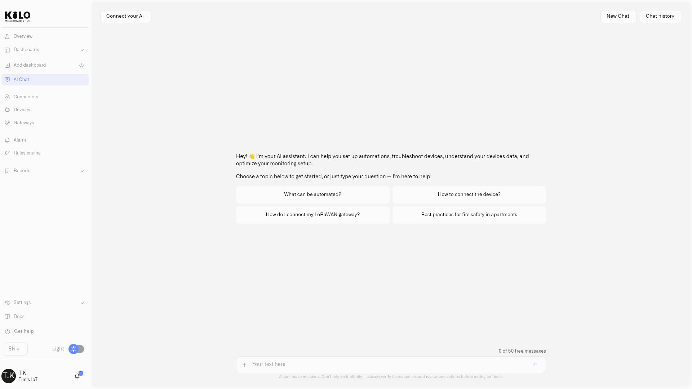

# IoT AI Assistant

Most "AI" in software is a chat box bolted onto a help page. The Kilo IoT Server's assistant is something else entirely: **an experienced IoT integrator that lives inside your platform, knows your whole deployment, and can do the work alongside you.** It is the difference between a tool that answers questions and a colleague who picks up tasks.

Ask it what your devices are doing and it answers from your real telemetry. Ask it to set something up — onboard a device, build an automation, define an alarm — and it does the work, shows you exactly what it's about to change, and only proceeds once you approve. Open it from **AI Chat** in the sidebar.

<figure><figcaption></figcaption></figure>

## Three things make it different

**It's grounded in your deployment, not guessing.** Every answer about your devices, rules, alarms, and dashboards comes from your live data — read through the platform at the moment you ask, scoped to your permissions. It doesn't pad answers with plausible-sounding generalities; if it can't retrieve something, it says so. That makes it trustworthy enough to act on.

**It acts, it doesn't just advise.** This is the leap. The assistant can provision a device or a gateway, author a complete automation — writing the [CEL](../rules-engine/cel-reference.md) logic and deploying it — create an alarm with escalation, **run a command on a device**, recommend compatible hardware, and manage team access. It runs the same operations you would, on your behalf, and verifies its own work afterward by reading the result back.

**It remembers and it confirms.** It keeps the context of your conversation and your setup, so you can refine a task across several messages without starting over. And before anything destructive or consequential — deleting a device or rule, resolving an alarm — it pauses and asks for an explicit **Confirm Action** / **Cancel**. Nothing irreversible happens without your say-so.

## What it can do for you

| | |
| --- | --- |
| **Understand your deployment** | Answer questions about live device state and full history, run aggregations and comparisons, and generate charts inline. See [Working With the Assistant](querying-your-data.md). |
| **Build and operate** | Provision devices and gateways (guided, or automatically when you provide the LoRaWAN keys), author/test/deploy rules including their CEL, create alarms with escalation, run device commands behind a confirmation, set up emulated devices, manage team roles, and recommend hardware. See [Building With the Assistant](building-with-ai.md). |
| **Guide and explain** | Search the platform knowledge base and IoT references to explain features, walk you through setup, and troubleshoot — grounded in [what it can access](data-sources.md). |

## Monitoring, automation, and control

The assistant works through the platform the same way you would: it answers from your data, builds **monitoring and automation**, and now **operates equipment directly**. Ask what a device can do and it lists the commands configured on it; ask it to run one and it executes it, then reports whether it was delivered. Because the effect is physical, every execution goes behind an explicit confirmation, and it runs command definitions that already exist on the device rather than composing a raw downlink.

Automations can act too: a rule can run a device command when its conditions are met (see [Running Device Commands](../rules-engine/running-device-commands.md)), so the logic it sets up can both notify the right people and act on a device. For hands-on control you still have the device's **Commands & States** tab and the dashboard [Control widget](../dashboards/adding-widgets/control-widget.md).

It also stays in its lane in the ways you'd want: it works only within your access and your current organization, never crosses into another organization's data, and never surfaces credentials or billing secrets. See [Privacy and Security](privacy.md).

## Availability

The assistant is part of the platform, with a monthly allowance of requests that scales with your plan. If you'd rather not be limited by the allowance, you can connect your own model API key and keep working. You'll see your remaining allowance above the chat input, and a prompt to review plans or add a key when you reach it.

The capabilities above are live today and improving continuously: the assistant runs on an enterprise-grade agent runtime built in-house, and its accuracy grows as the agents are trained on more real-world IoT work — so it keeps taking on more. We were confident enough in that runtime to open-source it as [Synthetic Brew](https://github.com/syntheticinc/syntheticbrew), where you can see how it is engineered or build on it yourself.

## Where to go next

* [Working With the Assistant](querying-your-data.md) — ask about your data and get answers, analysis, and charts
* [Building With the Assistant](building-with-ai.md) — hand it real setup work: devices, rules, alarms
* [What It Can Access](data-sources.md) — the sources behind its grounded answers
* [Privacy and Security](privacy.md) — authentication, isolation, and confirmation gates
* [MCP Server](../api/mcp-server.md) — connect your own AI client, such as Claude Code or Claude Desktop, to the same deployment
