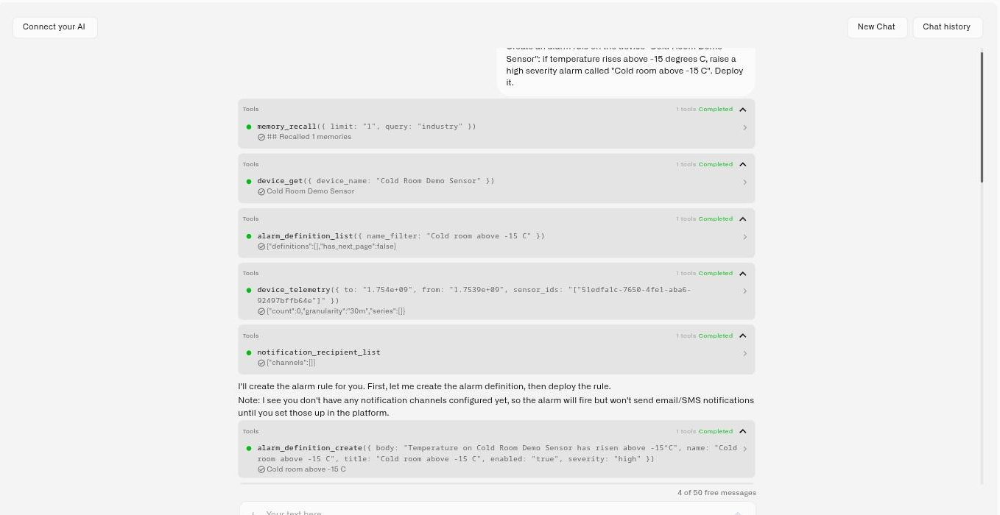

# Building With the Assistant

Answering questions is table stakes. What sets the assistant apart is that it can **do the work** — the same configuration tasks a system integrator would do, driven by a plain-language conversation and gated by your approval. This page covers that build-and-operate side.

## How acting works

When you ask the assistant to set something up, it doesn't hand you a checklist to follow. It carries out the task using the platform's real operations, on your behalf and within your permissions, then reads the result back to confirm it worked. Two principles govern every action:

* **You approve consequential changes.** Before anything destructive or hard to reverse — deleting a device or rule, resolving an alarm — the assistant pauses and shows a confirmation with **Confirm Action** and **Cancel**. When it needs a decision or a missing detail mid-task, it asks with a structured prompt rather than guessing.
* **It verifies its own work.** After making a change, it re-reads the affected object so it can tell you what actually exists now, not just what it intended to do.

## Onboard a device

Describe the device you want to add and the assistant runs the onboarding flow with you — choosing the connector, naming the device, capturing identifiers, and selecting the right profile. For a LoRaWAN device, if you provide the **DevEUI** and **AppKey** up front, it can complete the setup automatically and then run diagnostics to confirm the device is actually reporting.

> *"Add the new CO2 sensor in Lab 2. DevEUI 24E124..., AppKey ..."*
> The assistant provisions the device, binds it, and checks whether data is arriving — flagging it if the device stays silent.

This is especially useful at scale: instead of clicking through the registration steps for each unit, you describe what you're adding and the assistant does the mechanical work.

<figure><figcaption></figcaption></figure>

## Build and deploy an automation

This is the assistant's most powerful capability. Describe the behavior you want in plain language, and it **authors the complete rule — including the [CEL](../rules-engine/cel-reference.md) expressions — builds it, tests it, and deploys it.**

> *"Alert the on-call engineer if any freezer in Cold Storage A stays above −18 °C for more than ten minutes."*
> The assistant designs the rule's logic, writes the condition as a CEL expression, simulates it against both a matching and a non-matching value to prove it fires correctly, and then deploys it — showing you each step.

Because it simulates before claiming success, you're not trusting a black box: you see the rule trigger on the case that should match and stay quiet on the case that shouldn't. From there you can refine it conversationally ("make it fifteen minutes", "also notify the facility manager") and the assistant updates and redeploys.

To learn the rules engine itself, see [Rules Engine](../rules-engine/). The assistant is a fast way to produce a correct first draft — or a finished rule — without hand-building the canvas.

## Configure alarms and access

* **Alarms** — Ask it to create an alarm definition with severity and an escalation chain, and it sets up the recipients, channels, and steps. It can also resolve an alarm event (with your confirmation) when you tell it the situation is handled.
* **Team** — It can invite a user and assign a role, so onboarding a new operator or contractor is a sentence rather than a sequence of screens.
* **Hardware** — Ask what sensor fits a goal and it recommends compatible options drawn from the partner catalog and current references, so you're choosing from real, fitting hardware rather than a generic list.

## Run a device command

The assistant can operate your equipment, not just describe it. Ask what a device can do and it lists the commands configured on it; ask it to run one and it executes it — after showing you what it is about to send and waiting for your confirmation.

> *"What commands are available on the cold room controller?"*
> *"Set its reporting interval to five minutes."*
> The assistant lists the device's commands, shows the parameters it will use, asks you to confirm, sends it, and then reports whether it was delivered.

Three things govern this, and they are what make it safe to hand an AI a building:

* **It executes commands that already exist.** Commands are defined once on the device's **Commands & States** tab, with typed parameters and optional verification. The assistant runs those definitions — it does not invent new ones or improvise a payload.
* **It always asks first.** Command execution has real physical effects, so every one goes behind an explicit confirmation.
* **It checks the result.** Delivery is asynchronous, so after sending, the assistant reports the execution status rather than assuming success. The device also has to be online to receive the command.

This applies to devices that can receive downlinks in the first place — MQTT devices, Class C LoRaWAN devices, and emulated devices with **Support commands** enabled. A Class A LoRaWAN sensor only opens a brief receive window after each uplink, so it is not available for on-demand control. See [Device Commands](../devices/commands/README.md).

## Set up a gateway

Ask the assistant to add a gateway and it does the platform side for you — registering it and producing the connection details the hardware needs. It then tells you exactly what to enter on the gateway itself, since that last step happens in the gateway's own configuration rather than in Kilo.

## Drive the emulator

The assistant can run the whole [emulated device](../devices/emulated-devices.md) workflow in conversation: list the available device presets, provision a device from a preset or from metrics you describe, read and change its configuration and reporting interval, and send a one-off reading to exercise a rule. It can also take the device live onto a real **LoRaWAN** connection when the hardware arrives, and move a real device onto the Emulator to reproduce something. Other connector types are a manual swap on the device's Connection tab.

> *"Create an emulated air-quality sensor in Cold Room 3 and send a temperature of −20."*
> A device that reports on its own, ready for the dashboards and rules you are about to build.

## What it builds versus what it operates

The distinction worth holding onto is between the automations the assistant *writes* and the commands it *runs*.

The **automations** it builds monitor and alert. A rule that acts on its own does so through the Rules Engine's own Execute Command node, which you add deliberately — the assistant does not make a rule actuate as a side effect of asking for one.

And nothing here replaces the manual route: the device's **Commands & States** tab and a dashboard [Control widget](../dashboards/adding-widgets/control-widget.md) are still there for one-tap operation.

## Tips for delegating well

* **State the outcome, not the clicks.** "Onboard this sensor and put it on the Lab 2 dashboard" beats a step-by-step dictation — the assistant knows the steps.
* **Give it the specifics it needs.** Identifiers, thresholds, durations, and recipients up front mean fewer round-trips.
* **Read the confirmation before approving.** The confirmation card spells out the change; it's your last checkpoint before anything happens.
* **Iterate.** Treat the first result as a draft you can refine in the same conversation.

## See also

* [Working With the Assistant](querying-your-data.md) — the ask-and-analyze side
* [Device Commands](../devices/commands/) — defining the commands the assistant can run, and running them by hand
* [Rules Engine](../rules-engine/) — the automation surface the assistant builds into
