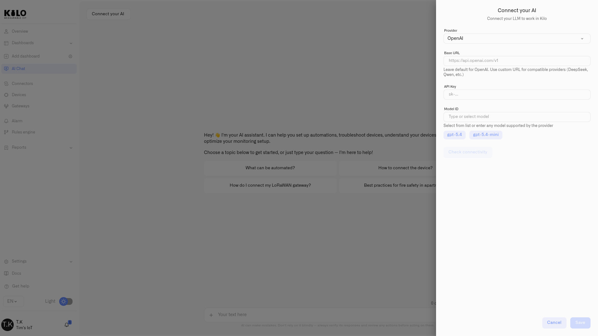

# Managing chats and AI access

The assistant lives in **AI Chat** in the sidebar. This page covers the workspace around the conversation itself — starting and revisiting chats, the request allowance that comes with your plan, and connecting your own model when you'd rather not work against that allowance.

## Starting a new chat

The **New Chat** action in the AI Chat top bar opens a fresh conversation. Because the assistant keeps the context of a conversation as you go — so you can refine a task across several messages — start a new chat when you move to an unrelated task, so earlier context doesn't carry over into work where it doesn't belong.

## Chat history

The top bar also opens **Chat history**, a list of your past conversations with the most recent first. Each conversation is titled from its content; one without a title yet shows as **Untitled chat**. Select any entry to reopen it and pick up where you left off. Your history persists across sessions and is scoped to you and your current organization — switch organizations and you see that workspace's conversations. Before you've chatted, the panel reads **No conversations yet**.

## Deleting a conversation

In Chat history, **Delete conversation** removes a chat and its messages. Deletion is immediate and cannot be undone, so remove only conversations you no longer need.

## Your request allowance

The assistant is part of the platform and includes a monthly allowance of AI requests that scales with your plan — higher tiers include more. Your remaining allowance is shown above the message input, so you always know where you stand.

When you reach the limit, the assistant tells you you've **reached your AI assistant limit**. The rest of the platform is unaffected — you can still monitor alarms, manage devices, and work through the regular interface. To keep using the assistant for building rules, diagnostics, and automation, either upgrade your plan or connect your own model key, which is not subject to the allowance.

## Connecting your own AI

<figure><figcaption></figcaption></figure>

Connect your own provider account when you need a particular model or want AI usage billed under your existing provider contract. Chats that use your connection do not consume the AI request allowance included with your Kilo plan.

Before you start, obtain an API key from your provider. The provider endpoint must be reachable from Kilo; an address available only inside your private network will not connect.

To connect:

1. Open **AI Chat**, then select **Connect your AI**.
2. Choose **OpenAI**, **Anthropic**, **OpenRouter**, **Ollama**, or **Custom (OpenAI compatible)** under **Provider**.
3. Review the prefilled **Base URL**. Change it only when you use a self-hosted endpoint or an internal gateway that Kilo can reach.
4. Enter the **API Key**. Kilo treats it as a secret and masks it in the form. Every provider requires a key, including Ollama.
5. Enter the provider's exact model identifier under **Model ID**, or select one of the suggestions.
6. Select **Check connectivity**. Save the connection only after the panel reports **Connected**.
7. Select **Save**.

### Getting the Model ID right

Kilo sends the Model ID to the provider exactly as entered, so it must match the provider's catalog character for character. The field offers suggestions, but you can use any model that the provider makes available to your account.

**Ollama identifiers carry a version tag.** Ollama names a model `name:tag` — `gpt-oss:120b`, `gemma4:31b` — and the tag is part of the identifier rather than an optional suffix. Leave it off and the model is not found. Two more things specific to Ollama: the prefilled Base URL is Ollama Cloud, and most of the Ollama Cloud catalog needs a paid subscription on your Ollama account. The suggested identifiers do not.

**OpenRouter identifiers are namespaced** — `vendor/model`, such as `anthropic/claude-sonnet-4-6`.

### Checking the connection before you save

**Check connectivity** sends a real request to the provider. The panel reports **Connected** or **Not connected** and explains common failures:

| Message | Meaning | What to do |
|---|---|---|
| the provider rejected the API key | The key is incorrect, revoked, or belongs to another account. | Create or copy a valid key from the selected provider. |
| the provider denied this key access to the model — check that your provider plan includes it | The key is valid, but its account cannot use the model. | Choose a model included in the provider plan or update that plan. |
| the provider does not serve this model — check the model id | The Model ID is not in the provider's catalog. | Correct the ID. For Ollama, include the version tag. |
| this model has been retired by the provider — pick a current one | The provider has withdrawn the model. | Select a current model. |
| the provider refused the request for billing reasons — check the account behind this key | Billing or a spending limit is blocking the provider account. | Resolve the account issue with the provider. |
| the provider is rate limiting this key — try again in a moment | The provider is temporarily limiting requests for the key. | Wait, then check the connection again. |
| could not reach AI provider | Kilo cannot reach the Base URL. | Check the address and make the endpoint reachable from Kilo. |

Once saved, the panel shows the active Base URL, masked key, and Model ID. Your own model now serves new chats without using the platform allowance. Return to **Connect your AI** to update or disconnect it.

## Where to go next

* [Working With the Assistant](querying-your-data.md) — ask questions about your live deployment
* [Building With the Assistant](building-with-ai.md) — have it provision devices and author rules
* [Privacy and Security](privacy.md) — what the assistant can and can't see
