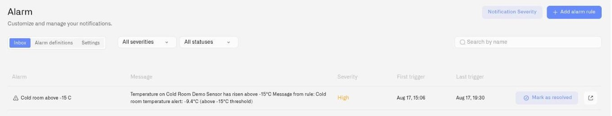

# Alarm

Kilo alarms turn a detected problem into an organized response: notify the right people, escalate through your chosen channels, and keep a shared record until the team resolves it. A cold-room warning can reach the on-call engineer first and the next responder if the event remains unresolved.

An **alarm event** is the record of something needing attention. An **alarm definition** stores the message, severity, recipients, escalation, and delivery timing. A **rule** raises an event using that definition when its workflow reaches the alarm step. Reusing definitions keeps the response consistent across devices and rules.

To set up an alert, prepare the definition and its recipients, then connect it to a [Rules Engine](../rules-engine/README.md) response. If the response should wait for a sustained condition, create a separate [trigger](../rules-engine/triggers.md) and use it to start the rule. Follow [Your First Alert](first-operational-alert.md) for the complete setup.

## Page structure

The Alarm page has three tabs:

| Tab | Purpose |
|---|---|
| **Inbox** | Lists every alarm event that has been triggered. Filter by severity or status, search by title, resolve events, or navigate to the originating rule for investigation. |
| **Alarm definitions** | Create and manage alarm configurations. Each definition specifies severity, escalation steps, notification timing, schedule, suppression, and the alert message. Click **Add alarm rule** to create a new definition. |
| **Settings** | Manage notification delivery contacts — email and SMS — with per-channel enable/disable toggles. Push notification setup is available when enabled for the account, delivered through the [IoT Alerts App](iot-alerts-app/README.md). |

A **Notification Severity** button in the page header (visible on all tabs) opens a modal for configuring how frequently each severity level re-sends notifications.

<figure><figcaption></figcaption></figure>

## Severity model

Kilo uses five severity levels to classify alarms by operational priority:

| Level | Operational context |
|---|---|
| **Critical** | Production-stopping conditions requiring immediate intervention — equipment failure, safety thresholds, compliance breaches |
| **High** | Urgent deviations needing prompt response — cold-chain drift, pressure anomalies, environmental exceedances |
| **Medium** | Non-urgent but operationally significant — scheduled maintenance triggers, capacity thresholds approaching limits |
| **Low** | Routine operational awareness — minor fluctuations within tolerance, informational device state changes |
| **Info** | Background reporting — periodic health checks, system status confirmations, operational summaries |

Each level carries its own notification repeat policy, configurable in [Notification Severity](notification-delivery-settings.md).

## Escalation

Unresolved alarms can escalate through multiple steps — notifying additional recipients through additional channels after configurable delays. An on-call engineer who does not respond within the configured window triggers notification to the shift supervisor, who in turn escalates to the site manager if the alarm remains unresolved.

For full details on configuring escalation chains, see [Escalation and Response](escalation-and-response.md).

## What to read next

| Page | When to read it |
|---|---|
| [Your First Alert](first-operational-alert.md) | Create one alarm definition end-to-end, see it fire, and resolve it. |
| [Alarm Definitions](notification-rules.md) | Full reference for creating, editing, and managing alarm definitions. |
| [Escalation and Response](escalation-and-response.md) | Configure multi-step escalation chains for unresolved alarms. |
| [Notification Severity](notification-delivery-settings.md) | Control repeat intervals and one-time notification behavior per severity level. |
| [Inbox and Resolution](inbox-and-resolution.md) | Triage incoming alarms — filter, search, resolve, and trace back to originating rules. |
| [Delivery Channels](notification-channels.md) | Set up and manage email, SMS, and push notification delivery. |
| [IoT Alerts App](iot-alerts-app/README.md) | Put alarms on responders' phones — and learn which severities wake the phone. |
