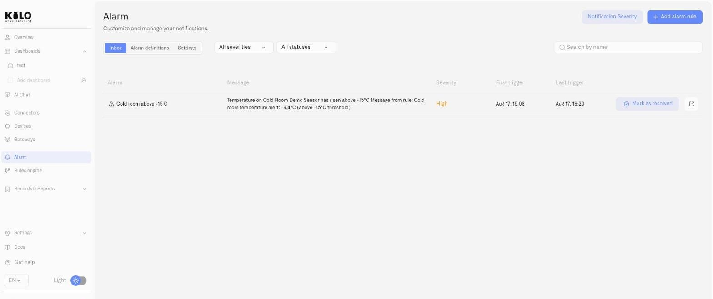

# Your First Alert

This walkthrough takes you from zero to a working operational alarm. By the end, you will have created an alarm definition, connected it to a rule in the Rules Engine, seen it fire in the Inbox, and resolved the event. This is the happy path — one alarm, one rule, one device.

For full reference on all alarm definition fields, see [Alarm Definitions](notification-rules.md).

## Prerequisites

- At least one device registered and reporting sensor data.
- A verified email contact in the [Delivery Channels](notification-channels.md) settings.

## Step 1 — Create the alarm definition

1. Open **Alarm** from the sidebar.
2. Switch to the **Alarm definitions** tab.
3. Click **Add alarm rule**.
4. Fill in the form:
   - **Alarm name:** "Cold Storage Alert" (or whatever describes the condition you are monitoring).
   - **Severity:** Choose **High** for this test. You can change it later.
   - **Escalation chain:**
     - **Step 1 (Immediate):** Select the on-call technician under **Notify**. Select **Email** under **Via**. This person is notified the moment the alarm fires.
     - Click **Add step** to add a second tier.
     - **Step 2 (After configurable delay):** Select the shift supervisor under **Notify**. Select **Email** and **SMS** under **Via**. If the technician does not resolve the alarm within the configured window, the supervisor is automatically notified — no manual intervention needed.
   - **Theme:** "Temperature exceedance in cold storage."
   - **Message body:** "Sensor reading has exceeded the operational threshold. Check the facility."
5. Leave Schedule, Custom Notification interval, and Suppress duplicates at their defaults for now.
6. Click **Add new alarm rule**.

Your alarm definition is created and appears in the **Alarm definitions** list.

## Step 2 — Connect it to a rule in the Rules Engine

The alarm definition you just created does not monitor sensors on its own — it defines the response. You need a rule in the [Rules Engine](../rules-engine/README.md) to evaluate sensor data and fire the alarm when conditions are met.

1. Open **Rules engine** from the sidebar.
2. Create a new rule (or edit an existing one).
3. In the visual editor, add a **Set Alarm** node to the automation canvas.
4. In the Set Alarm node's properties, select your "Cold Storage Alert" definition from the **Choose Alarm** dropdown.
5. Fill in the **Motivation Message** — this is a CEL expression that produces the notification text. For a simple test: `"Temperature reading exceeded threshold"`.
6. Connect the Set Alarm node into your automation flow (after a gateway condition that checks the sensor threshold).
7. **Save**, then **Build**, then **Deploy** the automation.

The rule is now running and will fire the alarm when the sensor data matches your conditions.

## Step 3 — See the alarm in the Inbox

Once the rule fires (either from real sensor data or a test condition), the alarm event appears in the **Inbox** tab on the Alarm page:

- The event shows with **Active** status (warning triangle).
- Severity is color-coded as **High**.
- The message matches what you configured in the definition.

<figure><figcaption></figcaption></figure>

## Step 4 — Resolve the alarm

Click **Mark as resolved** on the alarm event. The status changes to **Resolved** (checkmark). If the alarm was still in Step 1 when you resolved it, Step 2 never fires — the supervisor is not notified because the technician handled it. If the alarm had already escalated to Step 2, resolving it stops any further notifications from that event.

The resolved event stays in the Inbox as a historical record.

## What's next

| Goal | Where to go |
|---|---|
| Add escalation steps for unresolved alarms | [Escalation and Response](escalation-and-response.md) |
| Configure severity-level repeat timing | [Notification Severity](notification-delivery-settings.md) |
| Full reference for alarm definition fields | [Alarm Definitions](notification-rules.md) |
| Set up SMS or push delivery | [Delivery Channels](notification-channels.md) |
