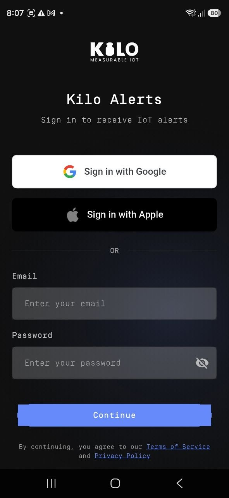

# Set Up IoT Alerts

Getting an on-call device ready takes a few minutes. Once it's connected and the Push channel is on, the phone receives operational alarms from your Kilo deployment. Repeat these steps on every responder's device that should be in the escalation chain.

## Step 1 — Install the app

- **iPhone:** [App Store](https://apps.apple.com/us/app/chirp-alerts/id6756504956)
- **Android:** [Google Play](https://play.google.com/store/apps/details?id=io.chirpwireless.alarm)

## Step 2 — Choose Business Use

On first launch the app asks **"How will you use the app?"** Select **Business Use** — described as *Kilo IoT — alerts for your business deployments*. This points the app at your Kilo account and deployment and applies Kilo branding.

<figure><figcaption></figcaption></figure>

You can change this later under **Settings → Platform → Change mode**, but switching between Home and Business signs you out, since each platform uses its own account.

## Step 3 — Sign in with your Kilo account

Sign in with the same credentials you use on the Kilo web platform — there is no separate app account. Email and password both work, as does single sign-on if your Kilo account is linked to it. Your organizations, deployments, and access carry over exactly as they are on the web.

<figure><figcaption></figcaption></figure>

## Step 4 — Grant notification and Critical Alert permission

When the app first launches it asks permission to send notifications, including the **Critical Alert** permission. Grant both:

- Standard notification permission lets the app deliver any alarm.
- **Critical Alert** permission is what lets a Critical alarm break through silent mode and a Focus or Do Not Disturb schedule. Without it, even Critical alarms are subject to the phone's silent and Focus settings.

If you dismissed either prompt, re-enable them in the phone's settings:

- **iPhone:** Settings → Notifications → IoT Alerts → allow Notifications and Critical Alerts
- **Android:** Settings → Apps → IoT Alerts → Notifications → enable

## Step 5 — Turn on Push for the account

The device still needs the **Push** channel enabled on the web before alarms are delivered to it:

1. Open the Kilo web platform and go to the **Alarm** page.
2. Open the **Settings** tab.
3. In the **Push** section — which becomes usable once the platform detects your signed-in device — turn the toggle **On**.

Push is now selectable as a delivery channel in [escalation steps](../escalation-and-response.md), alongside email and SMS. Route it into whichever tiers need device-level reach — typically the immediate, on-call tier. For how the Push channel sits beside email and SMS, see [Delivery Channels](../notification-channels.md).

## Multi-deployment responders

If your account spans more than one organization, open the app menu and switch organizations to see the alarms and definitions for each. The Inbox and Alert Definitions list update to the selected organization.

## Languages

The app is available in English, German, Spanish, French, and Portuguese, following the phone's language.
