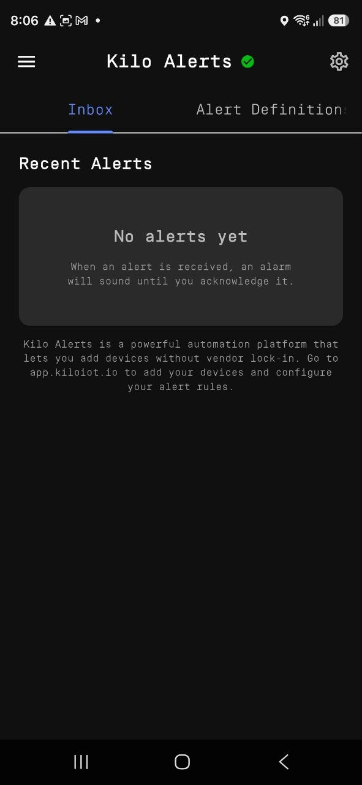
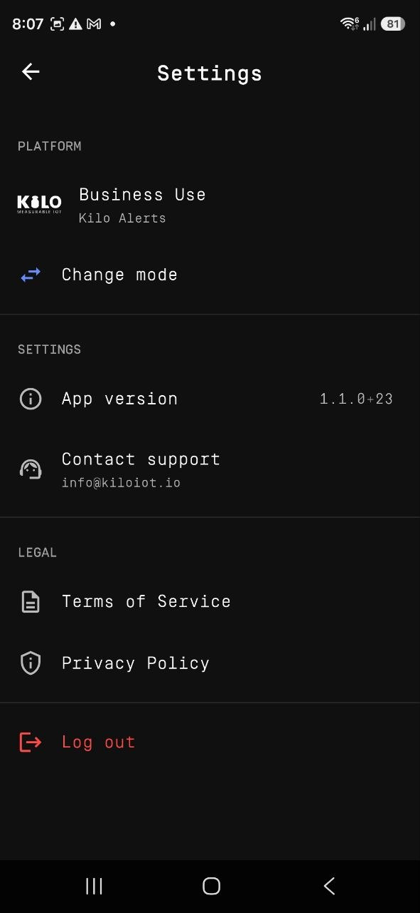

# Acknowledge and Resolve

The app is built for response, not just receipt. From a responder's phone you can triage incoming events, close the loop on the ones you've handled, and silence a noisy definition without opening a workstation. It has two tabs — **Inbox** and **Alert Definitions** — plus organization and platform switching.

## Inbox

The **Inbox** tab lists alarm events for the currently selected organization, newest first, and refreshes on its own while the app is open. Each entry shows the alert title and message, the time it triggered, and a status indicator — active versus resolved.

<figure><figcaption></figcaption></figure>

### Resolving an event

Tap an active event to resolve it. A confirmation appears, then the event is marked **resolved in Kilo for everyone** — its status flips, other recipients see it as resolved, and any remaining [escalation](../escalation-and-response.md) steps stop firing. This is the same outcome as **Dismiss & Acknowledge** on the full-screen alarm; it acknowledges the event platform-wide, not just on your device.

Resolution is the operational hand-off signal. Resolve an event only once it's genuinely handled, since doing so halts escalation for every other responder in the chain.

### Clearing an event from your view

Removing an event from your Inbox list takes it off your phone. Use it to tidy already-handled items — distinct from resolving, which changes the event's status for the whole deployment.

## Alert Definitions

The **Alert Definitions** tab lists the alarm definitions from your Kilo deployment. Use the search field to find one by name, then use its per-row toggle to **enable or disable** it.

This is the field control for a definition that's firing too often — mute it from the phone immediately, then refine its [conditions](../../rules-engine/README.md), [severity](../notification-delivery-settings.md), or [suppression settings](../notification-rules.md) on the web when you're back at a workstation. Definitions themselves are authored and edited on the web; the app gives you the on/off switch.

## Switching organization and platform

- **Organization** — if your account spans several organizations, switch between them from the app menu; the Inbox and Alert Definitions update to the selected one.
- **Platform** — under **Settings → Platform → Change mode** you can move between Business (Kilo) and Home (Chirp). Switching signs you out, because each platform uses its own account; sign back in with the credentials for the platform you selected.

<figure><figcaption></figcaption></figure>

## Acknowledgment paths at a glance

| Action | What it does | Where |
|---|---|---|
| **Close** | Silences the alarm tone on this phone only; the event stays active and escalation continues. | Full-screen alarm |
| **Dismiss & Acknowledge** | Silences the alarm and resolves the event in Kilo for everyone. | Full-screen alarm |
| **Tap to resolve** | Resolves the event in Kilo for everyone. | Inbox |
| **Disable definition** | Stops a definition from firing further alarms. | Alert Definitions |
