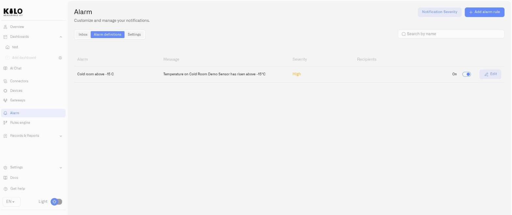

# Alarm Definitions

An alarm definition is a saved notification configuration in Kilo IoT Server. It specifies the message, severity, recipients, delivery channels, and escalation used when an alarm is raised. Reuse it wherever the same operational response is needed.

The definition is separate from both the **alarm event** your team handles and the **rule** that raises it. Configure the condition and response workflow in the [Rules Engine](../rules-engine/README.md); choose this definition in the rule's **Set Alarm** step.

Manage definitions in **Alarm → Alarm definitions**. Click **Add alarm rule** to create one or **Edit** to change one, and make sure the recipients have the [delivery channels](notification-channels.md) they need.

<figure><figcaption></figcaption></figure>

## Definition form fields

### Alarm name

| Field | Detail |
|---|---|
| **Alarm name** | Text field. Placeholder: *Enter name*. Required. This name appears in the Inbox when the alarm fires and in notification subject lines. |

### Severity

| Field | Detail |
|---|---|
| **Choose severity** | Dropdown. Options: Critical, High, Medium, Low, Info. Required. |

Severity determines the notification repeat cadence (configured in [Notification Severity](notification-delivery-settings.md)) and the visual priority in the Inbox. After selecting a severity, the form displays the current repeat policy for that level. Per-alarm overrides are available via the Custom Notification interval section below.

### Custom Notification interval

Override the global repeat policy for this specific alarm.

| Field | Detail |
|---|---|
| **Custom Notification interval** | Toggle (Off by default). When On, reveals interval and one-time controls. |
| **Interval** | Number + unit (Hours or Days). Controls how frequently notifications re-send while the alarm remains active. |
| **One-time notification** | Toggle. When On, one notification is sent and no repeats follow. A contextual message appears confirming: *"[Severity] notifications are sent once. You can change it below."* — where [Severity] matches the severity level selected for this alarm definition. |

### Escalation chain

Multi-step escalation for unresolved alarms. The first step is **Immediate** and cannot be removed. Additional steps fire after configurable delays if the alarm remains unresolved.

For a detailed walkthrough, see [Escalation and Response](escalation-and-response.md). In brief:

- Each step specifies: **Notify** (recipients from the organization — **required**, at least one recipient must be selected), **Via** (delivery channels).
- Click **Add step** to append escalation tiers with configurable delays.
- Resolution at any point halts further escalation.

### Schedule

| Field | Detail |
|---|---|
| **Schedule** | Displays the current schedule or "24/7 by default". |
| **Change schedule** | Opens a popover with day-of-week toggles and a From / To time range. |

Use scheduling to scope alarms to business hours, shift windows, or after-hours monitoring — for example, a server room temperature alarm that only fires outside of maintenance windows.

### Suppress duplicates

| Field | Detail |
|---|---|
| **Suppress duplicates within this window (in minutes)** | Slider. Range: 1–60 minutes. Prevents the same alarm from firing repeatedly when a sensor reports frequently. |

### Message

| Field | Detail |
|---|---|
| **Theme** | Notification subject line. Placeholder: *Fire alarm in the kitchen*. Required. |
| **Message body** | Notification body (multiline, 3 rows). Placeholder: *Your text here*. Required. |

Write messages that are immediately actionable — include what happened, where, and what the expected response is.

## Saving and managing

Click **Add new alarm rule** to create the definition, or **Save** when editing. Click **Cancel** to discard changes.

The **Alarm definitions** tab lists all definitions with the following columns:

| Column | Content |
|---|---|
| **Alarm** | Definition name |
| **Message** | Message body (truncated) |
| **Severity** | Severity level (color-coded) |
| **Recipients** | Escalation step recipients |

Each row has:

- **Toggle** — Enable or disable the definition without deleting it. Disabled definitions do not fire even when the Rules Engine triggers them.
- **Edit** — Reopen the definition form.

To delete a definition permanently, open it in Edit mode and click **Delete alarm** at the bottom of the form.

## Enterprise examples

- **Cold-chain temperature exceedance:** Severity Critical. Immediate notification to on-call refrigeration technician. Escalate to shift supervisor, then site manager. Schedule: 24/7. Suppression: 10 minutes.
- **Server room humidity alarm:** Severity High. Immediate notification to data center operations. Theme: "Humidity exceedance in DC-3." Message: "Rack row B humidity has exceeded the operational threshold."
- **Pump pressure deviation:** Severity Medium. Business hours only (Mon–Fri 06:00–22:00). Notify maintenance team. One-time notification — do not repeat.
