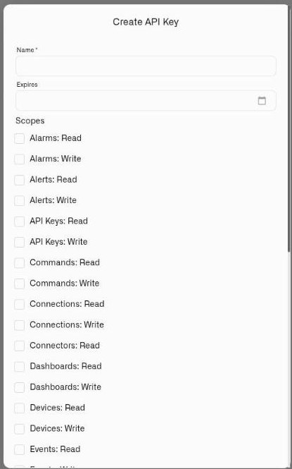

# Authentication & API Keys

Every API request — REST or gRPC — is authenticated with a **scoped API key**. Create, scope, rotate, and revoke keys in [Settings → API Keys](../settings/api-keys.md); this page covers how requests authenticate.

## How requests authenticate

- **`X-API-Key`** — your API key (format `kilo_<key>`). Send it on every request.
- **`X-Organization-Id`** — the organization the request acts in. It must match the organization the key was created in. Some operations also accept the organization as an `organizationId` query parameter instead of the header.

All requests are over TLS.

## Scopes

Keys are scoped. Most areas have separate **Read** and **Write** scopes; some — such as telemetry and subscription data — are read-only. A key grants only what you select when you create it, so grant only the scopes the integration needs. Each endpoint in the [API reference](https://api.kiloiot.io/) lists the scope it requires.

The **Create API Key** dialog asks for a name, an optional expiry date, and the scopes themselves — every scope starts unchecked, so a key grants nothing until you say so.

<figure><figcaption></figcaption></figure>

## Handling keys safely

- The full key value is shown **once** at creation; only a short prefix is visible afterward. Store it immediately in a secrets manager or vault.
- Use a **separate key per integration** so one can be revoked without disrupting the others.
- **Rotate or revoke** a key immediately if it may be exposed; rotation is the only recovery path for a lost key.
- Never embed a key in client-side code or commit it to source control.