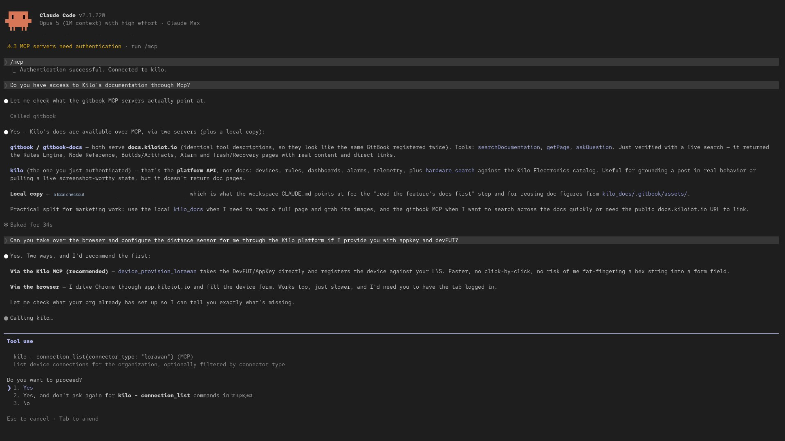

# Kilo IoT MCP Server for AI Agents

MCP — the Model Context Protocol — is an open standard that lets an AI client discover and call tools on a remote server. The Kilo IoT Server publishes an MCP endpoint, so any MCP-capable client — Claude Code, Claude Desktop, ChatGPT, Codex, Cursor, and others — can connect to your organization and work with your real deployment: devices, connectors, rules, alarms, and dashboards.

This is one integration path for the [Physical AI Platform for AI Agents](../physical-ai.md). Kilo remains the governed execution layer between the client and real infrastructure, so the model does not need to recreate device protocols, organization boundaries, or the operational lifecycle around a change.

Because MCP is an open standard rather than a per-vendor integration, this is not a fixed list. Any client that speaks MCP over Streamable HTTP can connect, and the walkthroughs below cover the two flows most clients follow: a command-line setup and a connector dialog.

The endpoint is:

```
https://mcp-auth.kiloiot.io/mcp
```

You authorize the connection in your browser with your usual Kilo account. There is no API key to mint, no token to paste, and nothing to store on the machine running the client.

## Why it matters

Without MCP, putting an assistant to work against a live deployment means writing an integration first: a key, a client library, a script per question. That is fine for a scheduled job and heavy for an incident at 2 a.m.

With the MCP server connected, the client you already use becomes an operator's console over your deployment — and it can act, not only read. An operations engineer can ask which devices in a site have stopped reporting and review the alarms around a failure window in one conversation, against live data. An integrator building a rollout can have it provision a batch of devices against the right connector instead of clicking through the same dialog fifty times. A team lead can ask for open alarm statistics before a shift handover. And because the toolset includes device commands, the same conversation can change a reporting interval or switch a relay. What governs that — and why an AI acting on physical infrastructure is a different proposition from one acting on data — is set out in [Physical AI](../physical-ai.md).

Because the connection carries your own account, the assistant is not an extra identity to govern. It can do what you can do, in the organization you are working in, and nothing else.

## Connect Claude Code

1. Add the server, giving it the name `kilo`:

   ```bash
   claude mcp add --transport http kilo https://mcp-auth.kiloiot.io/mcp
   ```

2. Start Claude Code in your project and run:

   ```
   /mcp
   ```

3. Select the `kilo` server. Claude Code opens your browser for authorization.
4. Sign in with your usual Kilo account and approve the request. The browser confirms the authorization, and you can return to the terminal.
5. Run `/mcp` again if you want to check the result. When the `kilo` server is reported as **connected**, its tools are available and you can start asking questions in plain language.

## Connect Claude Desktop

1. Open **Settings → Connectors**.
2. Click **Add custom connector**.
3. Paste the endpoint URL — `https://mcp-auth.kiloiot.io/mcp` — into the URL field.
4. Click **Connect**. Claude Desktop opens your browser for authorization.
5. Sign in with your usual Kilo account and approve the request.
6. Back in Claude Desktop, confirm the connector shows as active. Its tools are now available in any conversation.

## Connect another MCP client

ChatGPT, Codex, Cursor, and other MCP-capable clients follow one of the same two shapes. Where the client has a connector or integrations dialog, add a custom MCP server and paste the endpoint URL, as in the Claude Desktop steps above. Where it is configured from a command line or a config file, register the endpoint as a **Streamable HTTP** server — the transport this endpoint serves — as in the Claude Code steps.

Either way the authorization is the same: the client opens your browser, you sign in with your usual Kilo account, and the connection carries your permissions. Consult your client's own documentation for where it keeps MCP servers; nothing about this endpoint is client-specific.

## What a connected session looks like

<figure><figcaption>An authenticated Claude Code session working a live deployment: asked to configure a LoRaWAN sensor, it recommends provisioning through the platform, calls a Kilo tool, and stops for permission before continuing</figcaption></figure>

Two things in that exchange are worth pointing out. The client reasons about **your** deployment rather than IoT in general, because it can read the connections and devices that are actually there. And the approval prompt is the client's — Kilo annotates destructive tools and says so in the tool description, and a compatible client turns that into the prompt you see. See [Security and permissions](#security-and-permissions) below for what Kilo enforces regardless of which client you use.

## Choosing the organization

`https://mcp-auth.kiloiot.io/mcp` works against the organization **currently selected in the Kilo web app**. This is the right default for most people: whatever you are working on in the platform is what your client sees.

If you switch the active organization in the web app, reconnect the client so the default endpoint picks up the change.

To pin a client to one organization regardless of what is selected in the web app, connect it to the organization-scoped form of the endpoint instead:

```
https://mcp-auth.kiloiot.io/o/{organizationId}/mcp
```

Replace `{organizationId}` with the organization's ID from the web app. Pinning is worth doing when a client should always operate against a single production organization — an integrator maintaining one customer's deployment, for example, or a workstation that must never touch staging.

If you are not a member of the organization you pin to, the request is refused.

## What the assistant can do

Once connected, the client sees a set of tools it calls on your behalf. You do not call them yourself — you describe the task, and the client picks the tools it needs.

| Area | What the connected client can do |
|---|---|
| **Devices** | List devices in the organization, provision LoRaWAN devices and trackers, read device profiles, and inspect sensor mappings. `device_list`, `device_provision_lorawan`, `device_provision_tracker`, `device_profile_list`, `sensor_map` |
| **Commands** | List the commands configured on a device, execute one behind a confirmation, and check whether it was delivered. `device_command_list`, `device_command_execute`, `device_command_status` |
| **Emulator** | Browse device presets, provision an [emulated device](../devices/emulated-devices.md), read and update its configuration and interval, send a one-off reading, and move a device between the emulator and real hardware — any real device onto the Emulator, and an emulated device onto a real LoRaWAN connection. `emulator_preset_list`, `emulator_preset_get`, `device_provision_emulator`, `emulator_config_get`, `emulator_config_update`, `emulator_send_once`, `device_connection_swap` |
| **Connectors** | Review the connectors defined in the organization and create a connection for a device to report through. `connector_list`, `connection_create` |
| **Rules** | Review rules, prepare and deploy automation behind confirmation, simulate logic before it reaches production, and inspect execution history. `rule_list`, `rule_provision`, `rule_simulate`, `rule_execution_history` |
| **Alarms** | List alarms and summarize alarm activity for a shift or a site. `alarm_list`, `alarm_stats` |
| **Dashboards** | List dashboards and query the data behind a widget, so the client can reason about the same numbers your operators watch. `dashboard_list`, `widget_data_query` |
| **Organization** | Read organization details, list teams, invite users, and assign roles. `org_get`, `team_list`, `user_invite`, `user_role_assign` |

## What the client knows before it calls a tool

Every tool arrives with a plain-language title and a declaration of how it behaves, so a client that reads them can tell the difference between looking something up and changing your deployment **before** it acts rather than after. These are declarations the server publishes, not restrictions it imposes — what a client does with them is the client's design.

Three things are declared on each tool:

- **Whether it only reads.** Listing devices, reading alarm history, querying the data behind a widget — these change nothing, and a client can run them without interrupting you.
- **Whether it can change or remove something.** Deleting a device, updating a dashboard, swapping a device's connection, sending a command to physical equipment. These are marked as such so a client can put them behind a confirmation.
- **Whether it reaches outside your organization.** Almost everything works strictly within your own data. The two hardware tools are the exception: they search the partner catalog and the open web to recommend equipment, so they are declared as reaching beyond your deployment.

Provisioning tools sit deliberately in the middle. Creating a device or a dashboard adds something without overwriting or stopping anything that already exists, and the effect is undone by deleting what was created — so they are not treated as destructive, but they still change your organization.

The practical result, with a client that honors them, is that ordinary questions are answered without interruption while anything touching your deployment or your equipment stops for a confirmation. The declarations are generated from the running tool set rather than maintained by hand, so what a client is told does not drift from what the server does.

Your permissions remain the real boundary. A client that ignores the declarations still cannot do anything your account could not do.

## Security and permissions

- **You sign in, not a service account.** Authorization happens in your browser against your normal Kilo account. No key is generated, copied, or stored for the connection.
- **Your permissions are the ceiling.** The connection carries your own access. The client can only do what your account is allowed to do — if you cannot deploy a rule or invite a user, neither can it.
- **Organization boundaries hold.** A request for an organization you are not a member of is refused, whether it comes from the default endpoint or a pinned one.
- **Actions retain their operational records.** Rule changes and executions appear in rule history, device-command dispatches appear in command execution history, and organization access changes appear in the Audit Trail. These are separate records for their corresponding workflows, not one generic conversation log.

Treat an authorized client like a signed-in session: it belongs on machines you control.

## How this differs from the built-in assistant

Kilo has an [IoT AI Assistant](../ai-assistant/README.md) built into the web app — open it from **AI Chat** and it works your deployment alongside you, with no setup at all. That is the fastest path for most people, and it is where confirmation gates, inline charts, and the platform knowledge base live.

The MCP server points the other way: it brings **your own client** to the same deployment. Use it when you want your deployment in the tool you already have open — a terminal beside the code of the integration you are building, or a desktop client where the deployment sits next to your other context. Both talk to the same platform, so which one you use is a question of where you are working.

## How this differs from REST and gRPC

The [Public REST API](public-rest-api.md) and the [gRPC API](grpc-api.md) are for programs you write: a sync job, a reporting pipeline, a SCADA bridge. They authenticate with a scoped [API key](../settings/api-keys.md) that runs unattended. MCP is for an AI client acting on your behalf, authorized by your own sign-in and bounded by your own permissions. If you are writing code, use REST. If you are working with an assistant, use MCP.

## Tips

- **Name the server `kilo` in Claude Code.** The command above does this, and it gives you a short handle when you want to point the client at a specific server.
- **Start read-only.** Ask for a device list or an alarm summary before you ask for a provisioning run. It is a quick way to confirm the connection landed on the organization you expected.
- **Confirm the organization before batch work.** Ask the client which organization it is connected to, or pin the endpoint, before anything that creates or changes resources.
- **Pin production, leave staging on the default.** A pinned endpoint cannot be moved by a stray click in the web app's organization switcher.
- **Reconnect after switching organizations** in the web app if you are using the default endpoint — the existing connection keeps the organization it authorized against.

## See also

- [Physical AI Platform for AI Agents](../physical-ai.md) — how models, Kilo, and physical infrastructure divide responsibility.
- [IoT AI Assistant](../ai-assistant/README.md) — the assistant built into the platform.
- [Public REST API](public-rest-api.md) — the integration path for programs you write.
- [Authentication & API keys](authentication-and-api-keys.md) — how key-based API requests authorize.
