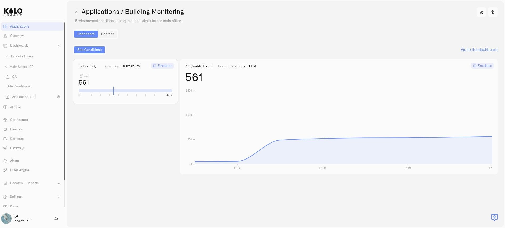

# Applications

An **application** is an IoT solution assembled for a particular job. It brings together the devices that collect information, the dashboards that show it, the rules that respond, and the alarms that notify people. For example, a **Leak Monitoring** application could contain a building's leak detectors, a floor dashboard, and the rules and notifications that help the maintenance team respond.

The purpose of Applications is to make that complete solution something a specialist can build and a customer can use. A dealer who serves property managers understands which sensors, views, and alerts they need. A vehicle-tracking specialist needs a different setup. Applications gives each solution a defined set of working parts, with a common place to open and manage them.

**The direction is reusable templates:** a specialist prepares a solution once, saves its configuration as a template, and customers apply it to create their own devices, dashboards, rules, and alarms together. Customers would start with a coordinated setup instead of configuring every part from scratch. Release 3.10.0 delivers the application itself and the ability to assemble its resources; publishing and applying templates are planned capabilities.

<figure><figcaption>
An application's Dashboard tab provides a place to use the views configured for that solution.
</figcaption></figure>

## What makes up a solution?

Consider a specialist setting up leak monitoring for a property manager. Each part has a job:

| Part | Example in Leak Monitoring |
|---|---|
| Devices | Digital devices connected to leak sensors in the building. |
| Dashboards | A view showing sensor readings and the locations being monitored. |
| Rules | Conditions that recognize a leak reading and run the configured response. |
| Alarms | Notification definitions specifying the message, recipients, and delivery behavior. |

The application brings these configured resources together under a recognizable name. A second application could serve space utilization or vehicle tracking, with its own equipment and workflows. Your team can open the solution it needs without searching through every device, dashboard, rule, and alarm in the organization.

Creating the application does not configure those relationships automatically. A dashboard still needs widgets bound to the appropriate devices, and a rule must refer to the alarm definition it should use. In the current release, you configure those connections and assign the resources to the application.

## An application and a template have different roles

An **application** is the setup in your organization: the particular devices, dashboards, rules, and alarms you work with. A **template** is the planned reusable configuration from which a customer could create an application of their own.

The intended workflow is:

1. **The specialist builds the solution.** A dealer or integrator prepares devices, useful dashboards, rules, and notification behavior for a particular customer need.
2. **The specialist publishes a template.** The prepared configuration becomes reusable for other customers with the same need.
3. **The customer applies the template.** Its digital device configurations, dashboards, rules, and alarms are created together for that customer, ready to be connected to their equipment and adapted to their installation.
4. **The customer uses the application.** They open its dashboards and work with the resources behind the solution.

Template publishing and installation are planned. This workflow explains where Applications is heading; the current setup steps are below.

## What you can do now

In release 3.10.0, you can create and name an application, assign devices, dashboards, rules, and alarm definitions, view its dashboards, and inspect its content. This is useful when building a solution yourself or maintaining a setup for an operations team.

1. [Create an application](creating-an-application.md) for a specific outcome, such as Building Monitoring.
2. Configure its devices, dashboards, rules, and alarm definitions through their normal platform workflows.
3. [Assign those resources](organizing-content.md) using each resource's **Application** field.
4. Open **Applications → My applications**, select the application, and use **Dashboard** for its views or **Content** for the resources behind them.

An application can contain several dashboards. For example, Building Monitoring could have a daily overview and a detailed environmental view. See [Using Application Dashboards](using-application-dashboards.md) for viewing and editing them.

Applications belong to the current organization. Users still need the relevant permissions to view or manage their contents; assigning a resource to an application does not grant additional access.

Content counts show the size of each resource category. **0** means it is empty. A dash means the count is unavailable, for example because access is missing or the category could not be loaded.

When retiring a solution, review [Deleting an Application](deleting-an-application.md) first: deletion also removes its associated resources. Move anything you need to keep to another application or **Default** before deleting.
