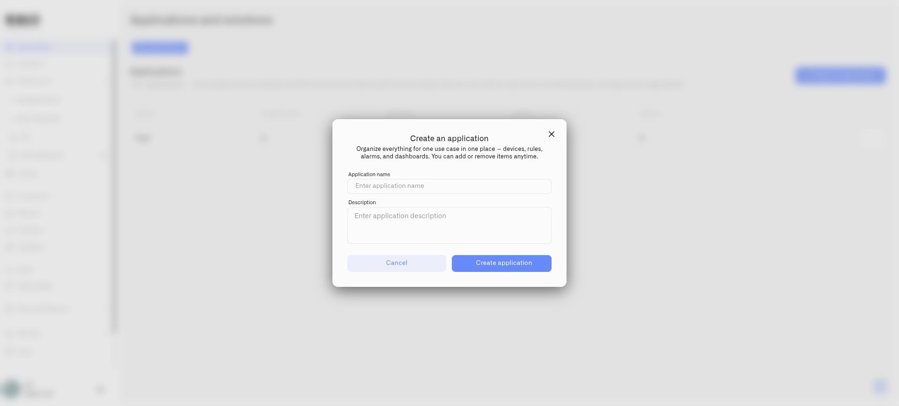

# Creating an Application

Create an application to assemble the resources for an IoT solution your team will use. This guide covers building the application yourself: you create its name and description, then configure and assign its devices, dashboards, rules, and alarms. Applying a prepared template is a planned alternative, explained in [Applications](README.md). Choose a name that tells operators what the solution does, such as **Building Monitoring**.

You must be a member of the current organization. Applications have no separate management permission; viewing or editing their devices, dashboards, rules, and alarms still requires the corresponding resource permissions. Check the organization selector before creating the application, particularly if you manage several customers or sites.

<figure><figcaption>
Give the application a recognizable name and describe its purpose.
</figcaption></figure>

## Create the application

1. Open **Applications** and select **My applications**.
2. Select **Create an application**.
3. Enter **Application name**, for example `Building Monitoring`.
4. Add an optional **Description**, such as `Environmental conditions and operational alerts for the main office.`
5. Select **Create application**.
6. Open the new application and select **Content**.

The name is required. The description gives colleagues context but does not configure devices or automation. A newly created application has no associated resources until you assign them.

## Update its details

Open the application and use its edit action to change **Application name** or **Description**, then save. Choose distinct names even though names are not required to be unique; identical names make assignment selectors harder to use.

You can also create an application from an **Application** selector using **Add new application** while configuring a resource. Complete the resource's own save action after choosing the new application.

Next, [assign the resources](organizing-content.md) that deliver the intended outcome.
