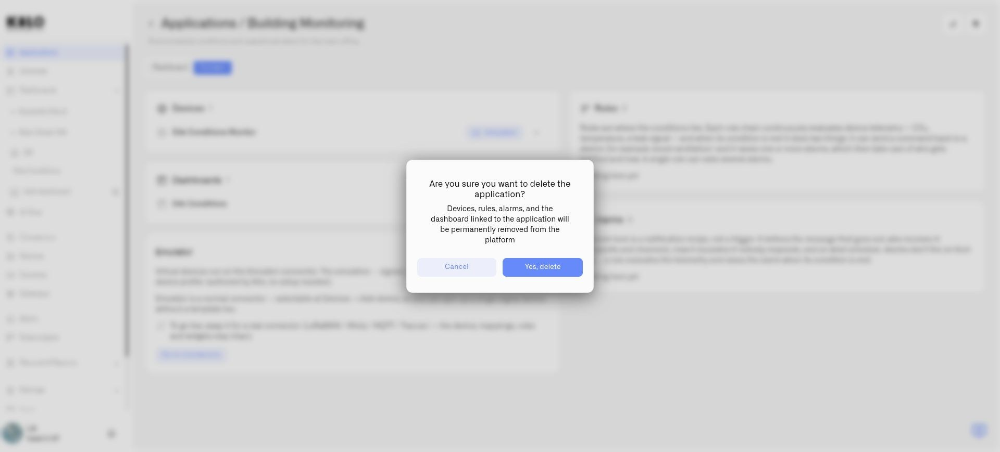

# Deleting an Application

Deleting an application retires its associated solution, not just its name. Use this action only after deciding what should happen to the resources listed in **Content**.


Deleting an application deletes associated devices and dashboards, removes associated alarm definitions, and stops and moves associated rules to Trash. Move resources you need to keep to another application or **Default** before deleting.


<figure><figcaption>
Review the consequences before confirming application deletion.
</figcaption></figure>

## Review before deletion

1. Open the application and select **Content**.
2. Inspect **Devices**, **Dashboards**, **Rules**, and **Alarms**.
3. Open each resource you want to preserve and change its **Application** assignment.
4. Save the resource where required, then return to Content to check that it is no longer associated.
5. Check running rules and dependent dashboards before removing resources that other operational workflows may use.

## Delete the application

Open the application's delete action, read the confirmation, and confirm only when its remaining contents can be removed. Return to **My applications** and check the result.

If deletion reports a failure, inspect the application and its resources before retrying. Resource removal may have partly completed. A rule being edited can also prevent the operation; have its editor finish and close the editing session, then retry.

Do not rely on rule Trash to recover the entire application. It does not restore deleted devices, dashboards, or alarm definitions. See [Trash and Recovery](../rules-engine/trash-and-recovery.md) for the rule-specific restoration process.

## Access and folder cleanup

Deletion requires **Read** access to devices, dashboards, rules, and alarms, plus **Write** access to each category that has resources in this application. A permission refusal occurs before resource removal. Ask an organization administrator to arrange the required access if the message names a missing permission.

When all removed dashboards share one parent folder and that folder becomes empty, the folder is removed too. A folder that still contains other items remains, and dashboards spread across different parent folders do not cause those folders to be deleted. Move any dashboard you want to keep before confirming deletion.
