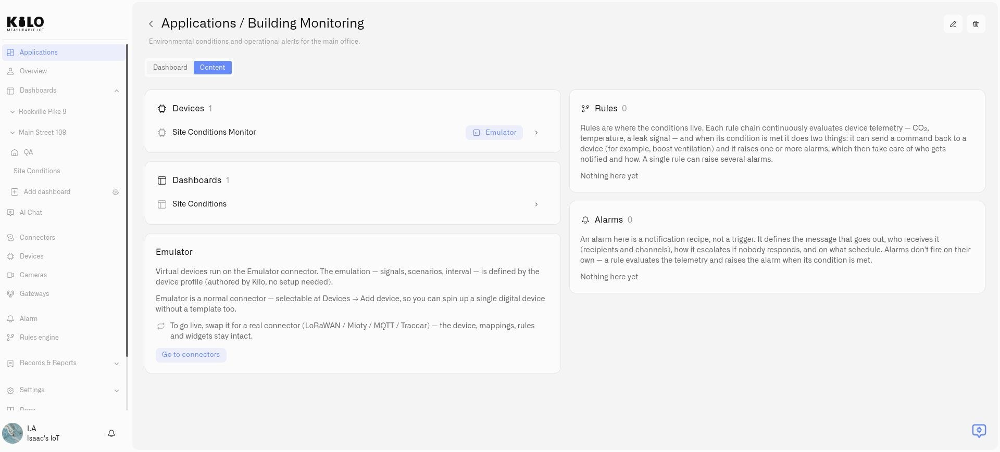

# Organizing Content

An application's **Content** tab is an inventory of the resources behind a solution. For Building Monitoring, this might include temperature sensors, a facilities dashboard, an overheating rule, and an alarm definition for the response team.

Create the resources through their normal platform workflows, then set their **Application** field. You need permission to edit the resource you are assigning.

<figure><figcaption>
The Content tab groups the application’s devices, dashboards, rules, and alarms.
</figcaption></figure>

## Assign resources

| Resource | Where to choose the application |
|---|---|
| Device | Open its details and choose **Application** on **Device info**, then select **Next**. |
| Dashboard | Use the dashboard's add or edit dialog and choose **Application**. |
| Rule | Choose an application in the rule list's **Application** selector. |
| Alarm definition | Open the alarm definition's create or edit dialog and choose **Application**, then save. |

Select `Building Monitoring` in each relevant field. Return to **Applications → My applications → Building Monitoring → Content** to confirm that the resources appear in the appropriate sections.

One resource belongs to one application at a time. To move it to another application, change that resource's selector. **Default** means the resource is not assigned to a named application; it is not a second copy or a separate organization.

## Understand what is included

The Content tab separates **Devices**, **Dashboards**, **Rules**, and **Alarms**. Open a listed item to continue working with that resource. Available actions and visible content depend on your permissions.

A rule evaluates conditions; an alarm definition describes notification behavior. Assigning both to an application does not connect them automatically. Configure the rule's alarm action to use the intended definition, as described in [Alarm Definitions](../alarm/notification-rules.md).

Use the content list to check for missing pieces before handing over the solution. For example, a dashboard with readings is useful for observation, but unattended monitoring also needs configured rules and alarm behavior.

## Preserve resources when reorganizing

Moving a resource changes its application association. Deleting an application has broader consequences. Before retiring an application, [review deletion behavior](deleting-an-application.md) and move anything you want to keep to another application or **Default**.

## Find an item in a larger application

Long resource lists scroll inside their own content block, and search becomes available when the list is large enough. Physical-device status reflects whether the device is reporting; emulated devices carry an Emulator badge. Open a resource from the application and use its return navigation to get back to the application context.

## Selections and resource status

The Application selector starts at **Default** until you have successfully created a resource with another selection. It remembers the last used selection for your account and organization; changing organizations keeps those choices separate. A searchable selector helps when there are many applications. Creating an application through **Add new application** creates it immediately, even if you later cancel the resource form.

A rule's Application selector can be changed while someone has its editor open. This changes membership, not the rule's flow or deployment. A rule editor lock can still prevent deletion of the application containing that rule.

An **Emulator** badge identifies a device producing simulated readings. The **Emulator** card explains the source and offers **Go to connectors**. Follow the [Emulator Connector](../connectors/emulator-connector.md) guide when preparing a test device or replacing its simulated input with a real connection. Physical devices use their connection and recent reporting state; an unresolved device can appear without a status while its details load.

The Rules and Alarms blocks load up to 200 entries each, including disabled alarm definitions. For larger collections, open **Rules engine** or **Alarm** and use their full lists. Loading or access failures are different from an empty application.
