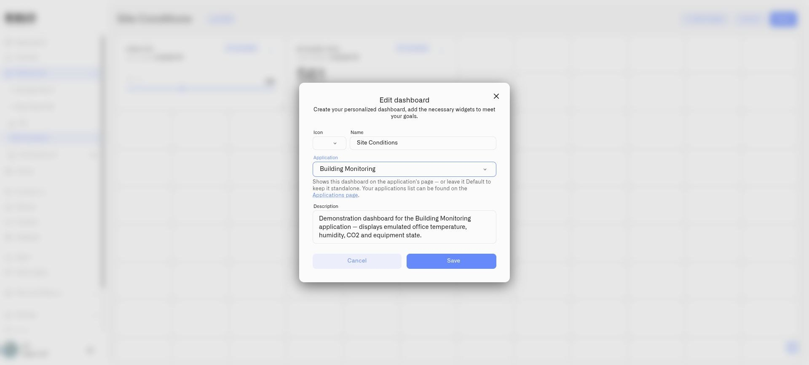

# Using Application Dashboards

The **Dashboard** tab presents the dashboards associated with an application. It gives operators a direct route from a solution's name to the measurements and controls they use, while the **Content** tab provides the underlying resource inventory.

A Building Monitoring application can have separate dashboards for environmental conditions and equipment operation. Associate each dashboard with the application through its **Application** field.

<figure><figcaption>
Choose the application in the dashboard editor.
</figcaption></figure>

## View a dashboard

1. Open **Applications → My applications**.
2. Select the application.
3. Open **Dashboard**.
4. If the application has several dashboards, select the one you want to view.

The dashboard displays its configured widgets. Their data and available interactions follow the underlying devices, widget configuration, and your permissions.

## Change the layout or widgets

The application's dashboard view is not the layout editor. Select **Go to the dashboard** to open the dashboard itself, then use its normal editing controls. See [Creating Dashboards](../dashboards/creating-dashboards.md) for the complete workflow.

After saving your changes, return to the application to check the result. The same dashboard is used in both locations; you are not maintaining an independent copy.

## If no dashboard appears

Check **Content → Dashboards**. If it is empty, create a dashboard or edit an existing one and set its **Application** field to this application. If you cannot view an associated dashboard, ask the organization administrator to check your dashboard access.

## Show the resources behind the view

Use a [Text widget](../dashboards/adding-widgets/text-widget.md) to list selected devices, rules, or alarms alongside the dashboard readings. An operations board can show the equipment and alarm severity relevant to that shift.
