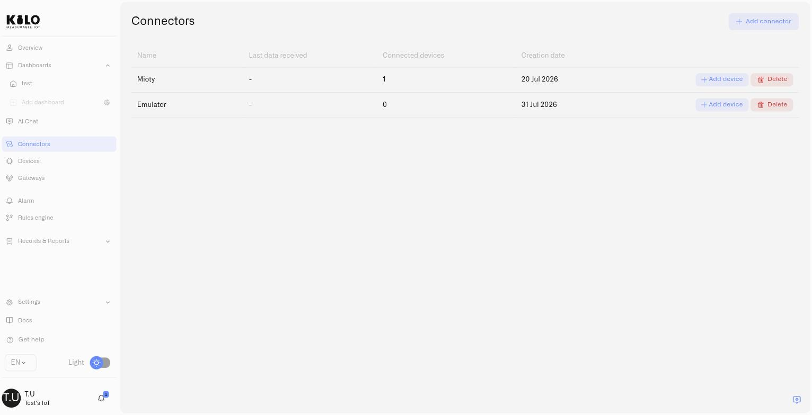
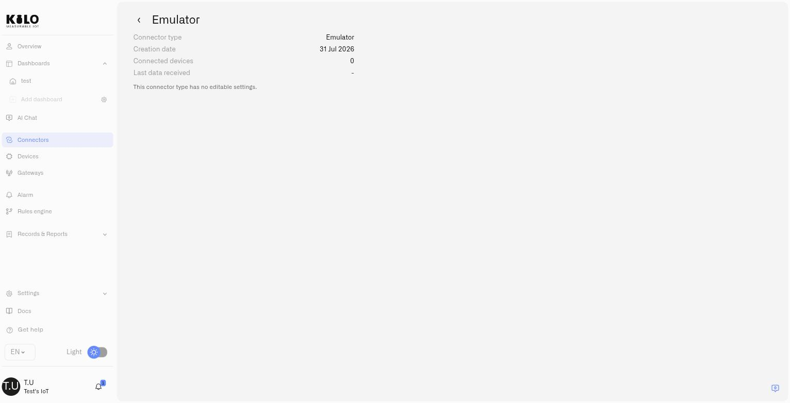

# Emulator Connector

The Emulator connector lets you run the Kilo IoT Server with **no hardware at all**. It creates devices that generate their own telemetry, so dashboards fill up, rules fire, and alarms escalate exactly as they will on site — while your sensors are still in a box, still on order, or still being specified.

Then comes the part that makes it more than a demo: **when the real device arrives, you point the same device at a real connector and keep everything you built.** The dashboards, the rules, the thresholds and the escalation chains stay exactly as they are. Only the source of the data changes.

<figure><figcaption></figcaption></figure>

## What the Emulator is for

Three situations where it changes how a project runs:

- **Evaluating the platform.** See your use case working — a cold room breaching its limit, an escalation chain reaching a phone — before committing to hardware.
- **Building ahead of delivery.** Sensor lead times are measured in weeks. The configuration work does not have to wait for them: build the deployment now, and go live the day the hardware lands.
- **Testing what you cannot easily reproduce.** Freezer failures, tank run-dry, a value that only misbehaves at −30 °C. You can produce the exact reading that should trigger an alarm, on demand, instead of waiting for it to happen for real.

## Adding the connector

Go to **Connectors → Add connector**, choose **Emulator**, and save. That is the entire setup.

The Emulator connector has **no settings to configure** — no credentials, no endpoint, no certificates. It exists purely so devices have something to bind to.

<figure><figcaption></figcaption></figure>

## Creating an emulated device

Add a device the way you always do, then open its **Connection** tab and choose **Emulator** as the connector type. The device form then asks for:

| Field | What it does |
|---|---|
| **Device ID** | The identifier this emulated device reports under. Any value you like — something readable such as `cold-room-01` helps later. |
| **Data sending interval** | How often the device emits a reading, as a number plus a unit (for example 10 minutes). Choose something close to the real sensor's reporting rate so your rules behave realistically. |
| **Support commands** | Turn this on to give the device a **Commands & States** tab, so you can define and run commands against it just like a physical device. |
| **Use device preset** | Start from a real device model instead of typing metrics by hand. |

### Starting from a device preset

Ticking **Use device preset** opens a list of real sensor models. Pick the one you have — or the one you have on order — and the platform fills in that model's actual measurements for you.

A multi-sensor preset, for instance, fills in its full set of readings — temperature, humidity, air quality and the rest — each with the right data type, and sets a sensible reporting interval. It is the fastest way to get a realistic device, and it means the metric names you build dashboards against are the ones the real sensor will send.

<figure><figcaption></figcaption></figure>

> **A preset replaces what is already there.** Selecting one overwrites metrics you typed by hand and resets the interval to the preset's own. Pick the preset first, then adjust.

### Defining metrics by hand

Without a preset — or alongside one — use **Add device data key** to define each measurement:

- **Device data key** — the metric name, such as `temperature`. This is what dashboards, rules and mappings refer to.
- **Data type** — `Float` for anything with decimals, `Integer` for whole numbers, and the other supported types for booleans and text.

Choose the data type deliberately. An **Integer** metric truncates decimals: send `1.5` and the device reports `1`. If a reading needs decimal precision, it must be a **Float**.

## Sending values

Once the device is saved, its **Emulator** tab lists every metric with two controls:

- **Save** pins a value. The device keeps reporting that value on its interval, which is how you hold a tank at 8% or a freezer at −18 °C while you watch a rule react.
- **Send once** transmits a single reading immediately, without changing what the device reports afterwards. This is the one to use when you want to trip a threshold on demand.

<figure><figcaption></figcaption></figure>

Sending a value is a **write action** — it feeds history, rules and alarms exactly as real telemetry does. A user with read-only access can view an emulated device but cannot inject readings into it.

## Running commands against an emulated device

With **Support commands** enabled, the device gets a **Commands & States** tab and behaves like controllable hardware: you define named commands with typed parameters, and operators run them from the States tab. Commands are the actions someone can send to a device — a reboot, a setpoint, a configuration change — and they are defined once and reused.

This is what lets you build and rehearse a closed loop before the equipment exists: a rule detects a condition, sends a command, and the alarm records that it happened.

## Going live: swapping to a real device

This is the step the Emulator is built around. When the hardware arrives, open the device's **Connection** tab and change the connector from **Emulator** to the real one — LoRaWAN, for instance — then supply the identifiers the physical device needs.

Everything else about the device stays: its name, its place on your dashboards, the rules bound to it, its alarm definitions and escalation chains. You are replacing the source of the data, not rebuilding the deployment.

The swap is deliberately restricted to pairs that involve the Emulator — emulator to real, or real back to emulator. Swapping directly between two physical connector types is not offered, because the device identifiers and payload mappings differ enough that the mapping has to be rebuilt anyway.

> Going the other way is just as useful: move a real device onto the Emulator to reproduce a problem, then move it back.

## Cloning an emulated device

Duplicating a device copies its emulator configuration with it — metrics, data types and interval. Building one device carefully and cloning it is the quickest way to stand up a realistic multi-device site, such as twenty cold rooms that all report the same measurements.

## Ask the assistant to do it

The whole workflow above is available in plain language through the [IoT AI Assistant](../ai-assistant/README.md). It can list the available device presets, provision an emulated device from a preset or from metrics you describe, read and update its configuration and interval, and send a one-off reading — and it can perform the swap to a real connector when your hardware arrives.

## What's next

- [Registering Devices](../devices/registering-devices.md) — the full device form
- [Rules Engine](../rules-engine/README.md) — build automations against your emulated data
- [Alarms](../alarm/README.md) — escalation chains you can rehearse before go-live
- [Device Commands](../devices/commands/README.md) — defining the commands an emulated device can run
