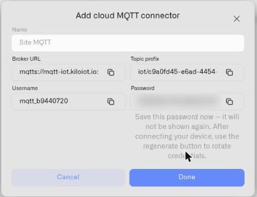
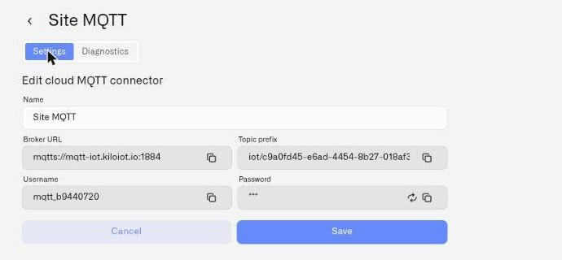

# Cloud MQTT

Cloud MQTT is the platform-managed broker option for an MQTT connector. The Kilo IoT Server provisions a dedicated broker endpoint per connector, generates credentials, and assigns a unique topic prefix that scopes the connector's namespace within the managed broker. Devices and edge gateways publish to that endpoint; the platform consumes the messages directly.

For deployments that don't have an operating need to run their own MQTT broker — pilots, remote sites, recently-acquired facilities, vendor-provided MQTT firmware that just needs a public destination — Cloud MQTT removes broker provisioning, certificate management, and reachability concerns from the integration scope.

## When Cloud MQTT is the right choice

- **Greenfield ingestion.** No existing broker; running one would add infrastructure scope without operational benefit.
- **Vendor-provided MQTT firmware.** A device or gateway is configured to publish MQTT to an internet-reachable endpoint, and a managed endpoint is preferable to spinning up infrastructure.
- **Remote sites with constrained operations.** A site has cellular or satellite uplink and limited on-site IT; pointing publishers at a managed cloud endpoint is operationally simpler than running a local broker.
- **Pilot deployments.** Validating an MQTT integration before committing to broker infrastructure investment.

When an existing broker is already in place — a Mosquitto cluster on-premise, AWS IoT Core, an enterprise HiveMQ instance, or another broker product — see [External MQTT](external-mqtt.md) instead.

## Provisioning the connector

1. Navigate to **Connectors** in the sidebar.
2. Click **Add connector**.
3. Select **Cloud MQTT** from the **Connector type** dropdown.
4. Provide a **Name** for the connector (operational label, e.g. `Plant 3 Line A Telemetry`).
5. Click **Add**.

The platform provisions the broker endpoint and displays four credentials:

| Field | Behavior |
|-------|----------|
| **Broker URL** | The complete managed endpoint, including scheme and port. Uses MQTTS (TLS) on port 1884. Copy verbatim — the scheme and port are part of the credential. |
| **Topic prefix** | The unique namespace prefix for messages routed to this connector. Every message your devices publish must begin with this prefix. The prefix has the shape `iot/{org}/{connection}` — two opaque segments identifying your organization and this connector. |
| **Username** | Generated by the platform. Copy exactly — it must be reproduced byte-for-byte on the publishing side. |
| **Password** | A randomly-generated secret. Shown once. **Copy and store securely on creation.** Recovery is not possible — only rotation. |

The password is not stored in a retrievable form. Treat the post-provisioning copy as the only opportunity to capture it; missing the moment requires regenerating credentials and reconfiguring all publishers.

<figure><figcaption></figcaption></figure>

## Integration model

Cloud MQTT publishers connect outbound to the managed broker. Three details matter:

- **TLS on port 1884.** Configure your publisher's MQTT client to use the `mqtts://` scheme on port 1884. Do not assume port 1883 — the managed broker does not accept plaintext connections. The broker certificate is signed by a publicly-trusted CA, so no client-side CA bundle is required for standard libraries.
- **Topic prefix is mandatory on every published topic.** A device publishing energy readings must publish to `{Topic prefix}/{your topic}` — for example, `iot/{org}/{connection}/meters/EM-4492/power`. Messages published outside the prefix are not delivered to this connector.
- **The Topic prefix is stripped before device routing.** When you configure a device's Device ID Topic in the Topic sub-tab, you specify only the device-level portion (`meters/{{deviceId}}/power` or similar). The platform handles the prefix internally.

For Zigbee2MQTT-bridged devices specifically, the Z2M `base_topic` setting in `configuration.yaml` should be `{Topic prefix}/zigbee2mqtt`. Z2M then publishes each device under `{Topic prefix}/zigbee2mqtt/{friendlyName}`, and the device-level topic seen for routing is `zigbee2mqtt/{friendlyName}`.

## Verifying ingestion

After publisher startup, open the connector's detail page. The **Last data received** field updates within seconds of the first publish. For Z2M-bridged setups, the bridge's own `bridge/state` retained-message announcement is the first thing the broker accepts — that's typically when **Last data received** first appears, before any device has reported.

If **Last data received** does not update after the publisher reports a successful broker connection, the most common causes are wrong port (1883 vs 1884), wrong TLS scheme, or topic prefix mismatch. See [Troubleshooting](troubleshooting.md) for the full diagnostic sequence.

## Credential rotation

Rotate Cloud MQTT credentials when:

- The original password was lost or never captured.
- A credential leak is suspected.
- A team transition or contractor offboarding warrants rotation.
- A compliance policy requires periodic rotation.

To rotate:

1. Open the connector detail page.
2. In edit mode, regenerate the password.
3. Capture the new password immediately.
4. Update every publishing client (firmware configuration, Z2M `configuration.yaml`, edge gateway settings) with the new password.
5. Restart publishers to pick up the new credential.

The username and Topic prefix remain stable across rotation. Only the password changes.

<figure><figcaption></figcaption></figure>

## Limits

Cloud MQTT connectors are unlimited per organization. Use multiple connectors to scope namespaces by site, vendor, or operational team — each connector has its own Topic prefix and credentials, and access can be managed independently per connector.
