# Adding LoRaWAN gateway

Adding a gateway is straightforward and can be completed in just a few simple steps. The platform is compatible with any **LoRaWAN** or **LR-FHSS** gateway from various manufacturers, as long as it supports the more secure **LoRa Basics™ Station** protocol. In this guide, we’ll demonstrate how to add a **RAKWireless** WisGate V2 gateway, but the process is the same for all manufacturers.

### Step 1: Access the Gateway Section

1. Log in to your account.
2. Click **Gateways** from the left-hand menu.

<figure>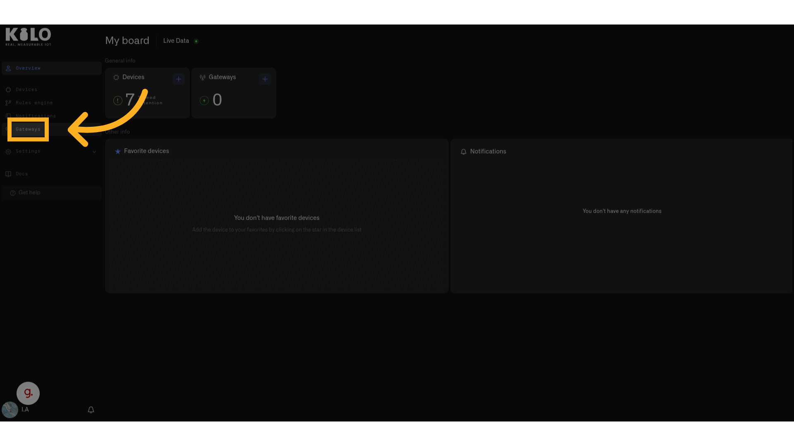<figcaption></figcaption></figure>

In the top-right corner, click **Add Gateway**.

<figure>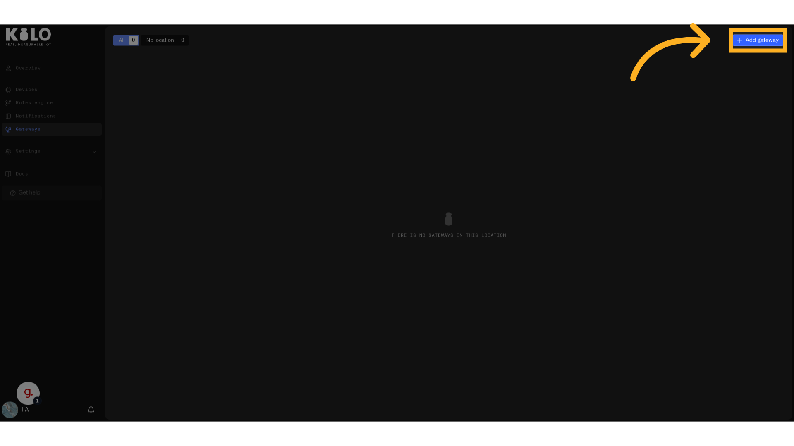<figcaption></figcaption></figure>

### Step 2: Configure Gateway Details

**Name your gateway** (e.g., `London Office Gateway 1`).

<figure>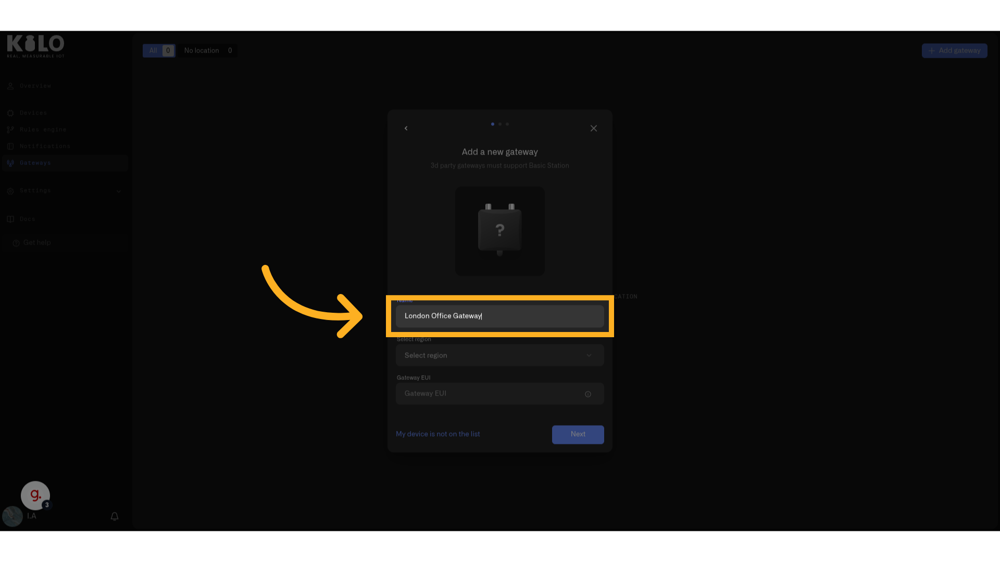<figcaption></figcaption></figure>

**Select the appropriate LoRaWAN frequency** for your country:

* For Europe: `EU868`
* For the United States: `US915`
* You can verify your country's frequency band [here](../../../lorawan-lr-fhss/lorawan/subg/frequencies.md).

<figure>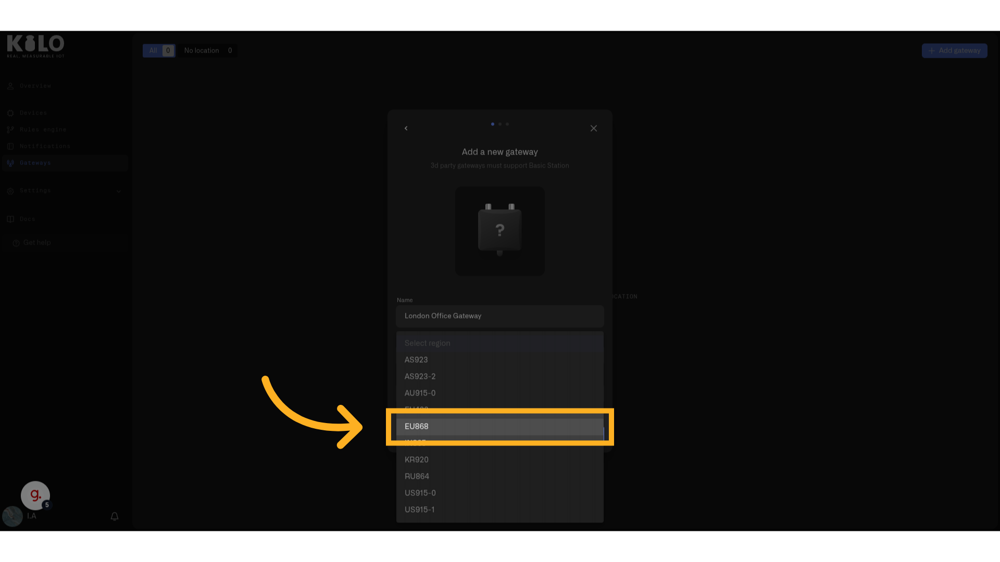<figcaption></figcaption></figure>

1. **Enter the Gateway EUI** – typically printed on a sticker from the manufacturer.
2. Click **Continue**.

### Step 3: Collect Connection Details

Copy the **LNS (LoRa Network Server) address** – you’ll need this in the next steps.

<figure>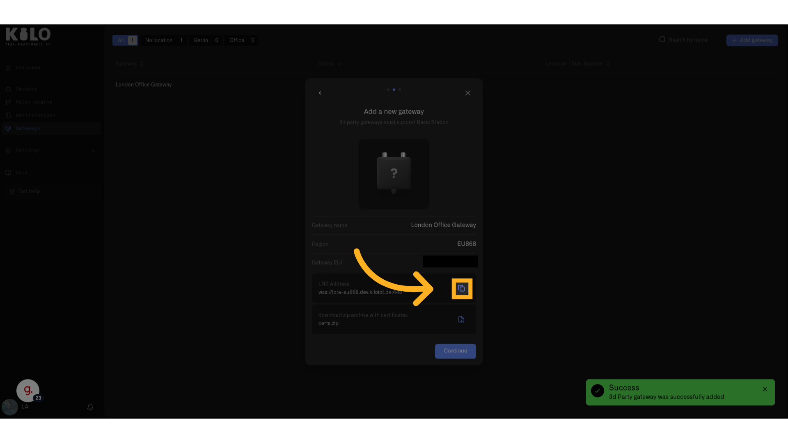<figcaption></figcaption></figure>

Download the **certificates** for secure gateway authentication and click continue

<figure>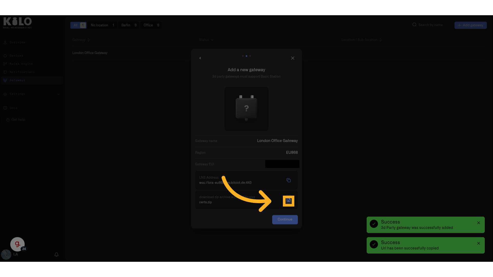<figcaption></figcaption></figure>

Click continue

<figure>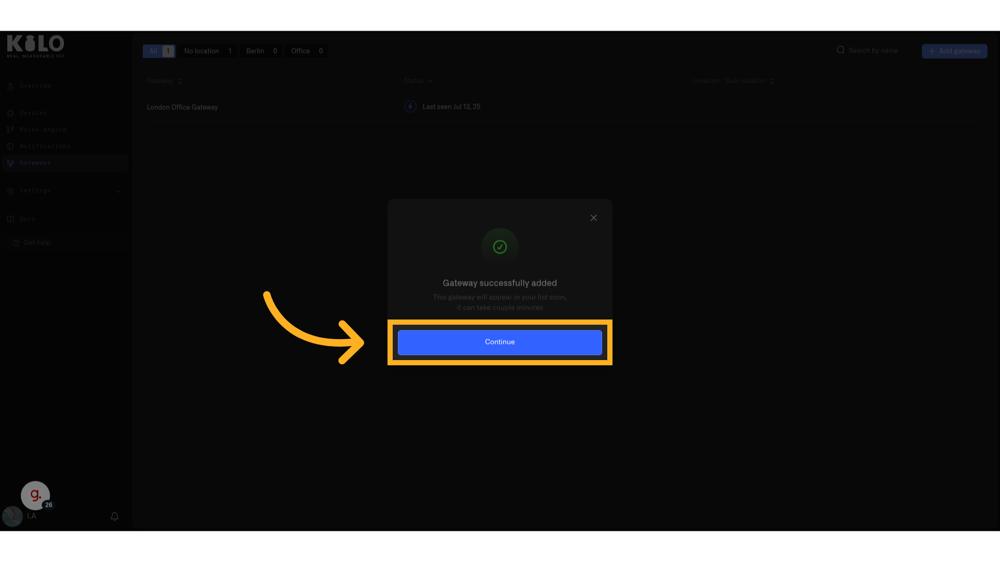<figcaption></figcaption></figure>

Congratulations you added your gateway to Kilos platform. Now you need to log into the gateway and point it to Kilo.

### Step 4: Connect to Your Gateway

You’ll now access your gateway’s web interface by identifying its local IP address.

**Ways to find your gateway's IP address:**

* **Router console:** View connected devices.
* **Windows:** Use [Angry IP Scanner](https://angryip.org/).
*   **Linux/macOS:** Run the command:

    ```bash
    nmap -sn 192.168.2.0/24
    ```

_(Replace `192.168.2.0/24` with your actual subnet)_

### Once You Have the IP Address

1. Open your browser and enter the IP in the URL bar. You will see a message that connection is not secure.
2. Click **Advanced**, then **Continue**.
3. Create a **password** for your gateway when prompted.

### Step 5: Configure Basics™ Station Protocol

1. Select **Basics™ Station** mode.

<figure>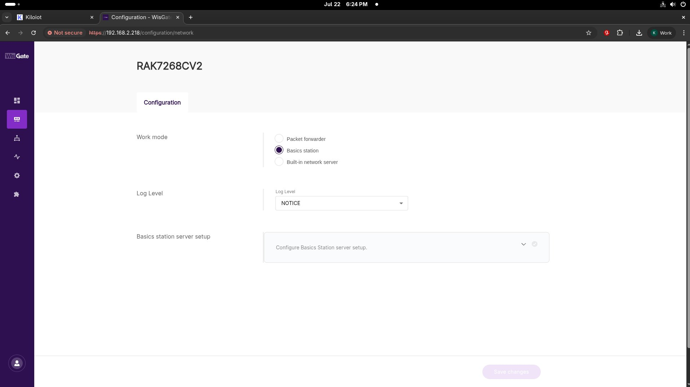<figcaption></figcaption></figure>

1. Paste the **LNS address** copied from the Kilo platform.

<figure>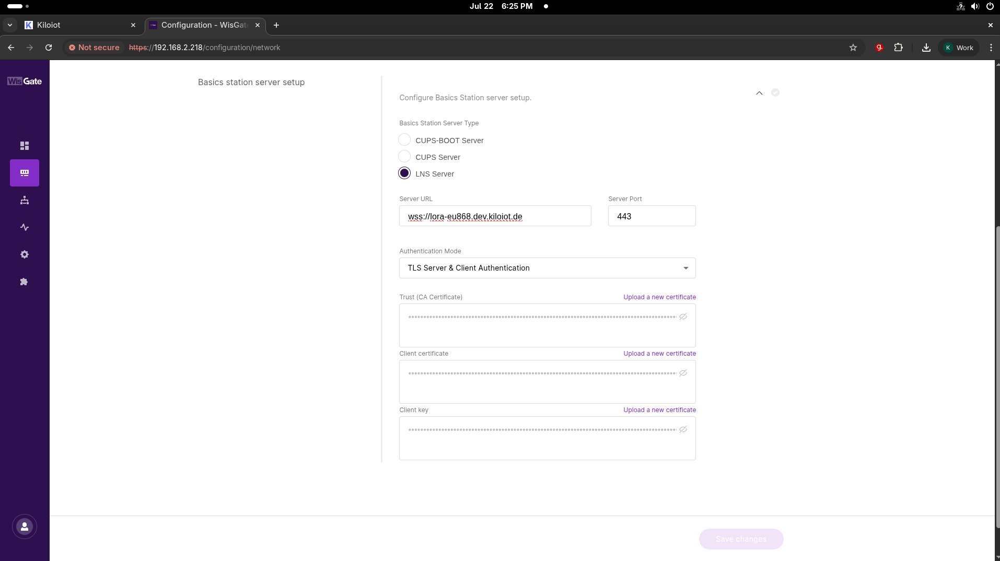<figcaption></figcaption></figure>

1. Upload the **certificates** you downloaded earlier.
2. Click **Save** to apply the configuration.

### Step 6: Verify Gateway Connection

1. Go back to the **Kilo platform**.

<figure>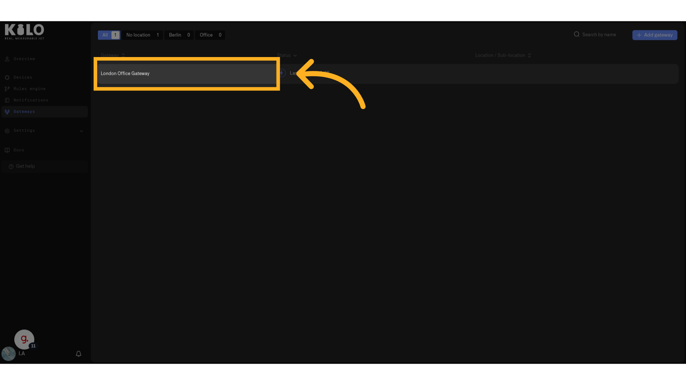<figcaption></figcaption></figure>

1. Your gateway should now appear **online** . You may need to click **Refresh** in your browser a few times.

<figure>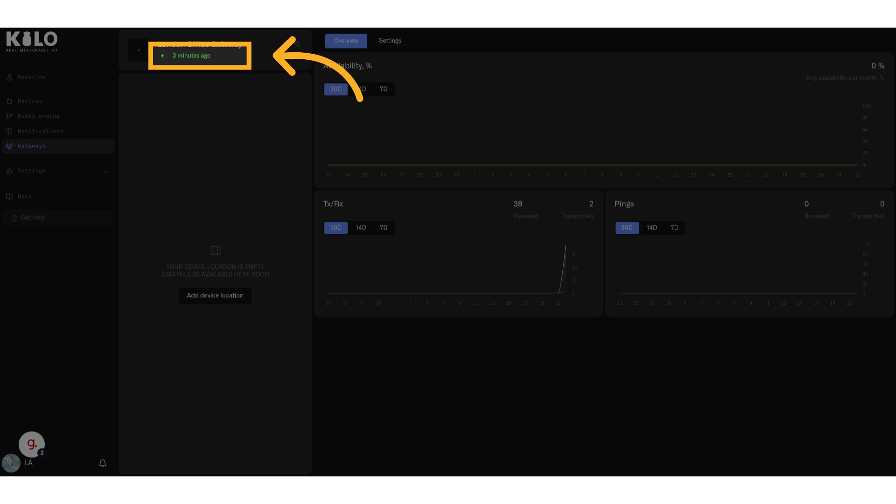<figcaption></figcaption></figure>

and Should be **transferring packets**

<figure>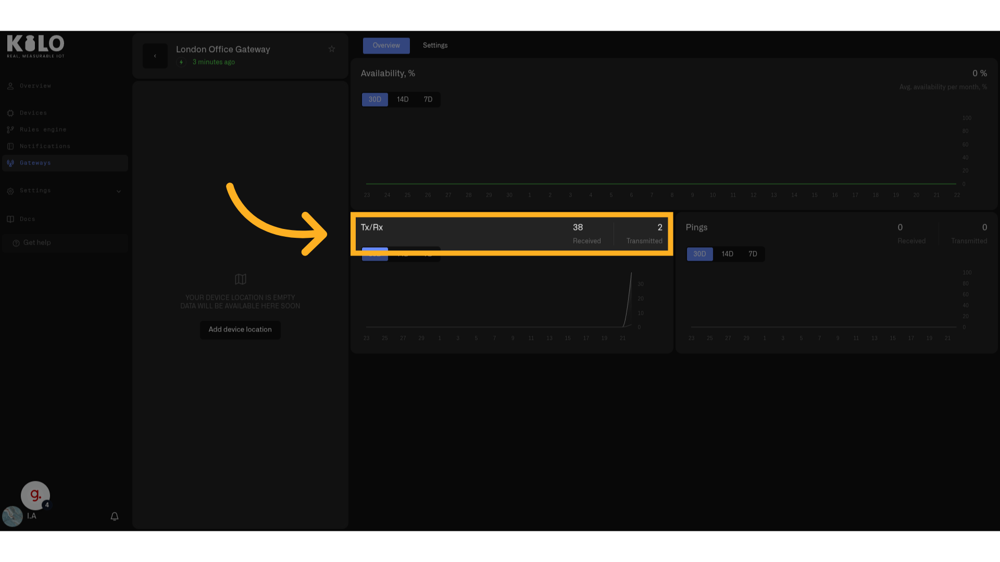<figcaption></figcaption></figure>

Congratulations you are all set. You are now ready to add your your devices.

