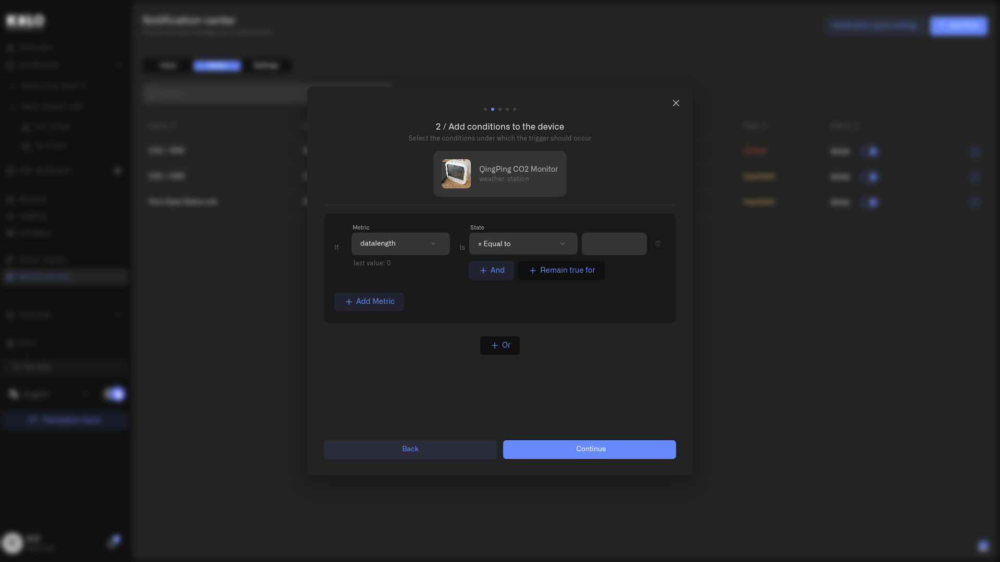

# Setting Alert Rules

Notification rules define **when** an alert should be triggered based on device data. Rules are created per device and evaluate incoming metrics such as temperature, humidity, CO₂ levels, battery status, and more.

***

### Creating a New Notification Rule

1. Go to **Notifications** in the left navigation menu.
2. Open the **Rules** tab.
3. Click **Add Rule** in the top-right corner.

A multi-step configuration modal will open.

***

### Step 1: Choose a Device

In the first step, select the device that the rule will apply to.

#### Selecting a Device

You can:

* Select a device from the list
* Use the **device type dropdown** to filter (e.g. sensor, gateway, camera)
* Use the **search field** if you have many devices

#### Example Device

For this example, we will use a **QingPing Temperature & CO₂ Sensor** installed inside a **lab refrigerator**.

Click the device and then click **Choose** to continue.

***

### Step 2: Add Conditions to the Device

This step defines **when** the notification should trigger.

#### Selecting a Metric

In the **Metric** field, choose a value reported by the selected device.

Available metrics depend on the device and may include:

* temperature
* humidity
* CO₂
* battery level
* signal strength
* and others

For this example, select:

**Metric:** `temperature`

***

### Defining the Condition (Thresholds)

Once a metric is selected, define the condition using comparison operators:

* Equal to
* Not equal to
* Less than
* Less than or equal
* Greater than
* Greater than or equal

#### Example Temperature Rule

To monitor a lab refrigerator:

* Temperature **greater than 7**
* **AND**
* Temperature **less than 10**

This creates a safe operating window and avoids triggering alerts for extreme or invalid readings.

***

### Using AND Conditions

Click **+ And** to add additional conditions to the same metric.

AND conditions are useful when:

* Defining ranges (minimum and maximum values)
* Avoiding false positives
* Creating precise alert logic

***

### Using “Remain True For” (Time-Based Conditions)

To avoid alerts caused by short spikes (for example, when someone briefly opens the refrigerator door), you can require the condition to remain true for a specific duration.

#### Example

Instead of alerting immediately:

* Set **Remain true for**
* `30 minutes`

This means:

> The temperature must stay above 7°C continuously for 30 minutes before the notification is triggered.

This is strongly recommended for:

* Refrigerators
* Freezers
* HVAC systems
* Environments with temporary fluctuations

***

### Adding Multiple Metrics (Optional)

Click **Add Metric** to monitor additional values from the same device (for example temperature **and** humidity).

***

### Using OR Conditions (Optional)

Click **+ Or** to define alternative trigger paths.

Example:

* Temperature is above threshold **OR**
* CO₂ exceeds safe level

This allows one rule to trigger from multiple independent conditions.

***

### Continuing Rule Setup

Once conditions are configured:

1. Click **Continue**
2. Complete the remaining steps (rule name, description, severity type, notification delivery)
3. Save the rule

The rule will now appear in the **Rules list** and begin evaluating incoming device data.

***

### Best Practices for Notification Rules

* Use **Remain True** to reduce noise and false alerts
* Keep thresholds realistic and aligned with operational limits
* Use **Critical** severity only for events requiring immediate action
* Name rules clearly (e.g. _“Lab Fridge – Temperature High”_)

<figure><figcaption></figcaption></figure>

<figure><figcaption></figcaption></figure>

<figure><figcaption></figcaption></figure>

<figure><figcaption></figcaption></figure>

<figure><figcaption></figcaption></figure>
