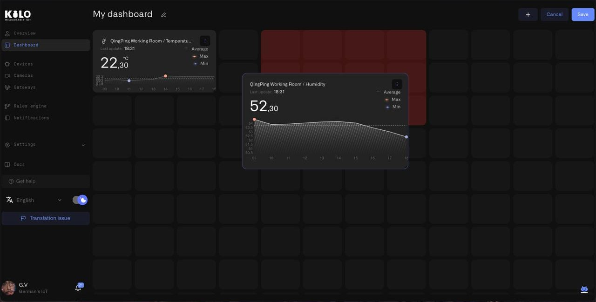

# Dashboards

Dashboards are customizable monitoring views that you assemble from widgets. Each dashboard focuses on a specific concern — a particular building, a device group, a compliance metric, or an operational workflow — and displays exactly the data that matters for that context.

Unlike the [overview page](../overview.md), which provides a fixed summary of your deployment, dashboards give you full control over what is displayed and how.

<figure><figcaption></figcaption></figure> You choose the devices, select the metrics, set the value ranges and thresholds, and organize everything into folders that match your operational structure.

The dashboard system supports folder-based hierarchy, so a multi-site deployment can maintain separate dashboard groups per building, region, or team — all accessible from the sidebar.

## Where dashboards fit in your operations

Dashboards are not limited to desktop use during working hours. They are designed to be deployed wherever operational visibility matters:

- **Operations center wall displays** — Mount a screen showing live facility status across all sites. Shift supervisors see everything at a glance without navigating.
- **Lobby and reception screens** — Display building conditions, energy metrics, or environmental data for visitors and tenants.
- **Factory floor workstations** — Equip production lines with dedicated monitors showing equipment health, vibration data, and throughput.
- **Compliance and regulatory displays** — Cold chain monitoring in pharmaceutical storage, temperature tracking in data centers, humidity control in cleanrooms — always visible, always current.
- **Conference room reviews** — Pull up dashboards during operational meetings to review trends and incidents with the team.

For any of these scenarios, collapse the sidebar to give the dashboard full screen width — hover over the logo area at the top of the sidebar and click the double-chevron. The navigation shrinks to icons only, keeping the data front and center.

## In this section

- [Creating Dashboards](creating-dashboards.md) — Create a dashboard with an icon, name, folder, and description. Edit metadata and delete dashboards.
- [Adding Widgets](adding-widgets.md) — Choose widget types, select devices and metrics, and customize how data is displayed.
- [Organizing Dashboards](organizing-dashboards.md) — Create folders, reorder dashboards, and structure your views for multi-site management.
- [Widget Reference](widget-reference.md) — Complete configuration guide for every widget type: appearance, thresholds, conditions, data sources, and display options.
