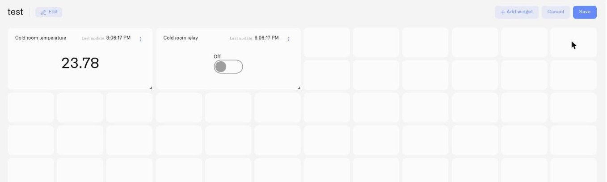

# Adding Widgets

Widgets are the visual components of a dashboard. Data widgets connect to devices and turn readings into current values, history, maps, or status. Control widgets send configured commands. Text and iFrame widgets add context without a device connection. A temperature reading of 22°C is normal in an office but a compliance breach in cold storage — ranges, thresholds, and conditions let operators see that context at a glance instead of interpreting the raw number themselves.

## Entering edit mode

Widgets can only be added or modified when the dashboard is in **edit mode**.

1. Open a dashboard from the sidebar.
2. Click the **actions menu** (three dots) in the header and select **Edit dashboard**.

In edit mode, the header changes:

- The **Live Data** indicator is replaced by a small **pencil icon** for editing dashboard metadata.
- A **plus button** appears — this opens the widget picker.
- **Cancel** and **Save** buttons appear on the right.

Any changes you make in edit mode are only saved when you click **Save**. Clicking **Cancel** discards all changes and returns to view mode.

<figure><figcaption></figcaption></figure>

## The widget picker

Click the **plus button** in the edit mode header (or the **Add widget** button in the empty state) to open the widget picker.

The picker shows the available widget types.

| Widget | Use it when | What it shows |
|--------|------------|---------------|
| **Last data** | Operators need the current state of a machine, process, or asset | Latest value received — running/stopped, fill level, current temperature |
| **Chart** | You need to understand how a reading changed — compliance history, drift, or shift-to-shift comparison | Historical graph plus the live current reading |
| **Text** | A dashboard needs headings, operating notes, or instructions | Formatted text that is not connected to a device |
| **Image** | Location context matters — which zone, floor, or component | Your own uploaded image — floor plan, machine diagram, or site layout — with live numeric readings pinned to locations |
| **Map** | The live location of something that moves matters | Current GPS position on an interactive outdoor map, plus one selected sensor value on the marker |
| **Control** | An operator needs to send a configured command to equipment | A switch, button, input, or slider connected to a controllable device |
| **iFrame** | External context belongs on the same screen — a BI report, a weather map, live traffic | A live external web page from a supported service, embedded in the tile beside your device data |
| **Digital building twin** | You want a 3D model of a building with sensors mapped to the objects they monitor | A built-in 3D editor that turns a facility into a live scene, recolored by sensor readings |

<figure><figcaption></figcaption></figure>

## Choosing a widget type

**Last data** is your default for displaying current operational state. Use it when you need to show the latest value from one or more devices in a single panel — a plain number for a quick reading, a Doughnut or Pie gauge when the value has a meaningful scale (tank fill, battery level, percentage within a range). Multiple devices can be combined into one widget.

**Chart** is for trend visibility. It shows a large current reading at the top and the historical graph below — you see where the reading is now and how it got there. Choose a [Line Chart](adding-widgets/chart-widget/line-chart.md) for a continuous trend or a [Bar Chart](adding-widgets/chart-widget/bar-chart.md) to compare individual reports. One data source and one metric per Chart widget.

**Text** adds headings, instructions, and operational notes. It is a standalone content widget and does not belong to the Control widget family.

**Image** puts data in physical context. Upload a floor plan, site diagram, or equipment schematic, then pin live sensor readings to their exact locations. Use it when location matters — warehouse zone monitoring, building HVAC status by floor, server room rack temperatures.

**Map** plots where a GPS-equipped device is right now on an interactive outdoor map, with one additional metric on the marker. Vehicles, field equipment, mobile tools, shipments, livestock — anything that moves and reports its location can go on it. Date range controls let you review route history without leaving the dashboard.

**Control** sends a configured device command through a Switch, Button, Input, or Slider. It is the only picker-level widget whose purpose is controlling equipment; Chart, Text, Image, and Map are separate widget types.

**Digital building twin** is a 3D model of a facility, built and edited right on the dashboard. Draw the building, place objects from a catalog, and bind each one to a sensor — the model then recolors itself in real time, so an operator reads facility state spatially instead of from a list. See [Digital Building Twin](adding-widgets/digital-building-twin/README.md).

## Adding a widget

For every widget type, the setup flow follows the same pattern:

1. Click the **plus button** or **Add widget** button to open the picker.
2. Select a widget type.
3. The selected widget's configuration panel opens.
4. For a data-driven widget, choose its device and metric under **Datasource**, then configure its presentation under **Appearance**. Standalone widgets such as Text and iFrame open their own content settings instead.
5. Click **Save** in the panel to add the widget.

A **close button** (X icon) in the top right dismisses the panel without saving. The **Next** button navigates from Datasource to Appearance. Settings are not applied until you click **Save** in the panel and then **Save** in the dashboard header.

For full configuration details, see the widget-specific pages linked below.

## Editing an existing widget

To modify a widget already on the dashboard:

1. Enter edit mode.
2. Hover over the widget. A **three-dot menu** appears in the top-right corner.
3. Click the menu:
   - **Edit** — Opens the widget's settings panel with current values pre-filled.
   - **Duplicate** — Creates a copy of the widget, with all of its configuration, on the same dashboard. A toast confirms **"Widget successfully duplicated"**; if the copy cannot be created you'll see **"Could not duplicate widget"**.
   - **Move to dashboard** — Moves the widget to a different dashboard. If the move cannot be completed you'll see **"Could not move widget"**.
   - **Delete** — Marks the widget for removal. The deletion is applied only when you click **Save** in the dashboard header. Clicking **Cancel** restores the widget.

The three-dot menu only appears in edit mode.

**Duplicate** saves real time on repetitive deployments. Configure one widget exactly as you want it — value ranges, thresholds, display type, conditions — then duplicate it once per identical sensor and change only the device on the Datasource tab. Fifty cold storage units with the same compliance band are fifty copies of one widget, not fifty configurations built from scratch.

**Move to dashboard** is for when a view outgrows its original home — a metric you added to a general site dashboard turns out to belong on the compliance dashboard, or a widget was built on the wrong dashboard entirely. Move it instead of rebuilding it.

## The empty dashboard state

If a dashboard has no widgets, the center of the screen shows:

- **"You have no widgets here"**
- **"Add your first widget to build your dashboard"**
- An **Add widget** button

## Customization at a glance

Widgets are configurable, not fixed cards. Key options available across widget types:

- **Last Data display types** — Value, Doughnut, Pie, Tube, Gauge, and Radial Gauge
- **Chart types** — Line and Bar, with chart-specific timeframes, axes, thresholds, and legends
- **Control types** — Switch, Button, Input, and Slider; Slider then offers Simple, Circular, and Vertical styles
- **Value ranges** — Min/max boundaries that set gauge scale or chart Y-axis limits
- **Thresholds** — Named bands (e.g., "Compliant", "Warning", "Breach") with colors, fills, and lines — Chart widget
- **Conditions** — Per-metric color rules based on the sensor's current value — Last data and Image widgets
- **Metric-level controls** — Data type, device metric selector, icon, and conditions per sensor

## Widget configuration guides

- [Last Data Widget](adding-widgets/last-data-widget.md) — Latest values, gauge types, value ranges, and conditions
- [Chart Widget](adding-widgets/chart-widget.md) — Time-series graphs with live current reading and threshold bands
- [Text Widget](adding-widgets/text-widget.md) — Headings, instructions, and notes without a device source
- [Image Widget](adding-widgets/image-widget.md) — Any image — a floor plan, an equipment schematic, a site photo — with draggable live-data pins
- [Map Widget](adding-widgets/map-widget.md) — GPS tracker location with route history controls
- [Control Widget](adding-widgets/control-widget.md) — Switches, buttons, inputs, and sliders that send device commands
- [iFrame Widget](adding-widgets/iframe-widget.md) — Embed an external web page from a supported service beside your device data
- [Conditions](adding-widgets/conditions.md) — Per-metric color rules for Last data and Image widgets

## Related pages

- [Creating Dashboards](creating-dashboards.md) — Create the dashboard before adding widgets.
- [Organizing Dashboards](organizing-dashboards.md) — Manage folders and dashboard ordering.
- [Real-Time Data](real-time-data.md) — How live sensor data reaches your widgets.
