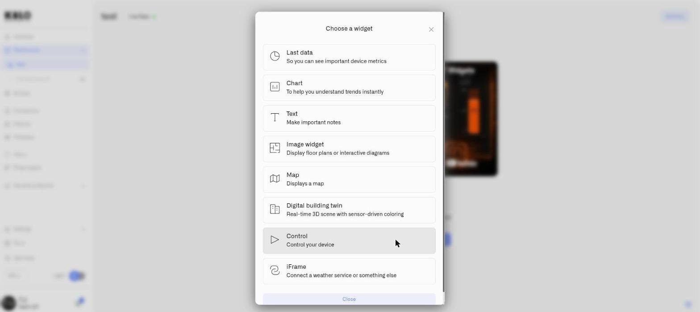

# Chart Widget

<figure><figcaption></figcaption></figure>

The Chart widget plots a reading's history as a graph — a line or bars across the last hour, day, week, or month — so you see not just where a value stands now but the trend that brought it there.

A single Chart widget combines four things in one place: the **current value** as a large reading at the top, the **historical graph** — a line or bars over a chosen timeframe — an optional **average line** across that period, and optional **threshold bands** that mark compliant, warning, and breach ranges directly on the graph. An operator sees the reading now, the path it took to get there, and the operational context, without switching views.

Threshold bands also color the **large current reading** at the top — when the live value falls inside a band, that headline number takes the band's color, while the line or bars keep the metric color set in the Datasource tab. So the widget signals status before anyone studies the trace.

A Chart widget tracks one metric. To compare several readings, add a separate Chart widget for each.

## Line and Bar are Chart types

The dashboard picker contains one **Chart** widget. Inside its **Appearance** tab, **Widget type** offers two presentations:

- [Line Chart](chart-widget/line-chart.md) — joins readings into a continuous trend.
- [Bar Chart](chart-widget/bar-chart.md) — draws a separate bar for each report.

They share the same data source, timeframe, value range, thresholds, average, axes, legend, and **Show metrics below** settings. **Display value on bar** belongs only to Bar and is hidden when Line is selected.

## Configure a Chart widget

Here is a full setup for one real case — tracking a refrigeration unit's temperature across the week, so you see not just the current reading but whether it held compliance the whole time. A temperature sensor on the unit reports in °C. This is one example: a Chart suits any reading whose history matters — only the device and the numbers change.

1. Open the dashboard in edit mode and click **Chart** in the widget picker. The settings panel opens on the **Datasource** tab, with no data sources yet.
2. Click **Add datasource**. A **Datasource 1** block appears.
3. In the block, click **Choose device** and select the refrigeration unit's temperature sensor.
4. Click **Add metric**. A metric row appears.
5. In the row, set **Data type** to **Telemetry**, choose the temperature reading under **Device metric**, and pick a **Color** — this color draws the line (or bars) on the graph and is also the base color of the large current reading at the top.

   > **Can't find your metric?** The **Device metric** list only offers numeric metrics. If a reading you expect is missing, the metric is stored as String or Boolean rather than Integer or Float. Open **Devices → Metrics**, find the metric, and change how it is stored to Integer or Float — provided the device actually reports a number. See [Metrics](../../devices/metric-templates.md).

   A Chart widget tracks **one metric** — once that metric is in place, there is no second metric row to fill in. To compare several readings, build a separate Chart widget for each.
6. Click **Next** to open the **Appearance** tab.
7. Enter a **Widget name** — for example "Cold store temperature" — and an optional **Description**.
8. Under **Widget type**, choose **line** or **bar**. The **line** type draws a continuous curve, best for a reading that changes gradually like temperature; **bar** draws one bar per interval, useful when each individual report is the thing you want to compare. For this case, choose **line**.
9. Set the **Timeframe** — the span of history the graph covers: **Last hour**, **Last day**, **Last week**, or **Last month**. For a weekly compliance review, choose **Last week**.
10. Under **Set value range**, set **From** and **To** — the floor and ceiling of the vertical axis. Pick a window that comfortably contains every temperature the unit reaches: **From** -5, **To** 20 (°C). (A new widget starts at 0–100; change it to suit the reading.)
11. Under **Thresholds**, click **Add threshold** for each operational band. A threshold's **From** and **To** are the lower and upper edge of a colored band on that same -5–20 °C scale; give it a **Label** and a **Color**. For the cold store, add three:
    - "Compliant" — **From** 2, **To** 8 — green
    - "Warning" — **From** 8, **To** 12 — amber
    - "Breach" — **From** 12, **To** 20 — red

    Each threshold has two independent visual switches. **Show fill** paints the band as a colored background across the whole graph; **Show line** draws a boundary line at the band's edges. Turn **Show fill** on for the Compliant band so the safe zone reads as a green wash behind the trace; turn **Show line** on for the Breach band so its lower edge at 12 °C is a hard red line the temperature must not cross.
12. Switch on **Show average value** to add a dashed line at the period's average, labeled "Average" in the legend.
13. **Show vertical axis lines** and **Show horizontal axis lines** add time-axis and value-axis grid lines — turn them on if a grid makes the graph easier to read.
14. Switch on **Display data legend** to list the threshold labels and the average beside the graph.
15. Switch on **Show metrics below** to display the metric name and current reading in a row beneath the graph. This keeps the reading visible when the widget is too small to show the large value clearly.
16. If you chose **bar** at step 8, **Display value on bar** prints each bar's own value on the bar itself, so an operator can read exact figures off the chart instead of estimating them against the axis. The option applies to bar charts only — on a line chart there are no bars to label, so it is not offered.
17. Click **Save** to place the widget on the dashboard.

The result: a widget whose large reading shows the current temperature and whose graph traces the whole week behind it — the green, amber, and red bands making it obvious at a glance whether the load held compliance or drifted toward a breach. The same setup fits any reading with a history worth watching; only the device, the value range, and the bands change.

## How the current reading color works

The large value at the top of the widget defaults to the metric color set in the Datasource tab. When the current value falls inside one of your threshold ranges, the display switches to that threshold's color, and returns to the metric color when the value moves outside every band.

So a cold-store widget shows green while the reading sits in the Compliant band and turns red the instant it climbs into Breach — with no separate configuration for the current reading. The widget makes the situation visible; to be paged when it happens, pair it with an [Alarm](../../alarm/README.md).

## Thresholds vs conditions

The Chart widget uses **threshold bands** — colored ranges drawn on the historical graph. The full conditions system — named rules, priority order, per-metric defaults — belongs to the Last Data and Image widgets. See [Conditions](conditions.md).

## Worked examples

**Server-room cooling — a week of history**
A rack air-temperature sensor on a **line** chart, **Last week**, value range 10–40 °C. Three thresholds: green 18–27 °C "Normal", amber 27–32 °C "Warm", red 32–40 °C "Critical". An operator checking the dashboard after a weekend sees at once whether the cooling held steady or spiked into the amber and red during off-hours.

**Vibration monitoring — discrete reports as bars**
An equipment vibration sensor reporting amplitude at regular intervals, on a **bar** chart, **Last day**, value range 0–20 mm/s. Three thresholds: green 0–7 mm/s "Normal", amber 7–12 mm/s "Elevated", red 12–20 mm/s "Critical". Each bar is one report interval, so an engineer can pick out exactly which intervals ran rough and line them up against the production schedule. This is the case that earns **Display value on bar** — when the point of the widget is comparing individual reports, having the amplitude printed on each bar saves reading every one off the axis.

**Energy consumption — baseline and peaks**
A power meter on a production line, **line** chart, **Last week**. Set the value range to span the line's draw — for example 0–60 kW — then add a green band across the expected production range (say 15–40 kW) and a red band above it for an over-draw. The figures are site-specific: set **From** and **To** to your own baseline and expected peak. Any drift above the expected range then shows immediately as the line leaves the green band.

A Chart suits any reading whose history carries meaning — pressure, flow, humidity, fill level — so treat these as starting points. Wherever "what is it now, and how did it get here" is the question, the Chart widget answers both.

## See also

- [Last Data Widget](last-data-widget.md) — The current value on its own, when you do not need the history
- [Line Chart](chart-widget/line-chart.md) — Configure and read a continuous trend
- [Bar Chart](chart-widget/bar-chart.md) — Compare reports and print values on bars
- [Conditions](conditions.md) — Per-metric color rules for the Last Data and Image widgets
- [Adding Widgets](../adding-widgets.md) — Edit mode and the widget picker
