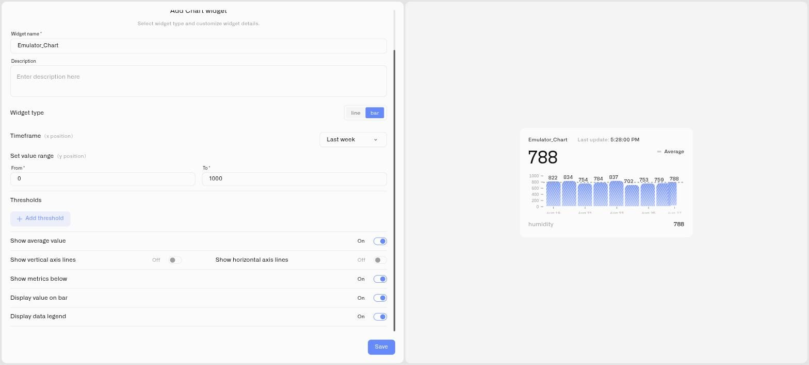

# Bar Chart

A Bar chart is the second presentation inside the **Chart** widget. Instead of joining readings into a line, it draws each report as a separate bar. This is useful when operators need to compare discrete intervals or read exact individual measurements.

The Bar chart is not a Last Data display and is not a separate choice in the dashboard widget picker. Select **Chart**, then choose **bar** under **Widget type**.

<figure><figcaption></figcaption></figure>

## Configure the Bar type

1. Add a **Chart** widget and select one device and one numeric metric on **Datasource**.
2. Open **Appearance** and set **Widget type** to **bar**.
3. Choose the timeframe and vertical value range.
4. Configure threshold bands, average, axis lines, and the data legend as required.
5. Turn on **Show metrics below** to show the metric name and its current reading beneath the plot.
6. Turn on **Display value on bar** to print each report's value on its bar.
7. Click **Save**.

**Display value on bar** is available only while Bar is selected. Kilo hides it for Line charts.

## When values on bars help

Use the labels when the exact difference between adjacent reports matters. For example, a vibration monitor reporting once per production interval can show `7.2`, `9.8`, and `12.4` directly on the bars. An engineer can identify the interval that crossed the operating limit without estimating against the vertical axis.

For a dense chart or a small dashboard tile, labels can compete for space. Keep them off when the overall shape matters more than each number, or enlarge the widget before enabling them.

## See also

- [Chart Widget](../chart-widget.md) — shared Chart configuration
- [Line Chart](line-chart.md) — follow a continuous trend
- [Last Data Widget](../last-data-widget.md) — display the latest reading without history
