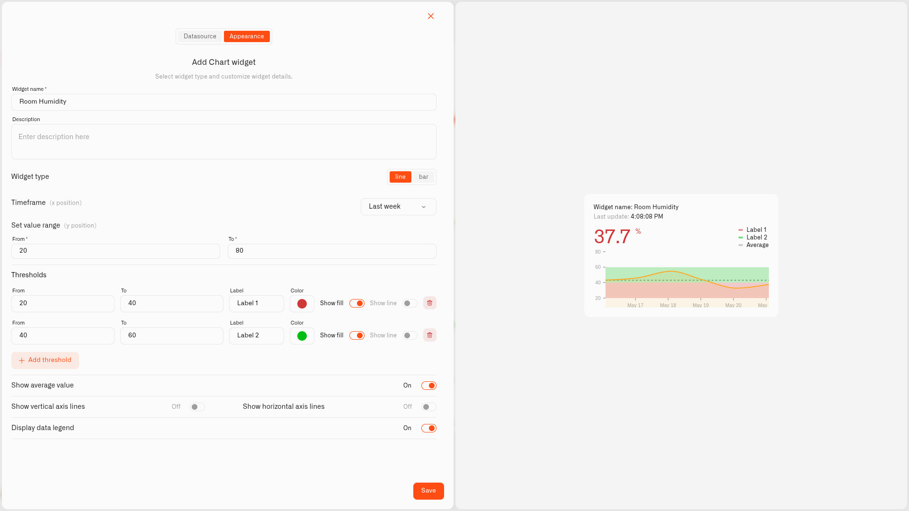

# Line Chart

A Line chart is one of the two presentations inside the **Chart** widget. It connects consecutive readings into a continuous trace, making gradual movement, drift, cycles, and sudden spikes easy to see.

Use Line for temperature, pressure, energy demand, humidity, and other measurements where the shape of the trend matters more than comparing individual reports.

<figure><figcaption></figcaption></figure>

## Configure the Line type

1. Open a dashboard in edit mode and select **Chart** from the widget picker.
2. On **Datasource**, add one device and one numeric metric.
3. Click **Next** and set **Widget type** to **line**.
4. Choose the **Timeframe**: Last hour, Last day, Last week, or Last month, subject to the data retention included in the plan.
5. Set the vertical **Value range** with **From** and **To**.
6. Add any threshold bands, average line, axis lines, and legend needed by operators.
7. Turn on **Show metrics below** when the metric name and current reading should remain visible beneath the plot.
8. Click **Save**.

The **Display value on bar** setting does not appear for Line because there are no bars to label.

## Read the result

The large value shows the latest reading. The line shows how that metric moved over the selected period. If the current reading falls inside a configured threshold, the large value adopts that threshold's color; the line keeps the metric color selected on Datasource.

For a server-room temperature chart, a week-long line makes an overnight cooling failure visible as a rise out of the normal band and shows when the reading returned to baseline.

## See also

- [Chart Widget](../chart-widget.md) — shared Chart data and appearance settings
- [Bar Chart](bar-chart.md) — compare individual reports instead
- [Last Data Widget](../last-data-widget.md) — show only the latest state
