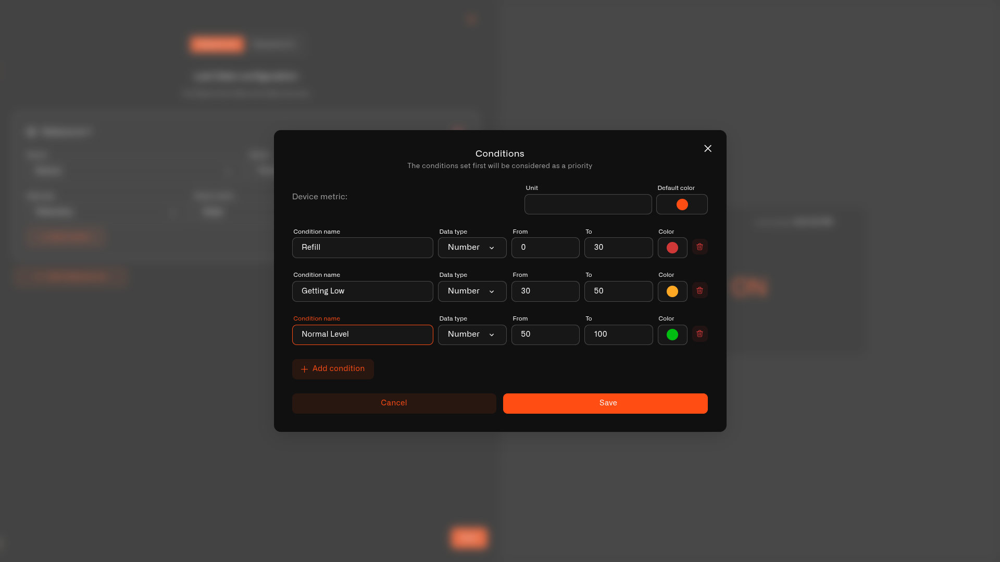

# Conditions

Conditions are per-metric color rules that turn a raw sensor reading into operational status. Instead of an operator looking at a number and deciding whether it's acceptable, the widget shows green, yellow, or red based on rules you define. The same sensor type in two different contexts can have completely different condition sets — a temperature of 4°C in a cold storage unit is compliant (green), but the same reading in a pharmaceutical cleanroom may be out of specification (red).

## Which widgets use conditions

Conditions are available for **Last data** and **Image** widgets. Each metric in these widgets has its own independent set of conditions.

The **Chart** widget uses a different approach — appearance-level threshold bands on the graph and a per-metric color picker. See [Chart Widget](chart-widget.md).

## Metric type note

The metric selectors in the Last data and Image widgets surface numeric sensor types (INTEGER and FLOAT). In practice, conditions on these widgets will be Number-type conditions matching numeric readings. The conditions modal also exposes String and Boolean data type options — these are covered below — but their use requires a widget that can select a sensor of those types.

## How to open the Conditions modal

1. Open the widget's settings panel and go to the **Datasource** tab.
2. Find the metric row for the sensor you want to configure.
3. Click the **Conditions button** — labeled **"Conditions: N"** where N is the current condition count.

## What the Conditions modal contains

**Title:** "Conditions" / **Subtitle:** "The conditions set first will be considered as a priority"

**Header (applies to the whole metric):**
- **Device metric** — Read-only. Identifies which sensor this modal is for.
- **Unit** — Override the unit label shown on the widget. Leave blank to use the sensor's default.
- **Icon** — Change the display icon for this metric.
- **Default color** — The color used when no condition matches. This is the only place to set the metric's base color.

**Per condition:**
- **Condition name** *(required)* — A label like "Compliant", "Warning", or "Breach". Must not be empty.
- **Data type** — Number, String, or Boolean (see below)
- **Value fields** — Depend on the data type
- **Color** — The color displayed when this condition matches
- **Delete** — Remove this condition

**Add condition** — Creates a new condition. Default: name "Condition N", type Number, range 0–100, primary color.

No limit on the number of conditions per metric.

**Save** (disabled while validation errors exist) / **Cancel**

## Priority: first match wins

Conditions are evaluated top to bottom. The first condition in the list that matches the current reading determines the color. If a sensor reads 10°C and your first condition matches readings from 8–12°C, that condition's color is used — subsequent conditions are not checked.

Order your conditions from most specific to most general, or from highest priority to lowest.

## Value fields by data type

### Number *(primary operational path)*

**From** and **To** fields — both are optional. Either or both can be left empty to create open-ended ranges:

- **Empty From** — matches any value below To (no lower bound)
- **Empty To** — matches any value above From (no upper bound)
- **Both filled** — From must be ≤ To

Examples:
- From 2, To 8 → matches readings between 2 and 8
- From 8 (no To) → matches any reading at or above 8
- (no From), To 2 → matches any reading at or below 2

### Number conditions — running/stopped and open/closed states

Control and status sensors often report binary state as an integer: 1 when active or open, 0 when stopped or closed. Number conditions map those values to operational labels:

- Condition "Running" — Number, From 1, To 1 — blue
- Condition "Stopped" — Number, From 0, To 0 — grey

Operational examples:
- Pump status: 1 = "Running" (blue), 0 = "Stopped" (grey)
- Valve position: 1 = "Open" (green), 0 = "Closed" (grey)
- Equipment interlock: 1 = "Engaged" (green), 0 = "Not engaged" (red)

The same Number condition type handles all of these. The difference is only in the labels and colors you assign.

### String

A single **Value** text field. Matches the reading exactly, case-sensitive. Available in the conditions modal but requires a widget that surfaces a String-type sensor — Last data and Image widget selectors do not surface String sensors.

### Boolean

A **True / False** dropdown. Matches the reading exactly. Available in the conditions modal but requires a widget that surfaces a Boolean-type sensor — Last data and Image widget selectors do not surface Boolean sensors.

## Color fallback hierarchy

1. **Matched condition color** — Color of the first matching condition
2. **Default color** — Set in the modal header; applies when no condition matches
3. **Platform default** — Applies when no default color is set in the modal

## Operational examples

### Keeping a reserve topped up

A level sensor on something that must stay full — a coolant or reagent reserve, a water tank feeding a process — reports its fill as a percentage (0 = empty, 100 = full). Three Number conditions turn that reading into an at-a-glance refill status. Because the **first matching condition wins**, order them most-urgent first:

- **Refill** — Number, From 0, To 30 — red
- **Getting Low** — Number, From 30, To 50 — amber
- **Normal Level** — Number, From 50, To 100 — green

<figure><figcaption></figcaption></figure>

On the widget the metric reads green while the reserve is healthy, turns amber as it draws down, and goes red the moment it crosses into the refill zone — so an operator restocks before it runs dry. To be alerted off the dashboard as well, pair the same threshold with an [Alarm](../../alarm/README.md).

### Number conditions — same sensor type, two contexts

**Refrigeration unit:**
- "Compliant" — From 2, To 8 — green
- "Warning" — From 8, To 12 — yellow
- "Breach" — From 12 (no upper limit) — red

**Pharmaceutical cleanroom (same sensor type, different spec):**
- "Normal" — From 20, To 22 — green
- "Elevated" — From 22, To 24 — yellow
- "Out of spec" — From 24 (no upper limit) — red

Both measure temperature in °C. The hardware is the same. The conditions encode what those temperatures mean in each specific environment.

### Number conditions — open-ended bounds for threshold monitoring

A liquid storage tank sensor reporting fill level as a percentage:
- "Critical" — (no From), To 10 — red
- "Low" — From 10, To 30 — yellow
- "Adequate" — From 30 (no upper limit) — green

The first condition catches everything below 10% with no need to specify a lower limit. The last condition catches everything above 30% with no upper limit needed. You only define where the meaningful boundaries are.

The same pattern applies to battery levels, tank volumes in liters, pressure in bar, or any operational metric where the scale matters but only the boundary zones need explicit definition.

### String conditions — device status sensors

If a sensor reports text status values (for example, "OK", "DEGRADED", "FAULT"), String conditions map each value to a color:
- "OK" — String, Value: OK — green
- "Degraded" — String, Value: DEGRADED — yellow
- "Fault" — String, Value: FAULT — red

The widget shows the right color for each status without any numeric evaluation.

### Boolean conditions — binary state sensors

For sensors that report True/False state (running/stopped, open/closed, active/idle):
- True = one color and label, False = another color and label

For example, a pump running status: True → blue "Running", False → grey "Idle". Or an equipment safety interlock: True → green "Engaged", False → red "Not engaged".

## See also

- [Last Data Widget](last-data-widget.md) — Apply conditions to sensor readings and gauges
- [Image Widget](image-widget.md) — Apply conditions to drive pin colors on the image
