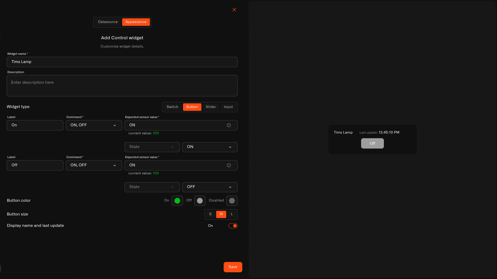

# Button Control

The **Button** is the one-shot action type. A press sends a command once. Unlike a Switch, it doesn't represent a lasting state — it triggers something and is done.

## When to use it

Use a Button for momentary or trigger actions where there's no on/off state to hold: **reset** a piece of equipment, trigger a **calibration**, **open a gate**, or **start a process**. If the action is "do this now" rather than "stay in this state," a Button is the right control.

## What you need first

* A controllable device with a command defined on its **Commands & States** tab (see [Creating Commands](../../../devices/commands/creating-commands.md)).
* The command that performs the action you want the button to trigger.

## How to set it up

1. Open the dashboard in **edit mode** → **Add widget** → **Control**.
2. **Datasource** tab: choose the **Device** and a **Device metric**. Click **Next**.
3. **Appearance** tab: enter a **Widget name**, then under **Widget type** choose **Button**.
4. Set the **state bindings** with the **Command** the button sends (and any parameter **Value**s), plus the **Expected sensor value** where the action produces a verifiable state.
5. Set the **Button color** (Active / Inactive / Disabled) and the **Button size** — **S**, **M**, or **L** (default M). Toggle **Display name and last update**.
6. Click **Save**.

<figure><figcaption></figcaption></figure>

## What happens when you use it

Pressing the button dispatches its command once through the device's command pipeline, and the execution is recorded in the device's **States** tab history like any other command. There's no persistent on/off position to maintain — the button is a trigger.

## Common mistakes

* **Using a Button for a state you need to see** — if you need the dashboard to show whether something is on or off, use a [Switch](switch.md) instead.
* **Expecting confirmation a momentary action can't give** — a one-shot trigger (e.g. "reset") may not produce a lasting metric change to verify against; that's expected.

## See also

* [Control widget](../control-widget.md) — overview and the other control types
* [Device Commands](../../../devices/commands/) — define the command this button fires
