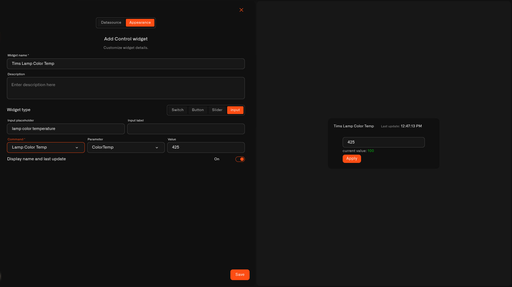

# Input Control

The **Input** is the exact-value control type. The operator types a precise figure and presses **Apply** to send it — ideal when a slider is too coarse or the value must be exact.

## When to use it

Use an Input when precision matters: a temperature or pressure **threshold**, an exact **setpoint**, or a specific **device parameter**. Where a [Slider](slider.md) is for dialling a value by feel, the Input is for entering an exact number.

## What you need first

* A controllable device with a command on its **Commands & States** tab whose **parameter accepts the value** you'll type (see [Creating Commands](../../../devices/commands/creating-commands.md)).
* A **Device metric** that reports the current value, shown beside the field for reference.

## How to set it up

1. Open the dashboard in **edit mode** → **Add widget** → **Control**.
2. **Datasource** tab: choose the **Device** and the **Device metric** for the current value. Click **Next**.
3. **Appearance** tab: enter a **Widget name**, then under **Widget type** choose **Input**.
4. Set an **Input placeholder** (hint text in the field) and an optional **Input label**.
5. Choose the **Command** the input sends, the **Parameter** it sets, and a default **Value**.
6. Toggle **Display name and last update**, then click **Save**.

<figure><figcaption></figcaption></figure>

## What happens when you use it

The widget shows the current value and a field. Type a new value and press **Apply** to dispatch the command with that value as its parameter — nothing is sent until you press Apply, so a half-typed number never reaches the device. Whether a value is accepted is governed by the command parameter's definition (for example its min/max), so out-of-range entries are rejected.

## Common mistakes

* **Expecting it to send as you type** — the Input only dispatches on **Apply**.
* **Entering a value outside the parameter's limits** — the command's parameter definition sets the valid range; values outside it won't be accepted.

## See also

* [Control widget](../control-widget.md) — overview and the other control types
* [Device Commands](../../../devices/commands/) — define the command this input sets
