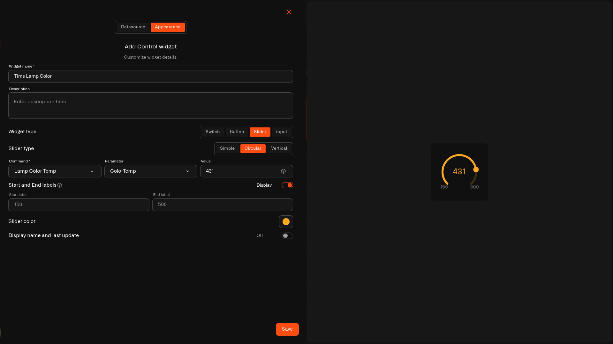

# Circular Slider

The **Circular** slider sets a **numeric value** on a radial dial — drag around the arc and the value follows. It has the look of an instrument gauge, so it draws the eye to a headline setting.

## When to use it

Reach for the Circular slider when a dial reads better than a bar — a **color temperature**, a **valve position** as a percentage, or any single setting you want to stand out on a control screen. For a compact in-row control use the [Simple Slider](slider-simple.md); for a level-style control use the [Vertical Slider](slider-vertical.md).

## What you need first

* A controllable device with a command on its **Commands & States** tab whose **parameter takes a number** (see [Creating Commands](../../../devices/commands/creating-commands.md)).
* A **Device metric** that reports the current value, so the dial shows where the setting sits.

## How to set it up

1. Open the dashboard in **edit mode** → **Add widget** → **Control**.
2. **Datasource** tab: choose the **Device** and the **Device metric** for the live value. Click **Next**.
3. **Appearance** tab: enter a **Widget name**, choose **Widget type → Slider**, then set **Slider type → Circular**.
4. Set the **Command**, the **Parameter** it sets, and a starting **Value**.
5. Add **Start and End labels** for the range (e.g. `150` and `500`) with **Display** on, pick a **Slider color**, and toggle **Display name and last update**.
6. Click **Save**.

<figure><figcaption></figcaption></figure>

## What happens when you use it

Dragging around the dial sends the command with the new value as its parameter. The dial position follows the **Device metric**, so it always reflects the value the device reports.

## Common mistakes

* **Confusing it with the Radial Gauge** — the Circular slider *sets* a value (it's a control); the Last Data [Radial Gauge](../last-data-widget/radial-gauge.md) only *displays* one.
* **No numeric parameter** — like every slider, it needs a command parameter it can set to a number; for on/off use a [Switch](switch.md).

## See also

* [Control widget](../control-widget.md) — overview and the other control types
* Other slider layouts: [Simple Slider](slider-simple.md) · [Vertical Slider](slider-vertical.md)
* [Device Commands](../../../devices/commands/) — define the command this dial drives
