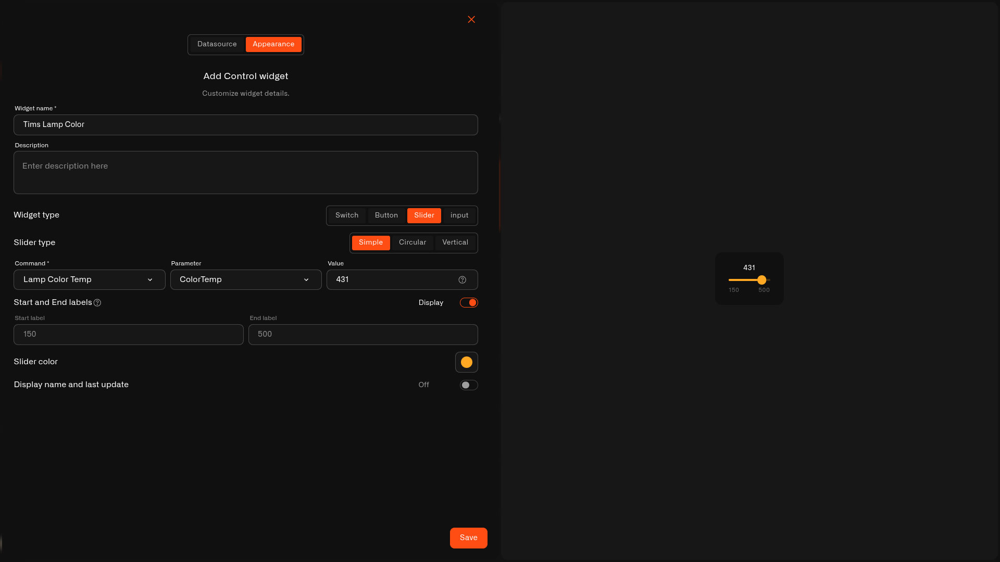

# Simple Slider

The **Simple** slider is a horizontal track you drag to set a **numeric value**. It's the most compact of the three slider layouts and fits neatly into a row of dashboard tiles.

## When to use it

Use a Simple slider for any value an operator dials up or down where a horizontal control reads naturally: a **motor or fan speed**, a **dimming level**, or a **target setpoint**. If you want a level-style or instrument-style look instead, see the [Vertical Slider](slider-vertical.md) or [Circular Slider](slider-circular.md).

## What you need first

* A controllable device with a command on its **Commands & States** tab whose **parameter takes a number** (see [Creating Commands](../../../devices/commands/creating-commands.md)).
* A **Device metric** that reports the current value, so the slider shows where the setting sits.

## How to set it up

1. Open the dashboard in **edit mode** → **Add widget** → **Control**.
2. **Datasource** tab: choose the **Device** and the **Device metric** for the live value. Click **Next**.
3. **Appearance** tab: enter a **Widget name**, choose **Widget type → Slider**, then set **Slider type → Simple**.
4. Set the **Command** the slider drives, the **Parameter** it sets, and a starting **Value**.
5. Add **Start and End labels** for the range (for example `150` and `500`) and toggle **Display** to show them; pick a **Slider color** and toggle **Display name and last update**.
6. Click **Save**.

<figure><figcaption></figcaption></figure>

## What happens when you use it

Dragging the slider sends the chosen command with the new value as its parameter, through the device's command pipeline. The handle follows the **Device metric**, so it reflects the value the device actually reports.

## Common mistakes

* **Binding a command without a numeric parameter** — a slider needs a parameter it can set to a number; a plain on/off command belongs on a [Switch](switch.md).
* **Range that doesn't match the device** — set Start/End to the parameter's real minimum and maximum so the full travel maps to valid values.

## See also

* [Control widget](../control-widget.md) — overview and the other control types
* Other slider layouts: [Circular Slider](slider-circular.md) · [Vertical Slider](slider-vertical.md)
* [Device Commands](../../../devices/commands/) — define the command this slider drives
