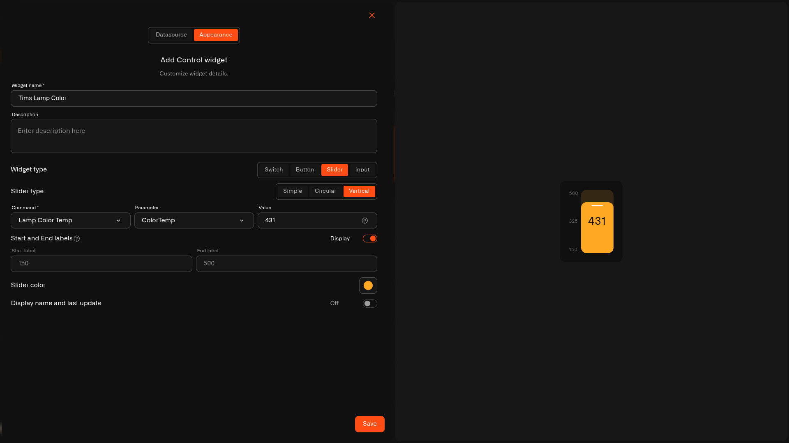

# Vertical Slider

The **Vertical** slider sets a **numeric value** on an upright track. It reads like a level — high is more, low is less — which suits values you picture filling up or down.

## When to use it

Use a Vertical slider where an upright control matches the mental model: a **tank-fill target**, a **valve position**, or a level you set by height. For a compact horizontal control use the [Simple Slider](slider-simple.md); for a dial use the [Circular Slider](slider-circular.md).

## What you need first

* A controllable device with a command on its **Commands & States** tab whose **parameter takes a number** (see [Creating Commands](../../../devices/commands/creating-commands.md)).
* A **Device metric** that reports the current value, so the slider shows where the setting sits.

## How to set it up

1. Open the dashboard in **edit mode** → **Add widget** → **Control**.
2. **Datasource** tab: choose the **Device** and the **Device metric** for the live value. Click **Next**.
3. **Appearance** tab: enter a **Widget name**, choose **Widget type → Slider**, then set **Slider type → Vertical**.
4. Set the **Command**, the **Parameter** it sets, and a starting **Value**.
5. Add **Start and End labels** for the range (e.g. `0` and `254`) with **Display** on, pick a **Slider color**, and toggle **Display name and last update**.
6. Click **Save**.

<figure><figcaption></figcaption></figure>

## What happens when you use it

Dragging the handle up or down sends the command with the new value as its parameter. The handle follows the **Device metric**, so it reflects the value the device actually reports.

## Common mistakes

* **No numeric parameter** — a slider needs a command parameter it can set to a number; for a two-state device use a [Switch](switch.md).
* **Range that doesn't match the device** — set Start/End to the parameter's real minimum and maximum so the full travel maps to valid values.

## See also

* [Control widget](../control-widget.md) — overview and the other control types
* Other slider layouts: [Simple Slider](slider-simple.md) · [Circular Slider](slider-circular.md)
* [Device Commands](../../../devices/commands/) — define the command this slider drives
