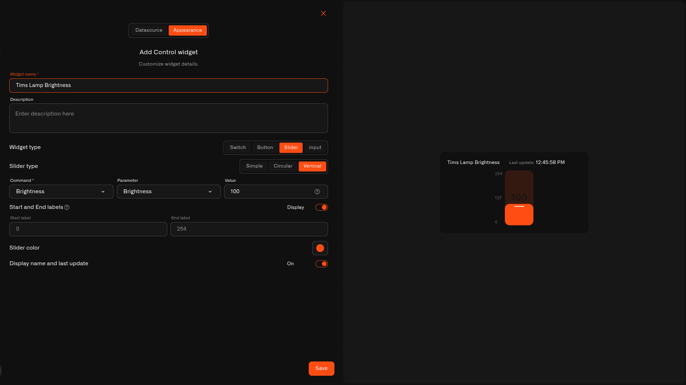

# Slider Control

The **Slider** is the numeric-range control type. Instead of a fixed on/off, it sends a **value** along a range, so an operator can dial a setting up or down from the dashboard.

## When to use it

Use a Slider for any value that varies across a range: **motor or fan speed**, **valve position**, a **dimming level**, or a **target setpoint**. It suits readings the operator adjusts by degree rather than switching between two states.

## What you need first

* A controllable device with a command on its **Commands & States** tab whose **parameter takes a number** (see [Creating Commands](../../../devices/commands/creating-commands.md)).
* A **Device metric** that reports the current value, so the slider shows where the setting sits.

## How to set it up

1. Open the dashboard in **edit mode** → **Add widget** → **Control**.
2. **Datasource** tab: choose the **Device** and the **Device metric** for the live value. Click **Next**.
3. **Appearance** tab: enter a **Widget name**, then under **Widget type** choose **Slider**.
4. Choose the **Slider type** — **Simple**, **Circular**, or **Vertical** — to match your dashboard layout.
5. Set the **Command** the slider drives, the **Parameter** it sets, and a starting **Value**.
6. Add **Start and End labels** for the range (for example `0` and `254`) and toggle **Display** to show them. Pick a **Slider color** and toggle **Display name and last update**.
7. Click **Save**.

<figure><figcaption></figcaption></figure>

## What happens when you use it

Moving the slider sends the chosen command with the new value as its parameter, through the device's command pipeline. The slider position follows the **Device metric**, so it reflects the value the device actually reports.

## Common mistakes

* **Binding a command without a numeric parameter** — the slider needs a parameter it can set to a number; a plain on/off command won't work (use a [Switch](switch.md)).
* **Range that doesn't match the device** — set Start/End to the parameter's real min and max (e.g. 0–254) so the full travel of the slider maps to valid values.

## See also

* [Control widget](../control-widget.md) — overview and the other control types
* [Device Commands](../../../devices/commands/) — define the command this slider drives
