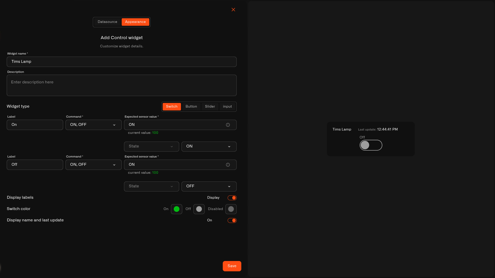

# Switch Control

The **Switch** is the two-state control type. It's a toggle for a condition that persists — running or stopped, open or closed, enabled or disabled — where the operator flips between two states and the dashboard shows which one is currently active.

## When to use it

Reach for a Switch when the device holds a lasting state you want to both **set** and **see**: enabling or disabling a **pump**, energising a **relay**, opening or closing a **valve**, or starting and stopping a **fan**. Pair it with a state metric so the toggle reflects the equipment's real condition, not just the last command sent.

## What you need first

* A controllable device — one with commands defined on its **Commands & States** tab (see [Creating Commands](../../../devices/commands/creating-commands.md)).
* A command for each state. This can be one command that takes a state parameter (e.g. `ON, OFF`) or two separate commands.
* A **Device metric** that reports the device's current state, so the switch can show on or off correctly.

## How to set it up

1. Open the dashboard in **edit mode** → **Add widget** → **Control**.
2. **Datasource** tab: choose the **Device** and the **Device metric** that reflects its state. Click **Next**.
3. **Appearance** tab: enter a **Widget name**, then under **Widget type** choose **Switch**.
4. Configure the two **state bindings** — the **On** row and the **Off** row. For each:
   * **Label** — what that state is called on the widget (e.g. "On" / "Off").
   * **Command** *(required)* — the command this state sends.
   * **Expected sensor value** *(required once a command is set)* — what the Device metric reads when this state is active. It's auto-filled from the command where possible; edit it if your sensor reports a different value.
   * If the command takes parameters, set each **Value**.
5. Set the **Switch color** for the **On**, **Off**, and **Disabled** states, toggle **Display labels**, and toggle **Display name and last update**.
6. Click **Save**.

<figure><figcaption></figcaption></figure>

## What happens when you use it

Toggling the switch dispatches the bound command for the target state through the device's command pipeline (the same one the States tab uses). The widget flips optimistically, then settles to the real state once the Device metric reports back — so if the device rejects or doesn't reach the new state, the switch returns to where it was.

## Common mistakes

* **No state metric bound** — without a Device metric, the switch can send commands but can't show the true state. Always bind the reading that reflects on/off.
* **Wrong expected value** — if the Expected sensor value doesn't match what the device actually reports, the switch will look out of sync. Check the *current value* hint against the field.
* **Only one state has a command** — both the On and Off bindings need a command for a two-way toggle.

## See also

* [Control widget](../control-widget.md) — overview and the other control types
* [Device Commands](../../../devices/commands/) — define the commands this switch operates
