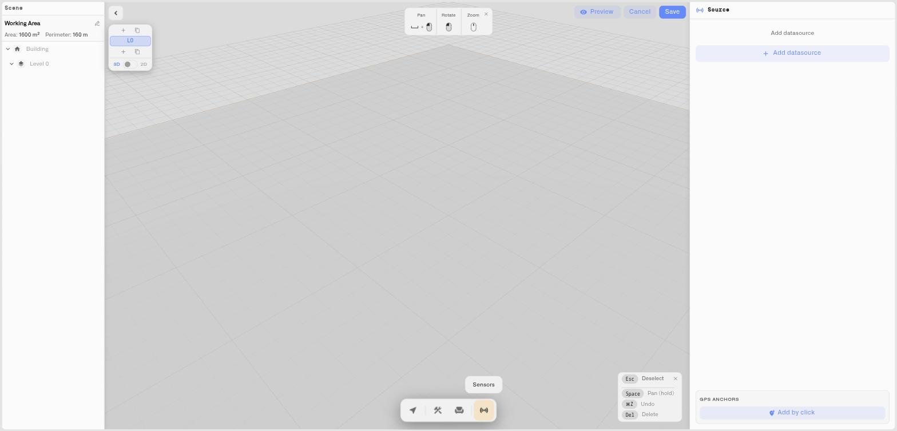

# GPS Anchoring

A Digital Building Twin is a model of a real place — and a real place has a location on the planet. GPS anchoring records that location: it ties the building, and selected points inside it, to actual latitude and longitude coordinates. This gives the model a geographic frame of reference and lays the spatial groundwork for location-aware operations.

This page covers the two ways a model gets anchored, and how to manage anchors from the Sensors panel.

## Two ways to anchor a building

### Anchor by tracing from the map

When you build the shell of a model by [tracing it from the aerial map](tracing-from-the-map.md), the trace is drawn on real-world coordinates. Importing the trace stores a **GPS origin** and a set of anchors on the building automatically — no extra step. If you traced your building from the map, it is already anchored.

### Anchor selected points by hand

You can also place anchors manually, on any model — including one drawn from scratch or imported from DXF. This is done in the **GPS Anchors** section at the bottom of the Sensors panel.

1. On the bottom toolbar, click **Sensors**, and find the **GPS Anchors** section.
2. Click **Add by click**. The editor enters pick mode with the prompt **Click on the scene to pick a point**.
3. Click a point in the model — a building corner, a known reference position.
4. A small form appears showing the point you picked. Enter its real-world **Latitude** and **Longitude**.
5. Click **Save**. The anchor is added to the list, labelled **A**, **B**, **C**, and so on.

Add as many anchors as you need. Two or three known points — the corners of the building, a surveyed reference — are enough to fix the model firmly in real-world space.

<figure><figcaption></figcaption></figure>

## The center point

As you add anchors, the editor computes a **Center** — the average position of all the anchors, in both geographic and model coordinates. The Center is shown at the top of the anchor list with its latitude and longitude. It represents the model's overall geographic position: where, on a real map, this building sits.

## Managing anchors

The GPS Anchors section lists every anchor with its coordinates. Each anchor can be removed individually. A visibility toggle shows or hides the anchor markers in the model, so you can keep them visible while you're setting the model up and hide them for a clean operational view.

## What anchoring enables

GPS anchoring gives the Digital Building Twin something a plain 3D model doesn't have: a true position in the world. The building and its anchored points are no longer floating in an abstract space — they have coordinates.

This is the spatial base that location-aware operations build on. A model that knows where it is, and where key points inside it are, can be related to other geographic data — site maps, regional views, the physical position of assets and people. Anchoring is the groundwork: it puts the building on the map so that spatial workflows have real coordinates to work from.

## Tips

* If you trace the building from the map, anchoring is already done — check the GPS Anchors section and you'll see the anchors the trace created.
* When anchoring by hand, pick points you actually know the coordinates of: surveyed corners, a site datum, a GPS reading taken on location.
* Spread anchors out — points at opposite corners of the building fix it more firmly than two points close together.
* Hide the anchor markers once the model is set up, so the dashboard view stays focused on sensor status.

## See also

* [Tracing from the map](tracing-from-the-map.md) — Anchoring happens automatically when you trace
* [Drop-pins and live values](drop-pins-and-live-values.md) — Mark live readings at scene points
* [Editor tour](editor-tour.md) — Finding the Sensors panel
