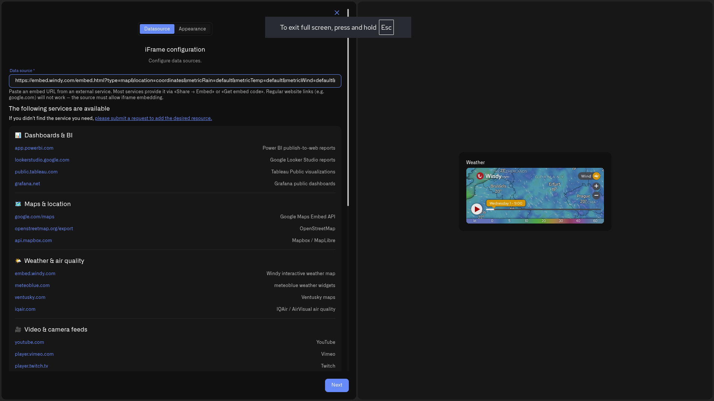

# iFrame Widget

<figure><figcaption></figcaption></figure>

Not every view an operations team needs comes from a sensor. A shift supervisor watching a plant floor may also need the corporate energy report, the regional weather radar, live traffic on the roads into the site, or the status page of a service the site depends on. The iFrame Widget brings those external views onto the same dashboard as your device data, so a single screen tells the whole operational story instead of scattering it across browser tabs.

An iFrame Widget embeds a live external web page inside a dashboard tile. The embedded page keeps working exactly as it does on its own site — it refreshes, animates, and updates in real time — but it now sits beside your Last Data panels, charts, and building views. You point the widget at an **embed URL** from a supported service, give it a name, and it renders in place.

Because the widget loads a third-party page directly, Kilo only embeds sources from a reviewed list of services that publish safe, embeddable views. That keeps a shared operations dashboard trustworthy: an embedded tile can only ever show a page from a service the platform has vetted, never an arbitrary site pasted in by mistake.

## Add an iFrame Widget

This walkthrough embeds a corporate Power BI operations report next to the live device data on a facilities dashboard. The steps are identical for any supported source — only the embed URL changes.

1. Open the dashboard in edit mode and click the **plus button** in the header, then choose **iFrame** in the widget picker. Its tile is labeled *iFrame* with the note "Connect a weather service or something else."
2. The settings panel opens on the **Data source** tab — titled "iFrame configuration" — with a live preview on the right. Find the **Data source** field.
3. Get the **embed URL** from the source service — not the address in your browser bar. On most services this is under **Share → Embed** or a **Get embed code** option. Some services give you a ready link; others give you a full HTML snippet such as `<iframe width="650" height="450" src="https://…/embed…" frameborder="0"></iframe>`. **Paste only the address inside `src="…"`** — the part that starts with `https://`. Leave out the surrounding `<iframe …>` wrapper; the field takes the URL by itself, and a pasted tag is rejected.
4. Paste the embed URL into the **Data source** field. Below it, under **The following services are available**, Kilo lists the sources it supports, grouped by category — use it to confirm your source is covered. The URL must begin with **https://**. The preview on the right renders the page as soon as the URL is valid and supported; an unsupported or malformed URL shows the message *"Enter a valid https:// embed URL"* instead of a frame.
5. Click **Next** to move to the **Appearance** tab.
6. Enter a **Widget name** (required) — for example "Site energy report". Add an optional **Description** to note what the embed shows or who owns the source.
7. Click **Save** in the panel, then **Save** in the dashboard header. The report now renders live in its tile alongside your device widgets.

> **Preview stays empty?** Almost always the pasted value isn't a bare embed URL. Check that you copied only the `https://` address from inside `src="…"` (not the whole `<iframe …>` tag), that it starts with `https://`, and that the service appears in the supported list under the field. A normal page URL, an `http://` link, or a service that isn't on the list won't render.

## What you can embed

The supported services are grouped by category in the picker, so you can scan for the one you need. Representative sources in each category:

- **Dashboards & BI** — Power BI, Looker Studio, Tableau, Grafana. Bring an existing corporate report or an operational dashboard onto the same screen as its underlying devices.
- **Maps & location** — Google Maps, OpenStreetMap, Mapbox. Show a site map, a service area, or a route.
- **Weather & air quality** — Windy, Meteoblue, Ventusky, IQAir. Overlay conditions that drive operational decisions — wind for a turbine site, air quality for a ventilation system.
- **Video & camera feeds** — YouTube, Vimeo, Twitch. Embed a published stream or a briefing clip.
- **Transport & flights** — Waze, Flightradar24, FlightAware. Watch live road traffic around a site with a Waze map, or follow inbound air freight.
- **Shipping & parcel tracking** — 17TRACK, AfterShip, TrackingMore. Follow inbound or outbound consignments.
- **Finance & markets** — TradingView, Investing.com, Trading Economics. Watch commodity prices or indices that affect procurement.
- **Status & docs** — Statuspage, Instatus, Google Docs. Pin the status page of a dependency, or a shared runbook.
- **Calendars & forms** — Google Calendar, Google Forms, Microsoft Forms, Calendly. Surface a maintenance schedule or an intake form.

The list of supported services shown in the widget is always the current one. If the service you need isn't there, use the **please submit a request to add the desired resource** link beneath the Data source field, and the team can review it for the allowed list.

## iFrame Widget vs Map Widget

These two are easy to confuse, so keep the distinction clear:

- The **iFrame Widget** embeds an external *web page* — including a third-party map like a Waze traffic view or an embedded Google Map. It shows what that website shows; it knows nothing about your devices.
- The **[Map Widget](map-widget.md)** plots one of *your own* GPS-reporting devices on an interactive map and follows its live position. Reach for it when you want to track a vehicle, an asset, or any tracker device registered on the platform — not the iFrame Widget.

## Worked examples

**Facilities dashboard — energy report in context**
A building-management dashboard already shows HVAC setpoints, occupancy, and room temperatures from the site's devices. Add an iFrame Widget pointing at the organization's Power BI energy report, and the shift supervisor sees consumption trends beside the equipment producing them — no switching tools to answer "is the load where it should be?"

**Wind-farm operations — weather beside turbines**
An operations screen tracks vibration and output per turbine. An embedded Windy map of the site's wind field lets controllers correlate a drop in output with a lull, or anticipate a high-wind curtailment, all on the dashboard the team already watches.

**Distribution center — traffic on the approach**
A logistics dashboard monitors dock-door sensors and cold-store temperatures. An embedded Waze live-traffic map of the routes into the site lets the yard team see congestion building and re-stage arrivals before trucks back up at the gate.

## What the widget shows

<figure><figcaption></figcaption></figure>

On the dashboard, the iFrame Widget renders the embedded page live inside its tile, right next to your device widgets — above, a Windy weather map sits beside a building twin and a tank-level gauge. The page behaves as it does on its own site: it refreshes and updates on its own schedule, so the widget itself has no separate refresh setting. Resize and reposition the tile in edit mode like any other widget to give a dense report the room it needs.

The iFrame Widget is a viewing surface, not a data source: it doesn't read your devices, feed the Rules Engine, or raise alarms. Use it to bring external context onto the dashboard, and keep device metrics in the widgets built for them — Last Data, Chart, Image, and the Digital Building Twin.

## See also

- [Adding Widgets](../adding-widgets.md) — Edit mode and the widget picker
- [Map Widget](map-widget.md) — Track a GPS device's live position (different from embedding a web map)
- [Digital Building Twin](digital-building-twin/README.md) — A live 3D model of a facility
