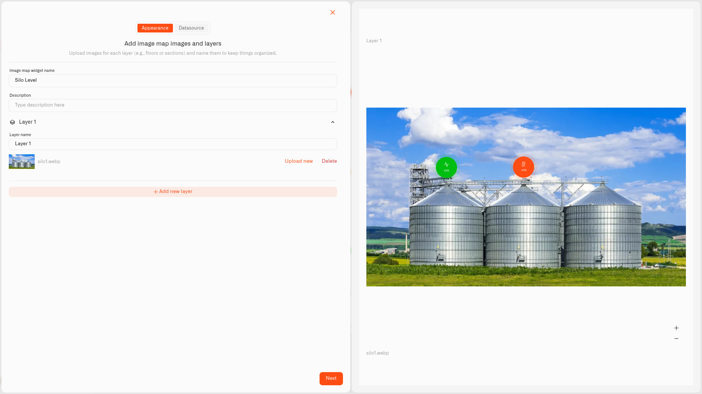
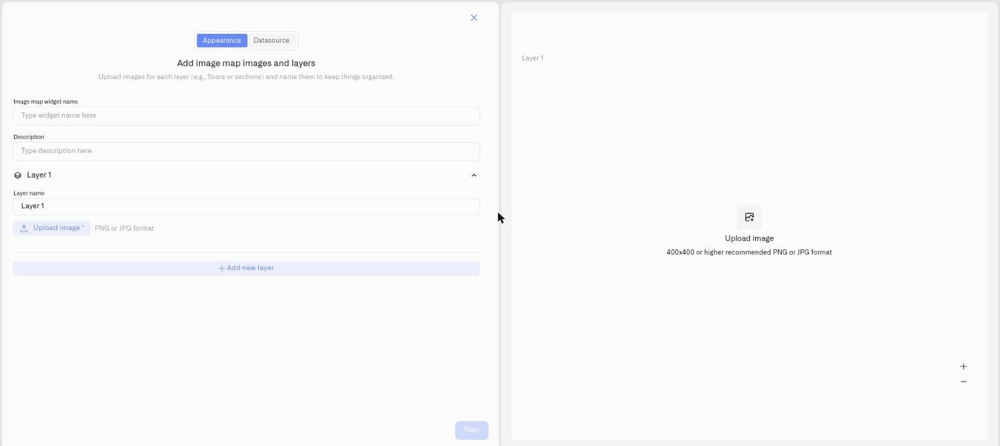

# Image Widget

<figure><figcaption></figcaption></figure>

The Image Widget turns a picture into a live dashboard. Upload an image — and it can be **any image at all**: a floor plan, an equipment schematic, a site diagram, a photo of a building, a photo of a piece of equipment such as the silo tanks above — then pin live numeric readings onto it, each one sitting exactly where its sensor is.

That is the whole idea: you stop reading a list of device names and instead look at the real place or machine and see what every part of it is doing right now. A plant manager looks at the silo photo and sees which tank is running low; a maintenance engineer looks at an equipment schematic and sees which component is outside tolerance.

Upload a supported image file — a PNG or JPG — of any place, object, or system you want to monitor. Each pinned reading shows its current value, its unit, and an icon, and its color changes as conditions trigger, so status is visible across the whole image at a glance.

## Configure an Image Widget

Here is a full setup for one real case — monitoring a row of grain silos from a single photo of the site. A level sensor in each silo reports its fill as a percentage. This is one example: the image can be anything, and the steps are the same.

1. Open the dashboard in edit mode and click **Image Widget** in the widget picker. The settings panel opens — and unlike the other widgets, the **Appearance** tab opens first, because you upload the image before you can place anything on it.
2. Enter a name for the widget — for example "Silo levels".
3. The widget starts with one layer, **Layer 1**, already created. Give it a clear **Layer name** ("Silo yard") and upload the image — a photo of the silos. PNG and JPG files are accepted.
4. Click **Next** to move to the **Datasource** tab.
5. Under the layer, click **Add datasource** — this creates an empty datasource block. In the block, click **Choose device** and select the first silo's level sensor.
6. Click **Add metric**. Set **Data type** to **Telemetry**, choose the fill-level reading under **Device metric**, and pick an **Icon**.

   > **Can't find your metric?** The Image Widget only pins numeric metrics. If a reading you expect is missing, the metric is stored as String or Boolean rather than Integer or Float. Open **Devices → Metrics**, find the metric, and change how it is stored to Integer or Float — provided the device actually reports a number. See [Metrics](../../devices/metric-templates.md).
7. Click **Conditions: N** to open the Conditions modal. Set a **Default color**, then for each band click **Add condition** and fill the row — a **Condition name**, **Data type** set to **Number**, the **From** and **To** values, and a **Color**. The pin's color comes entirely from these conditions. For a silo fill level reported as a percentage, add four:
   - "Critical" — **From** 0, **To** 10 — burgundy (a deep red)
   - "Refill now" — **From** 10, **To** 30 — red
   - "Refill soon" — **From** 30, **To** 60 — yellow
   - "Healthy" — **From** 60, **To** 100 — green

   Click **Save** to close the modal. The pin now shows green while the silo is well stocked and drops through yellow and red toward a burgundy sliver as it empties — so a glance at the photo tells the operator which tank to fill.
8. The pin for that sensor appears on the image. **Drag it** onto the silo it belongs to. Use the zoom controls (+ / −) on the preview to place it precisely.
9. Repeat — **Add datasource** for each remaining silo's sensor, add its metric and conditions, and drag its pin onto the right tank. One layer can hold several datasources, and a datasource several metrics.
10. Click **Save** to add the widget to the dashboard.

The result: the site photo with a colored pin on every silo, each showing its live fill percentage — the whole storage yard readable at a glance. The same steps fit any image; only the picture, the devices, and the condition bands change.

## What layers are

<figure><figcaption></figcaption></figure>

A **layer** is one image view inside the same Image Widget — not a transparent overlay on a single picture. Each layer has its own uploaded image and its own pins. When the widget has more than one layer, a **layer switcher** appears on it; the viewer clicks it to move between the views, so several images and sensor sets live in one widget.

Layers come into their own when one image cannot show everything. Take the silos — a single silo may carry far more than one sensor:

- **Layer 1 — "Silo yard".** The outdoor photo of all the silos, a fill-level pin on each. This view answers *which silo needs attention*.
- **Layer 2 — "Inside Silo 1".** When one silo carries a string of sensors — a multi-point temperature cable running down its interior, say — upload an open, cutaway image of that silo and pin each internal sensor on it. This view answers *what is happening inside that silo*.

On the dashboard the operator clicks the layer switcher to go from the yard overview straight to the inside detail, without leaving the widget or opening a device list. Further layers follow the same pattern — a photo of the conveyor and pump area, a diagram of the control panel — each its own image with its own pins.

Layers fit a multi-floor building just as well. Give each floor its own layer — the ground floor on Layer 1, the floors above on theirs — and pin temperature, humidity, or occupancy at the HVAC points of each. The facilities team uses the layer switcher to walk the building floor by floor from one widget, every floor held to its own spec.

A floor plan here is simply a flat image: the architectural drawings already on file just get uploaded, one per floor — nothing has to be drawn or modeled. The two are different tools: the Image Widget pins live readings onto flat 2D plans you already have, while the [Digital Building Twin](digital-building-twin/README.md) is for drawing and operating a full 3D model of the facility from scratch.

**Layers or separate widgets?** Use layers when the images are different views of the same place or system. Use separate Image Widgets when the images belong in different parts of the dashboard or cover unrelated systems.

To work with layers: **Layer 1** is already there — rename it and upload its image. Click **Add new layer** only when you want another image view in the same widget. **Every layer needs its own image** — if you add a layer and leave it empty, **Next** will not proceed. On the **Datasource** tab, add each datasource and metric under the layer it belongs to, and drag each pin on that layer's own image.

## Worked examples

**Grain silo yard — fill levels at a glance**
A photo of the silo site with a fill-level pin on each tank; conditions green above 60%, yellow 30–60%, red 10–30%, burgundy below 10%. A second layer holds a cutaway of the busiest silo with its internal temperature sensors pinned down the cable.

**Equipment schematic — readings on the machine**
A schematic of a production line, a vibration reading pinned to each motor and bearing — green 0–7 mm/s, amber 7–12, red above 12. The engineer sees which component is running rough without matching device names to machines.

**Multi-floor building — one layer per floor**
Each floor's plan on its own layer, HVAC and temperature pinned per floor — a server floor on a tighter band than the offices.

The image can be anything you can photograph or draw — a tank farm, a switchroom, a cold store, a site map — so treat these as starting points, not limits. Wherever a reading means more when you see *where* it is, the Image Widget puts it there.

## What the widget shows

On the dashboard, each layer shows its image with a colored circular pin at every position you set. Each pin carries the sensor's icon, its current live value, and the unit, and updates in real time as the sensor reports.

**Pin color comes entirely from conditions.** The first matching condition wins; if no condition matches, the pin uses the Default color set in the Conditions modal. The Image Widget visualizes status — to be paged when a reading crosses a limit, pair it with an [Alarm](../../alarm/README.md).

When a widget has two or more layers, the **layer switcher** lets the viewer move between them. If a layer has no image yet, or the widget has no sensors configured, that area shows a short placeholder message instead.

## See also

- [Conditions](conditions.md) — The color rules that drive every pin's color
- [Adding Widgets](../adding-widgets.md) — Edit mode and the widget picker
