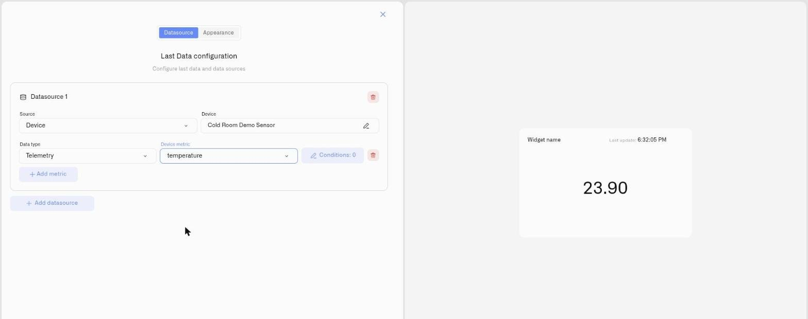

# Last Data Widget

The Last Data widget shows the **last value received from a sensor**. When a device is actively transmitting, that is also the current value. When a device goes offline after its last transmission, the widget continues showing that last value — it does not clear the display or indicate that the device has stopped reporting. The widget shows what the sensor last said: current if the device is still transmitting, potentially stale if it is not.

Is the pump running or stopped? Is the valve open or closed? What is the cold storage temperature? These are Last Data questions. The widget shows the last transmitted value for each — no trend, no historical comparison, no time axis. For compliance history and shift-to-shift comparison, use the [Chart widget](chart-widget.md).

You can display the latest value as-is — a number, text, or a Boolean (`true`/`false`) — or as a Doughnut ring gauge, a Pie filled gauge, a Tube that fills with the reading, a Gauge that marks the reading along a banded track, or a Radial Gauge that shows it on a circular instrument dial. One widget can hold multiple sensors across multiple devices — temperature, humidity, and CO2 for a zone, each styled and color-coded independently. Conditions encode operational context into the display: the same temperature reading that is green in a warehouse can be red in a pharmaceutical cleanroom, because you configure what the reading means in each specific environment.

## Setting up a Last Data widget

### Step 1 — Select Last Data from the widget picker

Click **Last data** in the picker. (See [Adding Widgets](../adding-widgets.md) for how to open edit mode and reach the picker.) The settings panel opens with two tabs: **Datasource** and **Appearance**.

### Step 2 — Datasource tab: connect sensors

The Datasource tab is titled **"Last Data configuration"** with the subtitle **"Configure last data and data sources."**

**Adding a data source:**

1. Click **Add datasource**. A **Datasource 1** block appears.
2. In the block, click **Choose device** and select the device whose sensor you want to display.
3. Click **Add metric**. A metric row appears. Each metric row contains:
   - **Data type** — set to Telemetry
   - **Device metric** — the sensor reading to display (any metric type — number, text, or Boolean)
   - **Icon** — a visual indicator for this metric on the widget
   - **Conditions button** — labeled **"Conditions: N"** where N is the current count. Click to define what color this reading shows at different values. The default color for the metric is also set here. See [Conditions](conditions.md).
   - **Delete** — remove this metric

There is no color picker directly in the metric row. The metric's base color and all threshold colors are set inside the Conditions modal.

> **Metric types.** The **Device metric** list offers every metric type. The **Value** display shows whatever the metric reports — a number, text, or a Boolean (`true`/`false`) — directly, with no conversion. The gauge-style displays (Doughnut, Pie, Tube, Gauge, Radial gauge) need a number to fill or mark a scale: a numeric text value is parsed, and a non-numeric one reads as 0. To change how a metric is stored, open [Metrics](../../devices/metric-templates.md).

**Adding more sensors:**

Click **Add datasource** to add a second device. Duplicate devices are not allowed — each device can only appear once. To add more readings from the same device, click **Add metric** on that device's entry. The button grays out once all available metrics from that device have been added.

When you add a metric, a default value range of 0–100 is created for it automatically. This range sets the scale for the Doughnut, Pie, Tube, and Gauge display types and can be changed in the Appearance tab.

When the data sources are set, click **Next** to continue to the Appearance tab.

<figure><figcaption></figcaption></figure>

### Step 3 — Appearance tab: set display style

**Widget name** *(required)* — The label shown on the dashboard. Placeholder: **"Enter widget name"**.

**Description** — Optional context note beneath the widget name.

**Widget type:** — choose how each reading is shown. Every display type has its own page with a screenshot and full detail:
- **Value** — The latest value shown as-is — a number with unit, text, or a Boolean (`true`/`false`) — for readings where the value itself is the information. [→ Value Display](last-data-widget/number.md)
- **Doughnut** — A ring gauge that fills proportionally between Min and Max. [→ Doughnut Display](last-data-widget/doughnut.md)
- **Pie** — A filled circle gauge — the same scale concept as Doughnut, with more visual weight. [→ Pie Display](last-data-widget/pie.md)
- **Tube** — A vertical cylinder whose fill marks where the reading sits in its range; it reads like a level. [→ Tube Display](last-data-widget/tube.md)
- **Gauge** — A horizontal track with the reading marked along it and conditions drawn as colored bands. [→ Gauge Display](last-data-widget/gauge.md)
- **Radial gauge** — A circular instrument dial with a configurable sweep angle and condition arcs. [→ Radial Gauge Display](last-data-widget/radial-gauge.md)

**Value range** *(Doughnut, Pie, Tube, Gauge, and Radial gauge)* — One row per sensor. Set **Min** and **Max** to define the scale the display fills or marks against. The tooltip reads: **"Set min and max to define the chart scale. Max is the value where the indicator is fully filled (for a pie, the whole circle)."** Min must be strictly less than Max — equal values are not accepted.

**Tick marks** *(Tube, Gauge, and Radial gauge)* — Set how many tick marks divide the scale. On a Gauge the ticks sit along the track, on a Tube they run down the side and take the color of any condition band they fall in, and on a Radial gauge they ring the dial.

**Sweep angle** and **Radial Gauge name** *(Radial gauge only)* — The sweep angle sets how far the dial travels, from 0 to 360 degrees (default 300); the name labels the dial. See [Radial Gauge Display](last-data-widget/radial-gauge.md).

**Tube and Gauge have no built-in "good" direction.** The fill or marker simply shows where the value sits; your conditions decide what that means — place the red band at the **low** end to catch something running down, or at the **high** end to catch a level climbing toward trouble. The [Tube](last-data-widget/tube.md) and [Gauge](last-data-widget/gauge.md) pages show this in full.

**Display data legend** — A toggle that shows a legend listing each sensor metric. Works for every display type.

### Step 4 — Save

Click **Save** to add the widget to the dashboard.

## What to expect

The widget immediately shows the last known value from each sensor. Values update as sensors report new data.

The value shown is the last one received. If a device has gone offline or is outside communication range, the widget continues showing the last reading — it does not clear the display. Verify a sensor's last-reported time on the device page before acting on a reading if the device may be offline.

If a sensor hasn't reported yet: **"Waiting for live data"**. If the widget has no metrics configured: **"Add a metric to start visualizing data"** or **"Choose data source and add metric"**.

## Common patterns

Most Last Data widgets fall into one of a few shapes. Each display type has its own page with the full walkthrough and worked examples — start here, then follow the link.

- **Statuses** — running/stopped, open/closed, on/off. A plain figure with one condition per state reads best as a [Value display](last-data-widget/number.md).
- **Measured readings** — an exact temperature, pressure, or flow with compliance bands behind it. Use a [Value display](last-data-widget/number.md) for the figure, or a [Gauge display](last-data-widget/gauge.md) when position against thresholds is what matters.
- **Levels** — tanks, silos, reserves, anything with a floor and a ceiling. Show the proportion as a [Doughnut](last-data-widget/doughnut.md) or [Pie](last-data-widget/pie.md), or as a filling [Tube](last-data-widget/tube.md) when it should read like a physical level.
- **Thresholds** — a value that must stay inside a safe window, or trip a warning when it crosses a line. The [Gauge display](last-data-widget/gauge.md) paints your conditions as bands along the track so a crossing is unmistakable.

## See also

- [Conditions](conditions.md) — Define color rules for each metric
- [Adding Widgets](../adding-widgets.md) — Edit mode and widget picker
