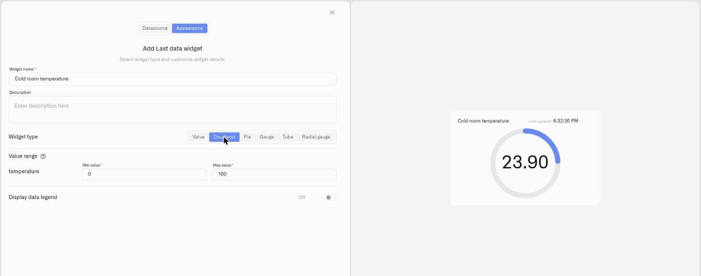

# Doughnut Display

<figure><figcaption></figcaption></figure>

The Doughnut display draws the reading as a ring that fills proportionally between a minimum and a maximum you define, with the current value in the center. At a glance it answers "how far along is this?" — a quarter full, nearly maxed out — without anyone reading the number.

It suits any reading that lives inside a known range: a fill level, a percentage, a capacity, a value that should sit somewhere within an operating band. The ring's fill makes the position in that range immediate.

## When to choose it

- A reading with a defined operating range where the proportion matters — tank capacity, battery charge, utilization against a limit.
- A dashboard tile where an operator should register low / mid / high in a glance, not parse digits.
- Anywhere a percentage or ratio reads more clearly as a filled ring than as a figure.

Wherever a reading has a meaningful floor and ceiling, the Doughnut turns it into a shape — let your own metrics suggest where it fits.

## Configure a Doughnut display

Here is a full setup for one real case — a ring that shows an office's temperature and whether it is comfortable. A temperature sensor reports the room in °C. A temperature is unlike a tank — it has no natural "empty" or "full", so there is no obvious 0 and 100. The ring still needs a floor and a ceiling, so you pick a window wide enough to hold every temperature the room could realistically reach: for a house room, about -5 °C to +40 °C. This is one example: a Doughnut suits any reading you want to see as a proportion of a range — only the device and the numbers change.

1. Open the dashboard in edit mode and click **Last data** in the widget picker. The settings panel opens on the **Datasource** tab, with no data sources yet.
2. Click **Add datasource**. A **Datasource 1** block appears.
3. In the block, click **Choose device** and select the temperature sensor.
4. Click **Add metric**. A metric row appears.
5. In the row, set **Data type** to **Telemetry**, choose the temperature reading under **Device metric**, and pick an **Icon**.

   > **Can't find your metric?** The **Device metric** list only offers numeric metrics. If a reading you expect is missing, its metric **Type** is set to String or Boolean instead of Integer or Float. Open **Metric Templates** (the **Metrics Templates** button on a connection's Connected Devices list), find the metric on the **Metrics** tab, and set its **Type** to Integer or Float — provided the device actually reports a number. See [Metric Templates](../../../devices/metric-templates.md).
6. Click **Conditions: N** to open the Conditions modal. Set a **Default color** — the color the reading falls back to whenever none of your conditions match the current value — then for each band click **Add condition** and fill the row — enter a **Condition name**, set **Data type** to **Number** (the condition's own Data type, not the metric row's), because a house room realistically swings between -5 °C and 40 °C, enter **From** -5 (the coldest you would expect) and **To** 40 (the hottest), and pick a **Color**. Then you can enter the color levels. For example:

   Working up from the coldest:
   - "Too cold" — **From** -5, **To** 15 — red
   - "Cool" — **From** 15, **To** 18 — yellow
   - "Comfortable" — **From** 18, **To** 24 — green
   - "Warm" — **From** 24, **To** 28 — yellow
   - "Too hot" — **From** 28, **To** 40 — red

   Click **Save** to close the modal.
7. Click **Next** to open the **Appearance** tab.
8. Enter a **Widget name** — for example "Office temperature" — and an optional **Description**.
9. Under **Widget type**, choose **Doughnut**. A **Value range** section appears for the metric.
10. Set **Min value** to **-5** and **Max value** to **40** — the window you chose for a house room. The ring fills to show where the current temperature sits across that -5–40 °C span, and the condition the reading falls in colors it.
11. Switch on **Display data legend** if useful, then click **Save**.

The ring shows the temperature as a position in the chosen range and turns green only inside the comfortable band. The same steps fit any reading with a sensible floor and ceiling — only the device, the **Min value**/**Max value**, and the conditions change. A Doughnut earns its place when "how far through the range" is the question; for a temperature you simply want to read off, a Number or Gauge is often the more natural display.

## Worked examples

**The same sensor, a completely different setup — a refrigerator**
A refrigerator uses the *same kind* of temperature sensor as the office above, yet every number is different — because the right window depends on what you are measuring. A fridge's safe band is roughly 0–5 °C, so you set the scale a little wider than that band, so a fridge that fails and warms up still shows on the ring: **Min value** **-5**, **Max value** **15**. Then build three conditions: "Too cold" — From -5, To 0 — blue; "Safe" — From 0, To 5 — green; "Too warm" — From 5, To 15 — red. Identical hardware, identical steps — only the window and the bands change, because "good" means something completely different in a fridge than in an office. That is the heart of conditions: you decide what each reading means in its own context.

**A fill level**
A Doughnut is a natural fit for a tank or a battery. A level sensor in a 5,000-liter tank reports the contents in liters, so 0 L is an empty tank and 5,000 L is full — **Min value** 0, **Max value** 5000 — with conditions green From 3000 To 5000, yellow From 1000 To 3000, red From 0 To 1000. The ring empties visibly as the tank is drawn down.

## See also

- [Last Data Widget](../last-data-widget.md) — Full setup reference and the other display types
- [Conditions](../conditions.md) — Numeric From/To color rules for each metric
- Other display types: [Number](number.md) · [Pie](pie.md) · [Gauge](gauge.md) · [Tube](tube.md)
