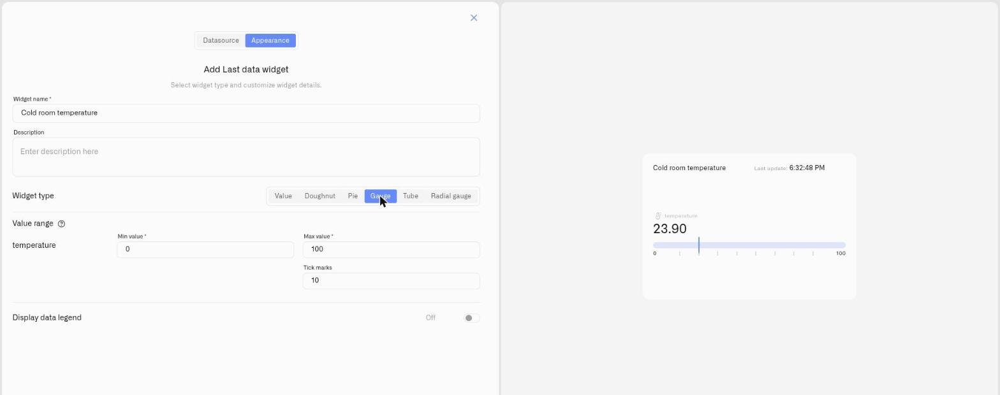

# Gauge Display

<figure><figcaption></figcaption></figure>

The Gauge display draws each reading as a marker sliding along a horizontal track. The track is scaled between a minimum and a maximum, and every numeric condition you set becomes a colored band along it — so the marker's position shows operational status, not just a value. The figure is shown in full above the track.

This is the display for readings where the position against thresholds is the point: whether a value sits inside its safe band, is drifting toward a limit, or has already crossed one.

## When to choose it

- A reading that should stay within an operating window — pressure, RPM, a controlled temperature — where the bands carry the meaning.
- Low-end alerting — a consumable or reserve where the marker dropping into a red band is the warning.
- High-end alerting — a level that should stay low, where the marker climbing into red signals trouble.

The Gauge has no fixed "good" end; your condition bands decide what each end of the track means. Wherever a reading has thresholds, the Gauge makes crossing them visible — the situations above are a starting point, not the limit.

## Configure a Gauge display

Here is a full setup for one real case — watching a sump pit so a pump failure is caught before the basement floods. The pump keeps the water low; the pit is about 100 cm deep, and a level sensor reports the water level in centimeters — so the reading runs from 0 (a dry pit floor) to 100 (water at the overflow point). That 0–100 is the track's scale, and each condition paints one stretch of it. This is one example: a Gauge suits any reading measured against thresholds — only the device and the band edges change.

1. Open the dashboard in edit mode and click **Last data** in the widget picker. The settings panel opens on the **Datasource** tab, with no data sources yet.
2. Click **Add datasource**. A **Datasource 1** block appears.
3. In the block, click **Choose device** and select the pit's level sensor.
4. Click **Add metric**. A metric row appears.
5. In the row, set **Data type** to **Telemetry**, choose the water-level reading under **Device metric**, and pick an **Icon**.

   > **This display needs a number.** The **Device metric** list offers every metric type, but a gauge fills against a scale — pick a numeric reading here; a non-numeric text value reads as 0. (To show text or an on/off value as-is, use the [Value display](number.md).) To change how a metric is stored, open **Devices → Metrics** — see [Metrics](../../../devices/metric-templates.md).
6. Click **Conditions: N** to open the Conditions modal. Set a **Default color** — the color the reading falls back to whenever none of your conditions match the current value — then for each band click **Add condition** and fill the row — enter a **Condition name**, set **Data type** to **Number** (the condition's own Data type, separate from the metric row's), because the pit is 100 cm deep, enter **From** 0 (the dry floor) and **To** 100 (the overflow point), and pick a **Color**. Then you can enter the color levels. For example:

   Working up from the dry floor:
   - "Normal" — **From** 0, **To** 30 — green
   - "Rising" — **From** 30, **To** 60 — yellow
   - "Critical" — **From** 60, **To** 100 — red

   On a Gauge these conditions render as colored bands along the track. Click **Save** to close the modal.
7. Click **Next** to open the **Appearance** tab.
8. Enter a **Widget name** — for example "Sump pit level" — and an optional **Description**.
9. Under **Widget type**, choose **Gauge**. A **Value range** section appears for the metric.
10. Set **Min value** to **0** (a dry pit) and **Max value** to **100** (water at the overflow) — the two ends of the track, the same 0–100 the bands use — and set **Tick marks** to **10**.
11. Switch on **Display data legend** if useful, then click **Save**.

The result: a track whose marker sits low and green while the pump keeps up. If the pump fails, the water rises and the marker travels along the track and crosses into the red band — that crossing is the event you are watching for. One note on the sensor: a level sensor reads higher as the water rises, while a top-mounted distance sensor reads lower — set the red band on whichever value means high water for the sensor you fitted. The Gauge makes the condition visible on the dashboard; for a notification, use an [Alarm](../../../alarm/README.md). The same banded track watches anything measured against limits — only the metric and the band edges change.

## Worked examples

**A consumable running low**
Where the danger is at the *low* end, paint the bands the other way. A reserve reported as a percentage runs 0 % (empty) to 100 % (full), so the track takes **Min value** 0 and **Max value** 100. A coolant or reagent tank then gets three conditions: "Top up now" — From 0, To 15 — red; "Getting low" — From 15, To 40 — yellow; "Healthy" — From 40, To 100 — green. The marker sits high and green while the reserve is full and drops toward the red as the process draws it down.

**Staying inside a safe window**
Some readings must stay *between* two limits, not above or below one. For a compressor whose pressure works between 0 and 10 bar, the track spans that working range — set **Min value** 0 and **Max value** 10 — then paint a green band across the middle with warning bands on both ends: "Low" — From 0, To 2 — red; "Low warning" — From 2, To 4 — yellow; "Normal" — From 4, To 7 — green; "High warning" — From 7, To 9 — yellow; "High" — From 9, To 10 — red. The marker's position shows at a glance whether the equipment is running where it should, and drift toward either edge is visible before it becomes a fault.

## See also

- [Last Data Widget](../last-data-widget.md) — Full setup reference and the other display types
- [Conditions](../conditions.md) — Numeric From/To rules that become the track bands
- Other display types: [Value](number.md) · [Doughnut](doughnut.md) · [Pie](pie.md) · [Tube](tube.md) · [Radial gauge](radial-gauge.md)
