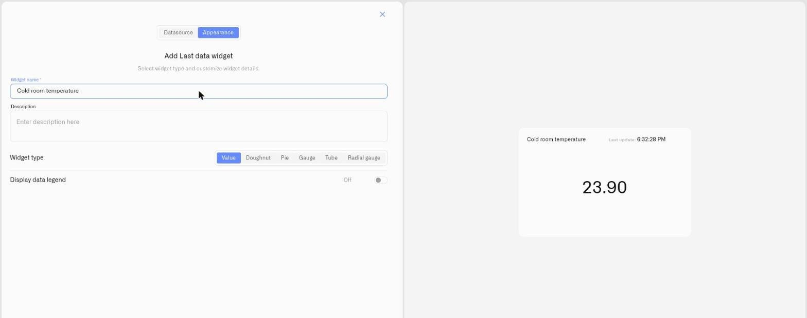

# Value Display

<figure><figcaption></figcaption></figure>

The Value display shows a reading's latest value as-is — no gauge, no scale, just the value. It works for **any** metric type: a number with its unit, a **text** value shown verbatim, or a **Boolean** shown as `true` or `false`. When a tile holds several metrics, they sit side by side, each with its own color and label, so one compact panel can carry the temperature, humidity, and CO2 of a zone at once.

Reach for Value when the reading itself is the information and there is no range to visualize against — an exact instrument reading an engineer acts on, a text status, an on/off state, or a multi-metric summary where space is tight.

Because there is no scale, Value is the one Last Data display type with no **Value range** to set.

## When to choose it

- A precise reading operators act on directly — a calibrated pressure, a flow rate, a cold-store temperature.
- A compact multi-metric tile — several readings from one zone or asset in a single panel.
- A status or count value where the number is self-explanatory and a gauge would add nothing.

These are starting points — any reading where the bare figure communicates best suits the Value display.

## Configure a Value display

Here is a full setup for one real case — a tile that shows at a glance whether a pump is running. The pump controller reports just two values — `1` when running and `0` when stopped. Because the reading is only ever 0 or 1, there is nothing to fill or scale: a Value tile is the natural fit, and each condition only has to match one of those two values. This is one example: a Value tile suits any reading where the figure itself is the information — only the device and the conditions change.

1. Open the dashboard in edit mode and click **Last data** in the widget picker. The settings panel opens on the **Datasource** tab, with no data sources yet.
2. Click **Add datasource**. A **Datasource 1** block appears.
3. In the block, click **Choose device** and select the pump controller.
4. Click **Add metric**. A metric row appears.
5. In the row, set **Data type** to **Telemetry**, choose the running-state reading under **Device metric**, and pick an **Icon**.

   > **Note on metric types.** The **Device metric** list offers every metric type. The Value display shows whatever the metric reports — a number, a text value, or a Boolean (`true`/`false`) — so no type conversion is needed here. (The gauge-style displays — Doughnut, Pie, Gauge, Tube, Radial gauge — do need a number: a numeric text value is parsed, and a non-numeric one reads as 0. To change how a metric is stored, open **Devices → Metrics** — see [Metrics](../../../devices/metric-templates.md).)
6. Click **Conditions: N** to open the Conditions modal. Set a **Default color** — the color the reading falls back to whenever none of your conditions match the current value — then for each state click **Add condition** and fill the row — enter a **Condition name**, set **Data type** to **Number** (the condition's own Data type, not the metric row's), because the pump only ever reports 0 or 1, set **From** and **To** to the same number — the value that condition should catch — and pick a **Color**. Then you can enter the two states. For example:
   - "Running" — **From** 1, **To** 1 — blue
   - "Stopped" — **From** 0, **To** 0 — gray

   Click **Save** to close the modal.
7. Click **Next** to move to the **Appearance** tab.
8. Enter a **Widget name** — for example "Pump 1" — and, if useful, a **Description**.
9. Under **Widget type**, choose **Value**. No **Value range** or **Tick marks** fields appear — the Value display has no scale, because a status reading like 0 or 1 has nothing to fill; the value itself is the message.
10. Switch on **Display data legend** if you want a labeled legend, then click **Save**.

The tile still shows the number — `1` or `0` — and the condition color paints it blue when the pump is running and gray when it is stopped, so the state reads at a glance without anyone interpreting the digit. Line up one Value tile per pump and a supervisor takes in the whole fleet at once. The same setup fits any status reading — a valve's open/closed flag, a door contact, a leak sensor — by changing the device and the two conditions.

## Worked examples

**An exact measured value**
When the figure itself matters, the Value tile shows it in full. A cold-storage probe reporting in °C needs no scale — the conditions are simply the temperature thresholds that matter. Take three: "Compliant" — From 2, To 8 — green; "Warning" — From 8, To 12 — amber; "Breach" — From 12, To 30 — red (the To value just sits above any temperature the rack would realistically reach). An operator sees the exact reading — `6.4 °C` — and the color delivers the compliance verdict at the same time. The number is never hidden; the color is meaning added on top of it. To confirm the rack held temperature across a whole shift, use the [Chart widget](../chart-widget.md).

**A text or on/off status**
The Value display isn't limited to numbers. A device that reports a text status (for example `OPEN`, `CLOSED`, `FAULT`) or a Boolean shows that value directly — the text verbatim, a Boolean as `true`/`false` — with no conversion. Conditions and colors still apply, so you can paint a `FAULT` status red while `OK` stays green.

**A multi-metric tile**
A Value widget can carry several readings at once. Add three metrics from one multi-sensor device — temperature, humidity, CO2 — and each keeps its own icon, conditions, and color, sitting side by side as one compact panel for the zone.

## See also

- [Last Data Widget](../last-data-widget.md) — Full setup reference and the other display types
- [Conditions](../conditions.md) — Numeric From/To color rules for each metric
- Other display types: [Doughnut](doughnut.md) · [Pie](pie.md) · [Gauge](gauge.md) · [Tube](tube.md) · [Radial gauge](radial-gauge.md)
