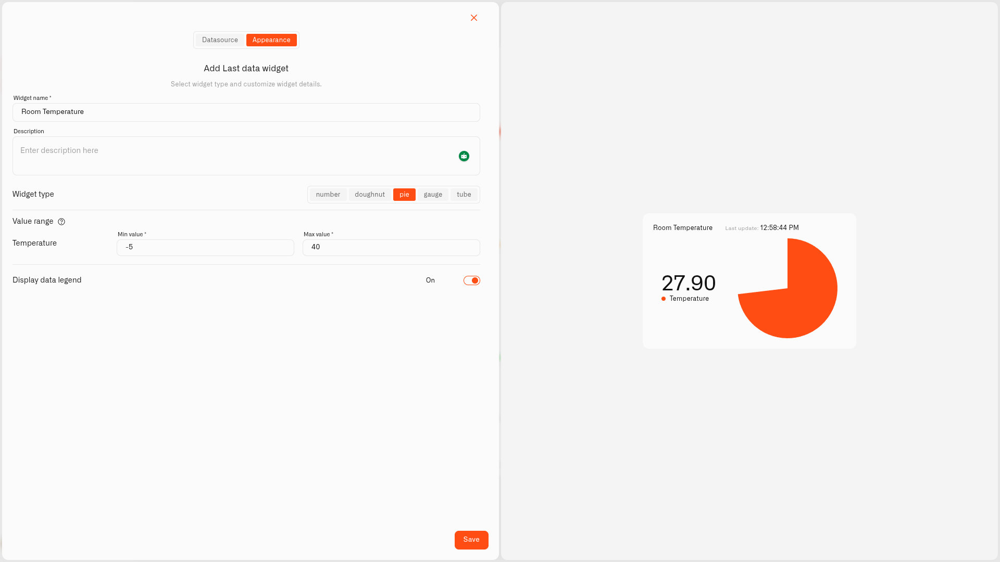

# Pie Display

<figure><figcaption></figcaption></figure>

The Pie display is a solid filled gauge — a circle that fills in as a wedge, complete at the maximum — with the value beside it. It works on the same scale principle as the Doughnut: the reading is shown as a proportion of a defined range. The difference is visual weight — a solid disc rather than a thin ring.

Choose Pie when you want a bolder mark on the dashboard, a tile that reads as a strong block of color.

## When to choose it

- The same range-based readings the Doughnut handles — fill, capacity, percentage — when a solid, high-contrast visual suits the board better.
- A tile that needs to stand out among lighter widgets.
- A wall display where a filled disc reads more clearly at distance than a ring outline.

Doughnut and Pie are interchangeable in function — pick whichever visual fits the dashboard, and let the look of the surrounding board guide the choice.

## Configure a Pie display

Here is a full setup for one real case — a bold capacity tile for a process-water reservoir on a supervisory dashboard. A level sensor reports the reservoir contents in litres, and the reservoir holds 8,000 litres — so the reading is 0 when empty and 8,000 when full. That 0–8,000 is the scale, and each condition is a slice of it. This is one example: a Pie suits any reading shown as a proportion of a range — only the device and the numbers change.

1. Open the dashboard in edit mode and click **Last data** in the widget picker. The settings panel opens on the **Datasource** tab, with no data sources yet.
2. Click **Add datasource**. A **Datasource 1** block appears.
3. In the block, click **Choose device** and select the reservoir's level sensor.
4. Click **Add metric**. A metric row appears.
5. In the row, set **Data type** to **Telemetry**, choose the volume reading under **Device metric**, and pick an **Icon**.

   > **Can't find your metric?** The **Device metric** list only offers numeric metrics. If a reading you expect is missing, its metric **Type** is set to String or Boolean instead of Integer or Float. Open **Metric Templates** (the **Metrics Templates** button on a connection's Connected Devices list), find the metric on the **Metrics** tab, and set its **Type** to Integer or Float — provided the device actually reports a number. See [Metric Templates](../../../devices/metric-templates.md).
6. Click **Conditions: N** to open the Conditions modal. Set a **Default color** — the colour the reading falls back to whenever none of your conditions match the current value — then for each band click **Add condition** and fill the row — enter a **Condition name**, set **Data type** to **Number** (the condition's own Data type, not the metric row's), because the reservoir holds 8,000 litres, enter **From** 0 (an empty reservoir) and **To** 8000 (a full one), and pick a **Color**. Then you can enter the colour levels. For example:

   Working up from empty:
   - "Adequate" — **From** 5000, **To** 8000 — green
   - "Plan a refill" — **From** 2000, **To** 5000 — yellow
   - "Refill now" — **From** 0, **To** 2000 — red

   Click **Save** to close the modal.
7. Click **Next** to open the **Appearance** tab.
8. Enter a **Widget name** — for example "Process water" — and an optional **Description**.
9. Under **Widget type**, choose **Pie**. A **Value range** section appears for the metric.
10. Set **Min value** to **0** (an empty reservoir) and **Max value** to **8000** (its full 8,000-litre capacity) — the same range the conditions use. The wedge fills the whole circle at 8,000 litres.
11. Switch on **Display data legend** if useful, then click **Save**.

The result: a solid disc that reads as a strong block of colour from across the room — full and green while the reservoir is well stocked, shrinking through yellow to red as it is drawn down. The same steps fit any capacity or proportion reading; change the device, the **Min value**/**Max value**, and the bands to match.

## Worked examples

**Daily throughput against a target**
Set the day's target as the **Max value** and a counter that resets each shift as the metric. With **Min value** 0 (nothing produced yet) and **Max value** set to the day's target, the disc fills as the shift progresses — a half-filled disc by midday is on pace. Conditions can hold it red until a minimum output is reached and green once the target is in sight.

**Soil moisture across a planted area**
A soil-moisture sensor reports a percentage, so the scale is naturally **Min value** 0 (bone dry) and **Max value** 100 (saturated), with conditions green From 40 To 80, yellow From 20 To 40, red From 0 To 20. The filled disc makes a dry zone obvious at a glance.

## See also

- [Last Data Widget](../last-data-widget.md) — Full setup reference and the other display types
- [Conditions](../conditions.md) — Numeric From/To color rules for each metric
- Other display types: [Number](number.md) · [Doughnut](doughnut.md) · [Gauge](gauge.md) · [Tube](tube.md)
