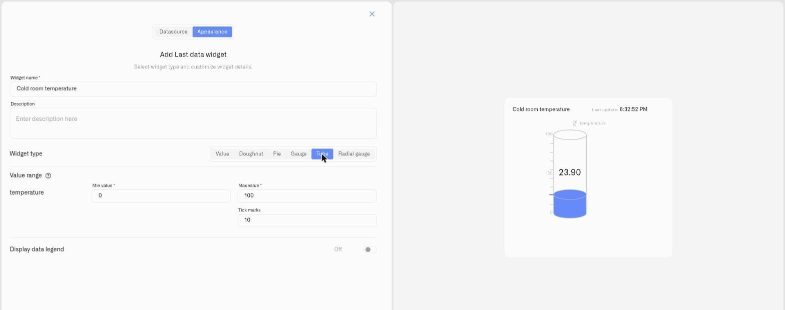

# Tube Display

<figure><figcaption></figcaption></figure>

The Tube display is a vertical cylinder that fills from the bottom as the reading rises between a minimum and a maximum, with tick marks down the side and the value shown on the tube. It reads like a physical sight glass — the fill height *is* the reading.

Tube is the natural choice for anything you already picture as a level. Because the conditions decide the colors, it works equally for "how full" and "how empty" — a tank filling up, or a reserve draining down.

## Watch a drop, or watch a rise

The Tube has no built-in "good" or "bad" end. You decide which direction is the problem and paint the conditions to match — the same widget covers two opposite jobs:

- **Monitor a decrease** — when the danger is *running low*. A diesel or heating-oil tank, a chemical reserve, a water cistern: the level falls as it's consumed, so put the warning colors at the **bottom**. The column reads green while well stocked and turns yellow then red as it drains toward empty, so a refill is never a surprise.
- **Monitor an increase** — when the danger is *rising too high*. A sump or drainage pit kept low by a pump: if the pump malfunctions the water has nowhere to go and the level climbs, so put the warning colors at the **top**. The column sits short and green in normal service and rises into a red band near the overflow point, flagging the fault before it floods.

The mechanism is identical — only where you place the red condition changes. Both setups are shown in full below.

## When to choose it

- A genuine physical level — a storage tank, a silo, a cistern, a reservoir, a sump pit.
- A reserve or consumable where the question is "how much is left," and the fill falling toward the bottom is the signal.
- A contained level that must not climb past a safe point, where the fill rising toward the top is the signal.
- Any reading where an operator's instinct is to picture a column rising and falling.

Wherever a value has a meaningful floor and ceiling and "level" is the mental model, the Tube fits — the conditions then decide which end is the one to watch.

## Configure a Tube display

Here is a complete setup for one real case — monitoring the level in a storage tank so you know when to refill it. The tank stands 100 cm tall, and a level sensor reports the current fill in centimeters — so the reading is 0 when the tank is empty and 100 when it is full to the top. Those two numbers, 0 and 100, become the scale for the whole widget, and every condition is a slice of that 0–100 cm height. This is only an example: the same steps fit salt, grain, feed, water, fuel, or any material on a scale — only the device and the numbers change.

1. Open the dashboard in edit mode and click **Last data** in the widget picker. The settings panel opens on the **Datasource** tab, with no data sources yet.
2. Click **Add datasource**. A **Datasource 1** block appears.
3. In the block, click **Choose device** and select the tank's level sensor.
4. Click **Add metric**. A metric row appears.
5. In the row, set **Data type** to **Telemetry**, choose the fill-level reading under **Device metric**, and pick an **Icon**.

   > **This display needs a number.** The **Device metric** list offers every metric type, but a gauge fills against a scale — pick a numeric reading here; a non-numeric text value reads as 0. (To show text or an on/off value as-is, use the [Value display](number.md).) To change how a metric is stored, open **Devices → Metrics** — see [Metrics](../../../devices/metric-templates.md).
6. Click **Conditions: N** to open the Conditions modal. Set a **Default color** — the color the reading falls back to whenever none of your conditions match the current value — then for each band click **Add condition** and fill the row — enter a **Condition name**, set **Data type** to **Number** (the condition's own Data type, not the metric row's), Because for this example our tank is 100cm in Height enter **From** 0cm (Bottom of the tank) and **To** 100cm , and pick a **Color**. Then you can enter the color levels. For example:

 Working up from the bottom:
   - "Critical" — **From** 0, **To** 10 — burgundy (a deep red, darker than the next band)
   - "Refill now" — **From** 10, **To** 30 — red
   - "Refill soon" — **From** 30, **To** 60 — yellow
   - "Healthy" — **From** 60, **To** 100 — green

   Click **Save** to close the modal.
7. Click **Next** to open the **Appearance** tab.
8. Enter a **Widget name** — for example "Tank level" — and an optional **Description**.
9. Under **Widget type**, choose **Tube**. A **Value range** section appears for the metric.
10. Set **Min value** to **0** (an empty tank) and **Max value** to **100** (full to the top) — the same 0–100 the conditions are built on — and set **Tick marks** to **10** so the tube is divided every 10 cm (each tick takes the color of the band it falls in).
11. Switch on **Display data legend** if you want the metric labeled, then click **Save**.

The result: a cylinder that stands tall and green while the tank is well stocked, drops through yellow and red as the contents run down, and shows a burgundy sliver when it is nearly empty — so a glance tells you when to act. Swap in a different sensor and different band edges and the very same setup watches a salt tank, a grain store, a feed bin, or a chemical drum.

## Worked examples

**Sump or groundwater pump — a rising level**
A sump or drainage pit relies on a pump to keep the water low; if the pump fails, the level climbs and the basement floods. Put a level sensor in the pit and show it on a Tube. The pit is about 100 cm deep, so 0 is a dry floor and 100 is water at the overflow point — set **Min value** 0 and **Max value** 100, then add three conditions: "Normal" — From 0, To 30 — green; "Level rising" — From 30, To 60 — yellow; "Critical — check the pump" — From 60, To 100 — red. In normal service the column is short and green; if the pump quits, the water has nowhere to go and the column climbs into the red band. The sensor matters here: a level sensor reads higher as the water rises, while a top-mounted distance sensor reads lower — set the red condition on whichever value represents high water for the sensor you installed. The Tube makes the rising level visible on the dashboard; for an actual notification, use an [Alarm](../../../alarm/README.md).

**Heating-oil or rainwater tank**
Any stored liquid works the same way — a level sensor in a heating-oil tank or a rainwater cistern, with **Min value** 0 for an empty tank and **Max value** set to that tank's own full level. The tube rises as the tank fills and falls as it is drawn down, with conditions coloring the low end so a refill is never a surprise.

## See also

- [Last Data Widget](../last-data-widget.md) — Full setup reference and the other display types
- [Conditions](../conditions.md) — Numeric From/To color rules for the fill
- Other display types: [Value](number.md) · [Doughnut](doughnut.md) · [Pie](pie.md) · [Gauge](gauge.md) · [Radial gauge](radial-gauge.md)
